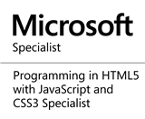

I'm a passionate software developer with over 7 years of professional experience. Most of the time I've been designing and developing front-end solutions for companies from the financial sector. I’ve been working on desktop and web-based software development using Microsoft .NET platform and attending projects using WPF, Silverlight and MVC frameworks.  
In the last few years, I've moved my interest from front-end to back-end development and got more engaged with the architectural aspects of the software development. 
As a speaker and co-organizer of [Cracow's .NET Developers Community Group](https://meetup.com/KGD-NET/), as well as [Open Source contributor](https://github.com/cezarypiatek), I'm trying to have a real impact on the developer's community. In my spare time, I blog about `Selenium`, `DevOps` and `.NET` related topics.  __I'm a huge fan of automation and enthusiast of `software craftsmanship`, `clean code` and `domain driven design`.__ 

I started programming at 10 years old trying to retype some simple Basic programs from an old user guide to my C-64. It was just a temporary hobby but a few years later I bought a programmer magazine with C++ Builder on CD and started to write my first real programs. In high school, I got interested in web development using Html, JavaScript, and PHP. I graduated from the University of Science and Technology AGH (Cracow, Poland). At university, I didn’t learn too much useful stuff but I got a basic knowledge of C, C++, Java, and algorithms. In my free time, I’ve started to learn `C#` and getting familiar with the `Microsoft .NET platform`. I am currently employed as a senior software developer for a private company in Cracow, Poland. 

<a href="" id="mailaddress"><i class="fa fa-envelope-square"></i></a>
<a href="https://twitter.com/cezary_piatek"><i class="fa fa-twitter"></i></a>

<table id="certificats">
<tr>
<td></td>
<td></td>
<td></td>
</tr>
</table>

