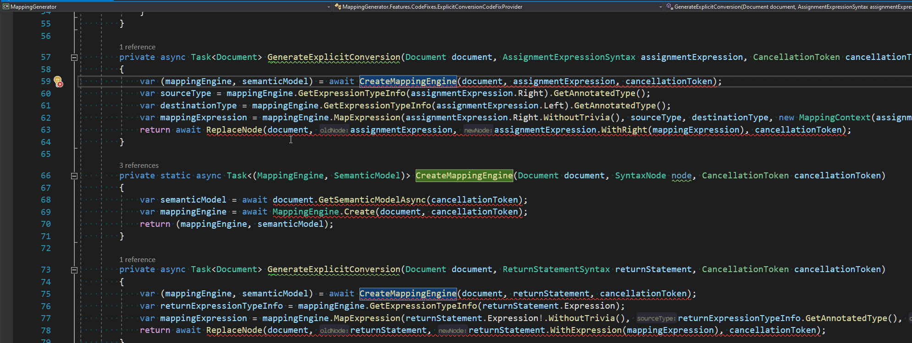

This blog post continue series which is a guide through the available on the market code analyzers and theirs possibilities. I'm trying to help you answer the question: **"Which analyzer package should I use and how to configure it to avoid problems related to async/await.?"**. In [the previous episode](http://localhost:1313/post/async-analyzers-p1/) I presented  the first seven most common code smells related to asynchronous programming. Today, I present the next seven traps from this area. Lucky you, they can be easily avoided with appropriate analyzer - for every issue, I provide entries for `.editorconfig` that configure analyzers that can detect it.

## Async Code Smells

### 8. Synchronous waits

`async/await` keyword are viral which means if you want to await asynchronous expression and you are in non-asyc method then you are forced to rewrite the whole call chain to asynchronous. The easier solution seems to be calling `Wait` or `Result` on the returned task but it's just asking for the troubles. This solution will cost you two thread for that execution or even result in a deadlock. This problem is more widely described in [
ASP.NET Core Diagnostic Scenarios - Asynchronous Programming](https://github.com/davidfowl/AspNetCoreDiagnosticScenarios/blob/master/AsyncGuidance.md#avoid-using-taskresult-and-taskwait). I highly recommend reading this article - you will find there even more asynchronous code smells.

❌ Wrong

```cs
void DoSomething()
{
    Thread.Sleep(1); // Reported diagnostics: MA0045
    Task.Delay(2).Wait();  // Reported diagnostics: VSTHRD002, MA0045
    var result1 = GetAsync().Result; // Reported diagnostics: VSTHRD002, MA0045
    var result2 = GetAsync().GetAwaiter().GetResult() // Reported diagnostics: VSTHRD002, MA0045
}
```

✔️ Correct
```cs
void DoSomething()
{
    await Task.Delay(1);
    await Task.Delay(2);    
    var result1 = await GetAsync();
    var result2 = await GetAsync();
}
```


🛠️ Configuration
```
# VSTHRD002: Avoid problematic synchronous waits
dotnet_diagnostic.VSTHRD002.severity = error

# MA0045: Do not use blocking call (make method async)
dotnet_diagnostic.MA0045.severity = error
```

### 9. Missing ConfigureAwait(bool)

By default, when we await asynchronous operation using `await` keyword, the continuation is scheduled using captured SynchronizationContext or TaskScheduler. This comes with additional performance cost and might result in deadlock depends on the SynchronizationContext/TaskScheduler provided by the environment - especially in `WindowsForms`, `WPF` and old `ASP.NET` application (yes, ASP.NET Core is not using SynchronizationContext). `ConfigureAwait` method wraps returned task into `ConfiguredTaskAwaitable` structure which change the logic of scheduling the continuation. By calling `ConfigureAwait(continueOnCapturedContext: false)` we are ensuring that the current context (if provided) is ignored while invoking the continuation. Setting `continueOnCapturedContext` parameter to `true` doesn't make any sense. If you want to go into the details about this subject I recommend reading [ConfigureAwait FAQ](https://devblogs.microsoft.com/dotnet/configureawait-faq/) by `Stephen Toub`.  

❌ Wrong

```cs
async Task DoSomethingAsync()
{
    await DoSomethingElse(); //Reported diagnostics: ASYNC0004, MA0004, RCS1090, VSTHRD111
}
```

✔️ Correct
```cs
async Task DoSomethingAsync()
{
    await DoSomethingElse().ConfigureAwait(false);
}
```

🛠️ Configuration
```
# ASYNC0004: Use ConfigureAwait(false) on await expression
dotnet_diagnostic.ASYNC0004.severity = error

# MA0004: Use .ConfigureAwait(false)
dotnet_diagnostic.MA0004.severity = error

# RCS1090: Call 'ConfigureAwait(false)'.
dotnet_diagnostic.RCS1090.severity = error

# VSTHRD111: Use ConfigureAwait(bool)
dotnet_diagnostic.VSTHRD111.severity = error
```

All of the above analyzers offer appropriate code fix. You can easily add "ConfigureAwait(false)` to all await expressions in one go:



### 10. Returning null from a Task-returning method

Returning `null` value from non-async method that declares `Task/Task<>` as a returning type results in `NullReferenceException` if somebody awaits the method invocation. To avoid that, you should always return result from this kind of method using `Task.CompletedTask` or `Task.FromResult<T>(null)` helpers.
  
❌ Wrong

```cs
Task DoAsync() 
{
    return null; //Reported diagnostics: MA0022, VSTHRD114
}

Task<object> GetSomethingAsync() 
{
    return null;  //Reported diagnostics: MA0022, VSTHRD114, RCS1210
}

Task<HttpResponseMessage> TryGetAsync(HttpClient httpClient)
{
    return httpClient?.GetAsync("/some/endpoint"); //Reported diagnostics: RCS1210
}
```

✔️ Correct
```cs
Task DoAsync() 
{
    return Task.CompletedTask;
}

Task<object> GetSomethingAsync() 
{
    return Task.FromResult<object>(null);
}

Task<HttpResponseMessage> TryGetAsync(HttpClient httpClient)
{
    return httpClient?.GetAsync("/some/endpoint") ?? Task.FromResult(default(HttpResponseMessage));
}
```

🛠️ Configuration
```
# MA0022: Return Task.FromResult instead of returning null
dotnet_diagnostic.MA0022.severity = error

# RCS1210: Return Task.FromResult instead of returning null.
dotnet_diagnostic.RCS1210.severity = error

# VSTHRD114: Avoid returning a null Task
dotnet_diagnostic.VSTHRD114.severity = error
```

Right now, non of the analyzers is able to detect all three cases so we should go with one of two combinations: `RCS1210` with `VSTHRD114` or `RCS1210` with `MA0022`.


### 11. Asynchronous method names should end with Async

I'm not a fan of this rule. It adds unnecessary noise and reminds me about the [hungarian notation](https://en.wikipedia.org/wiki/Hungarian_notation). In the description of [VSTHRD200](https://github.com/microsoft/vs-threading/blob/master/doc/analyzers/VSTHRD200.md) we can see:

> `The .NET Guidelines for async methods includes that such methods should have names that include an "Async" suffix.` 

However, I wasn't able to find an original document and there's nothing about it in the [Framework Design Guidelines - Naming Guidelines](https://docs.microsoft.com/en-us/dotnet/standard/design-guidelines/naming-guidelines). IMHO, this naming convention only makes sense when a class provides both synchronous and asynchronous versions of a given method - this is the case mostly for APIs that were created before `async/await` era. Anyway, if this rule belongs to your coding standard you can easily spot all the violations with the following diagnostics: `VSTHRD200`, `ASYNC0001`, `RCS1046`.

❌ Wrong

```cs
async Task DoSomething() //Reported diagnostics: VSTHRD200, ASYNC0001, RCS1046
{
    await Task.Yield();
}
```

✔️ Correct
```cs
async Task DoSomethingAsync()
{
    await Task.Yield();
}
```

🛠️ Configuration
```
# ASYNC0001: Asynchronous method names should end with Async
dotnet_diagnostic.ASYNC0001.severity = error

# VSTHRD200: Use "Async" suffix for async methods
dotnet_diagnostic.VSTHRD200.severity = error

#RCS1046: Asynchronous method name should end with 'Async'.
dotnet_diagnostic.RCS1046.severity = error
```


### 12. Non asynchronous method names shouldn't end with Async

This rule definitely makes more sense for me than the previous one. Adding `Async` suffix to non-asynchronous method might cause confusion. I think this code smell is rather a result of carless refactoring or requirements change rather than intended action.

❌ Wrong

```cs
void DoSomethingAsync() //Reported diagnostics: VSTHRD200, ASYNC0002, CS1047
{    
}
```

✔️ Correct
```cs
void DoSomething()
{    
}
```

🛠️ Configuration
```
# VSTHRD200: Use "Async" suffix for async methods
dotnet_diagnostic.VSTHRD200.severity = error

# ASYNC0002: Non asynchronous method names should end with Async
dotnet_diagnostic.ASYNC0002.severity = error

# RCS1047: Non-asynchronous method name should not end with 'Async'.
dotnet_diagnostic.RCS1047.severity = error

```

It's worth to point out that `VSTHRD200` is tracking both naming deviations, it simply check if `Async` suffix is applied correctly. It might be good if you need both rules, but if you just need only check if `Async` suffix is not applied to synchronous methods then you should rather use `ASYNC0002` or `RCS1047`.

### 13. Pass cancellation token

Forgetting about passing cancellation token might cost you a lot of trouble. Log running operation without a cancellation token can block the action of stopping the application or can result in thread starvation when there's a lot of cancelled web requests. In order to avoid such problems you should always provide and pass a cancellation token to the methods that accept it, even if it's an optional parameter. `Meziantou.Analyzer` package implements two diagnostic which can detect missing cancellation token: `MA0032` is reported always when we skip cancellation token parameter and `MA0040` is reported only when there's a cancellation token in current scope that can be used. More details about those analyzers you can find in the article from analyzers author [
Detect missing CancellationToken using a Roslyn Analyzer](https://www.meziantou.net/detect-missing-cancellationtoken-using-a-roslyn-analyzer.htm).

❌ Wrong

```cs
public async Task<string> GetSomethingA(HttpClient httpClient, CancellationToken cancellationToken)
{
    var response = await httpClient.GetAsync(new Uri("/some/endpoint")); //Reported diagnostics: MA0040
    return await response.Content.ReadAsStringAsync();
}

public async Task<string> GetSomethingB(HttpClient httpClient)
{
    var response = await httpClient.GetAsync(new Uri("/some/endpoint")); //Reported diagnostics: MA0032
    return await response.Content.ReadAsStringAsync();
}
```

✔️ Correct
```cs
public async Task<string> GetSomething(HttpClient httpClient, CancellationToken cancellationToken)
{
    var response = await httpClient.GetAsync(new Uri("/some/endpoint"), cancellationToken);
    return await response.Content.ReadAsStringAsync();
}
```

🛠️ Configuration
```
# MA0040: Specify a cancellation token
dotnet_diagnostic.MA0032.severity = error

# MA0040: Flow the cancellation token when available
dotnet_diagnostic.MA0040.severity = error
```

### 14. Using cancellation token with IAsyncEnumerable

This is a similar code smell as the previous one but it's strictly related to the usage of `IAsyncEnumerable` an can quite easily overlooked. It might not be so obvious, but passing a cancellation token to asynchronous enumerator is done by calling `WithCancellation()` method. In case of `IAsyncEnumerable` the `Meziantou.Analyzer` provides two diagnostics: `MA0080` for all missing invocation of `WithCancellation()` method and `MA0079` only when any `CancellationToken` is present in the current context.

❌ Wrong

```cs
async Task IterateB(IAsyncEnumerable<string> enumerable, CancellationToken cancellationToken)
{
    await foreach (var item in enumerable) // Reported diagnostics: MA0079
    {
    }
}

async Task IterateA(IAsyncEnumerable<string> enumerable)
{
    await foreach (var item in enumerable) // Reported diagnostics: MA0080
    {
    }
}
```

✔️ Correct
```cs
async Task Iterate(IAsyncEnumerable<string> enumerable, CancellationToken cancellationToken)
{
    await foreach (var item in enumerable.WithCancellation(cancellationToken)) 
    {
    }
}
```

🛠️ Configuration
```
# MA0079: Use a cancellation token using .WithCancellation()
dotnet_diagnostic.MA0079.severity = error

# MA0080: Use a cancellation token using .WithCancellation()
dotnet_diagnostic.MA0080.severity = error
```

## Summary

| #   | Code smell                                             | VS-Threading   | Roslyn.Analyzers | Meziantou.Analyzer | Roslynator   | FxCop       | Asyncify                                  |
|----:|--------------------------------------------------------|----------------|------------------|--------------------|--------------|-------------|-------------------------------------------|
| 8.  | Synchronous waits                                      | 🔎🛠️VSTHRD002 |                  | 🔎MA0042, MA0045   |              |             | 🔎🛠️AsyncifyInvocation, AsyncifyVariable |
| 9.  | Missing `ConfigureAwait(bool)`                         | 🔎🛠️VSTHRD111 | 🔎🛠️ ASYNC0004  | 🔎🛠️ MA0004       | 🔎🛠️RCS1090 | 🔎🛠️CA2007 |                                           |
| 10. | Returning null from a Task-returning method            | 🔎🛠️VSTHRD114 |                  | 🔎MA0022           | 🔎🛠️RCS1210 |             |                                           |
| 11. | Asynchronous method names should end with Async        | 🔎🛠️VSTHRD200 | 🔎🛠️ASYNC0001   |                    | 🔎RCS1046    |             |                                           |
| 12. | Non asynchronous method names shouldn't end with Async |                | 🔎🛠️ASYNC0002   |                    | 🔎RCS1047    |             |                                           |
| 13. | Pass cancellation token                                |                |                  | 🔎MA0032,MA0040    |              |             |                                           |
| 14. | Using cancellation token with IAsyncEnumerable         |                |                  | 🔎MA0079,MA0080    |              |             |                                           |


🔎 - Analyzer

🛠️ - CodeFix