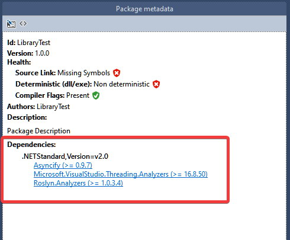

In the last two posts, I've described 14 different code smells related to the `async/await` keywords. Besides the problem description, I've also provided info about code analyzers that can detect and report a given issue. Those analyzers come from a few different packages that are not strictly devoted to the asynchronous programming area. They contain also rules from other fields with predefined severity which might not be appropriate to your needs or you might not be interested in enforcing them at all. The fact that those analyzers come from different packages provided by different community members results in the duplicated effort (some rules were implemented more than once) and force us to spend more time researching then and deciding which one to use. **I wish there was a single analyzer package that contains all those rules related to async programming, and only them.** This will result in a better time disposition of people who works on the analyzers (in most cases, they are doing it in their spare time without getting paid for it), increasing analyzers' quality, and definitely simplify the consumption. Right now we need to somehow deal with what we have. To save you some time and to finally answer the question **"Which analyzer package should I use and how to configure it to avoid problems related to async/await?"** I decided to write this summary. 

## Installing the analyzers

Here are the entries for `csproj` that add async analyzers to your project.

```xml
<ItemGroup>
    <PackageReference Include="AsyncFixer" Version="1.3.0">
        <PrivateAssets>all</PrivateAssets>
        <IncludeAssets>runtime; build; native; contentfiles; analyzers; buildtransitive</IncludeAssets>
    </PackageReference>
    <PackageReference Include="Asyncify" Version="0.9.7" >
        <PrivateAssets>all</PrivateAssets>
        <IncludeAssets>runtime; build; native; contentfiles; analyzers; buildtransitive</IncludeAssets>
    </PackageReference>
    <PackageReference Include="Meziantou.Analyzer" Version="1.0.570">
        <PrivateAssets>all</PrivateAssets>
        <IncludeAssets>runtime; build; native; contentfiles; analyzers; buildtransitive</IncludeAssets>
    </PackageReference>
    <PackageReference Include="Microsoft.VisualStudio.Threading.Analyzers" Version="16.8.50" >
        <PrivateAssets>all</PrivateAssets>
        <IncludeAssets>runtime; build; native; contentfiles; analyzers; buildtransitive</IncludeAssets>
    </PackageReference>
</ItemGroup>
```

If you install analyzer packages manually using Nuget UI or CLI then you might notice that some package references are decorated with
`PrivateAssets` as well as `IncludeAssets` properties. This is due to the fact that packages were marked as [DevelopmentDependency](https://docs.microsoft.com/en-us/nuget/reference/nuspec#developmentdependency). **I think the lack of those attributes is rather an overlook and you can safely add them for analyzer references which are missing them** - they do not provide any runtime dependencies which will be required to run your app or library. **If you do not add it, those packages became your dependencies which is rather not expected:**



Justification of the choice:

- I decided to go with `AsyncFixture`, `VS-Threading` and  `Meziantou.Analyzer`. Those packages combined together cover all rules which are critical in my opinion.
- I took additionally `Asyncify` package because contains very helpful refactoring which can rewrite whole call chain from sync to async. Similar code fix is provided by `VS-Threading` but it's broken right now [Issue#454](https://github.com/microsoft/vs-threading/issues/454) - I hope somebody will fix it soon.
- I decided to not use `Roslyn.Analyzers` package because the maintainer is not responding to Github Issues and PRs. No activity since 2017 so the project looks dead to me.


## Configuring the rules

Analyzer's rules can be configured using `ruleset` file or `.editorconfig` which is recently gaining the popularity and it seems to be currently recommended option. Here's the excerpt from my `.editorconfig` file with a configuration of async related rules from the chosen packages:

```
# AsyncFixer01: Unnecessary async/await usage
dotnet_diagnostic.AsyncFixer01.severity = suggestion

# AsyncFixer02: Long-running or blocking operations inside an async method
dotnet_diagnostic.AsyncFixer02.severity = error

# VSTHRD103: Call async methods when in an async method
dotnet_diagnostic.VSTHRD103.severity = error

# AsyncFixer03: Fire & forget async void methods
dotnet_diagnostic.AsyncFixer03.severity = error

# VSTHRD100: Avoid async void methods
dotnet_diagnostic.VSTHRD100.severity = error

# VSTHRD101: Avoid unsupported async delegates
dotnet_diagnostic.VSTHRD101.severity = error

# VSTHRD107: Await Task within using expression
dotnet_diagnostic.VSTHRD107.severity = error

# AsyncFixer04: Fire & forget async call inside a using block
dotnet_diagnostic.AsyncFixer04.severity = error

# VSTHRD110: Observe result of async calls
dotnet_diagnostic.VSTHRD110.severity = error

# VSTHRD002: Avoid problematic synchronous waits
dotnet_diagnostic.VSTHRD002.severity = error

# MA0045: Do not use blocking call (make method async)
dotnet_diagnostic.MA0045.severity = error

# AsyncifyInvocation: Use Task Async
dotnet_diagnostic.AsyncifyInvocation.severity = error

# AsyncifyVariable: Use Task Async
dotnet_diagnostic.AsyncifyVariable.severity = error

# MA0004: Use .ConfigureAwait(false)
dotnet_diagnostic.MA0004.severity = none

# VSTHRD111: Use ConfigureAwait(bool)
dotnet_diagnostic.VSTHRD111.severity = none

# CA2007: Consider calling ConfigureAwait on the awaited task
dotnet_diagnostic.CA2007.severity = none

# MA0022: Return Task.FromResult instead of returning null
dotnet_diagnostic.MA0022.severity = error

# VSTHRD114: Avoid returning a null Task
dotnet_diagnostic.VSTHRD114.severity = error

# VSTHRD200: Use "Async" suffix for async methods
dotnet_diagnostic.VSTHRD200.severity = none

# VSTHRD200: Use "Async" suffix for async methods
dotnet_diagnostic.VSTHRD200.severity = none

# MA0040: Specify a cancellation token
dotnet_diagnostic.MA0032.severity = suggestion

# MA0040: Flow the cancellation token when available
dotnet_diagnostic.MA0040.severity = error

# MA0079: Use a cancellation token using .WithCancellation()
dotnet_diagnostic.MA0079.severity = suggestion

# MA0080: Use a cancellation token using .WithCancellation()
dotnet_diagnostic.MA0080.severity = error

#AsyncFixer05: Downcasting from a nested task to an outer task.
dotnet_diagnostic.AsyncFixer05.severity = error
```

Justification of the choice:

- Rules related to redundant `async/await` keywords marked as `suggestion` because they are not critical and they should be applied with caution.
- All rules related to blocking calls are marked as `error`.
- Rules detecting `async void` methods and lambdas as well as and un-awaited asynchronous operations configured with severity set to `error`.
- Detecting missing `ConfigureAwait(false)` discarded because right now I'm not working on apps with SynchronizationContext. It should be applied with caution.
- Returning null value as a Task set to `error` - awaiting always results with runtime exception.
- Rules related to the async method naming convention discarded. Those conventions don't make any sense to me. Adding `Async` suffix to every asynchronous method smells like a `Hungarian notation`. I've also encountered a perfectly fine situation when the `Async` suffix was added to a method that doesn't return `Task`.
- Rules verifying the flow of `CancellationToken` set to severity `error`.
- Rules enforcing the mandatory of `CancellationToken` set to `suggestion`.  Satisfying that rule can result in introducing breaking changes in the API - sometimes it might not be welcomed.
- I've also marked as error the `AsyncFixer05: Downcasting from a nested task to an outer task.` which can also be a source of troubles.

## Call to action

If you read my two previous articles about async analyzers and you haven't installed them so far then I highly encourage you to do so. You can start by taking my configuration from this article (`NuGet` as well as `.editorconfig`) and give a try. You don't need to right away commit then to the repository - just install, apply config, and try to build your solution. I'm very curious how many code smells did you detect with this setup. How many of them might cause real troubles in the future but they haven't revealed so far on the production? How many false-positives have been reported? Please let me know in the comment section. Thanks for sharing your experience.


## Summary

| #   | Code smell                                             | AsyncFixer          | VS-Threading    | Roslyn.Analyzers | Meziantou.Analyzer | Roslynator     | FxCop       | Asyncify                                  |
|----:|--------------------------------------------------------|---------------------|-----------------|------------------|--------------------|----------------|-------------|-------------------------------------------|
| 1.  | Unnecessary async/await usage                          | 🔎🛠️  AsyncFixer01 |                 |                  |                    | 🔎🛠️  RCS1174 |             |                                           |
| 2.  | Call sync methods inside async method                  | 🔎🛠️  AsyncFixer02 | 🔎🛠️ VSTHRD103 |                  |                    |                |             |                                           |
| 3.  | Async void methods                                     | 🔎🛠️ AsyncFixer03  | 🔎🛠️ VSTHRD100 | 🔎🛠️  ASYNC0003 |                    |                |             |                                           |
| 4.  | Unsupported async delegates                            |                     | 🔎 VSTHRD101    |                  |                    |                |             |                                           |
| 5.  | Not awaited Task within using expression               |                     | 🔎🛠️ VSTHRD107 |                  |                    |                |             |                                           |
| 6.  | Not awaited Task inside the using block                | 🔎 AsyncFixer04     |                 |                  |                    | 🔎🛠️ RCS1229  |             |                                           |
| 7.  | Unobserved result of asynchronous method               |                     | 🔎 VSTHRD110    |                  |                    |                |             |                                           |
| 8.  | Synchronous waits                                      |                     | 🔎🛠️VSTHRD002  |                  | 🔎MA0042, MA0045   |                |             | 🔎🛠️AsyncifyInvocation, AsyncifyVariable |
| 9.  | Missing `ConfigureAwait(bool)`                         |                     | 🔎🛠️VSTHRD111  | 🔎🛠️ ASYNC0004  | 🔎🛠️ MA0004       | 🔎🛠️RCS1090   | 🔎🛠️CA2007 |                                           |
| 10. | Returning null from a Task-returning method            |                     | 🔎🛠️VSTHRD114  |                  | 🔎MA0022           | 🔎🛠️RCS1210   |             |                                           |
| 11. | Asynchronous method names should end with Async        |                     | 🔎🛠️VSTHRD200  | 🔎🛠️ASYNC0001   |                    | 🔎RCS1046      |             |                                           |
| 12. | Non asynchronous method names shouldn't end with Async |                     |                 | 🔎🛠️ASYNC0002   |                    | 🔎RCS1047      |             |                                           |
| 13. | Pass cancellation token                                |                     |                 |                  | 🔎MA0032,MA0040    |                |             |                                           |
| 14. | Using cancellation token with IAsyncEnumerable         |                     |                 |                  | 🔎MA0079,MA0080    |                |             |                                           |


🔎 - Analyzer

🛠️ - CodeFix