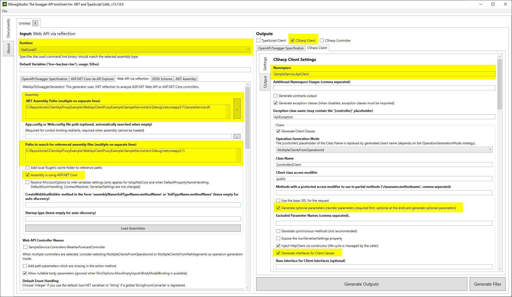

In the era of microservices and distributed systems, not only web browser applications written in `JavaScript` are the consumers of the `REST API`. Today, more and more often this type of communication is used to connect backend services too. Integrating two services using REST protocol doesn't require any form of sharable contract which makes the process extremely easy (more loosely decoupled) but it comes with own price. At the end of day we always need to write some set of classes which act as client proxy, and if there are more than one consumer of a given service we need to repeat that work in everyone of them. Another problem is with propagating information about changes in the API and adjusting all client to those changes. Taking account those disadvantage it's worth to consider publishing a client proxy alongside with the service itself, especially if it's possible to generate it automatically. There's a couple of existing projects on the market that allow to generate C# client from `OpenAPI` (`Swagger`) specification like:

- [swagger-codegen](https://swagger.io/tools/swagger-codegen/)
- [openapi-generator](https://github.com/OpenAPITools/openapi-generator)
- [NSwag](https://github.com/RicoSuter/NSwag). 

`swagger-codegen` and `openapi-generator` are Java based CLI tools, so they require `JVM` to run but they allows to generate Rest API clients in verity of programming languages. `NSwag` is built with dotnet but supports only `C#` and `TypeScript` clients generation. Anyway I decided to use `NSwag` because it was the easiest one to integrated with `MsBuild` and allows for generating client directly from WebAPI server assembly. Although there's a plenty of article about generating C# client using NSwag, it took me a whole day to put all necessary pieces together so I decided to write my own description for future reference.

## Project organization

- `SampleService` - this is AspCore WebAPI project providing REST endpoints
- `SampleService.ApiClient` - responsible for producing `dll` as well as `nuget package` with REST client based on the SampleService project's output assembly
- `SampleService.ComponentTest` - contains components test for SampleService using [in-memory test server](https://docs.microsoft.com/en-us/dotnet/api/microsoft.aspnetcore.testhost.testserver?view=aspnetcore-3.0). Tested API is always called via client generated by `SampleService.ApiClient` project


## Steps to configure automated client generation

### Prepare `nswag.json` manifest

`nswag.json` defines set of parameters required by NSwag for generating client code like input assembly and output file path as well as other different options allowing to adjust the shape of output code to our needs. The easiest way to generate this manifest file is to use Windows UI application called [NSwag Studio](https://github.com/RicoSuter/NSwag/wiki/NSwagStudio).
Here's the minimal configuration required to correctly generate C# client:



`Generate Outputs` button allows to preview the generated client source code. After achieving the desired output, we should save the current configuration as `nswag.json` file directly in `SampleService.ApiClient` project's directory - `NSwag` should automatically convert all paths (assembly and references) to the relative form.

### Configure build of ApiClient project

Having `nswag.json` manifest adjusted to our requirement we can configure automatic Api Client generation during the build. This can be easily achieved with [NSwag.MSBuild](https://github.com/RicoSuter/NSwag/wiki/NSwag.MSBuild) package and a little bit of of `MsBuild` scripting. Here's a content of `SampleService.ApiClient.csproj` file:

```xml
<Project Sdk="Microsoft.NET.Sdk">
  <PropertyGroup>
    <TargetFramework>netcoreapp3.1</TargetFramework>
    <!--Automatically generate nuget package with client library-->
    <GeneratePackageOnBuild>true</GeneratePackageOnBuild>
  </PropertyGroup>
  <ItemGroup>
    <!--Add required nuget packages necessary for ApiClient build-->
    <PackageReference Include="System.ComponentModel.Annotations" Version="4.7.0" />
    <PackageReference Include="Newtonsoft.Json" Version="12.0.3" />
    <PackageReference Include="NSwag.MSBuild" Version="13.7.0">
      <PrivateAssets>all</PrivateAssets>
      <IncludeAssets>runtime; build; native; contentfiles; analyzers; buildtransitive</IncludeAssets>
    </PackageReference>
  </ItemGroup>
  <ItemGroup>
    <!--Add build time reference to SampleService project-->
    <ProjectReference Include="..\SampleService\SampleService.csproj">
      <Private>False</Private>
      <ReferenceOutputAssembly>False</ReferenceOutputAssembly>
    </ProjectReference>
  </ItemGroup>
  <!--Add build step responsible for generating the source code of client api and including it to compilation-->
  <Target Name="GenerateApiClientSourceCode" BeforeTargets="CoreCompile;PrepareResource">
    <Exec Command="$(NSwagExe_Core31) run nswag.json /variables:Configuration=$(Configuration),Output=$(IntermediateOutputPath)\ApiClient.generated.cs" />
    <ItemGroup>
      <Compile Include="$(IntermediateOutputPath)\ApiClient.generated.cs" />
    </ItemGroup>
  </Target>
</Project>
```

In the `GenerateApiClientSourceCode` build target we are passing additional values with `/variables` parameter to NSwag CLI. Those values can be accessed in `nswag.json` manifest using `$()` notation as show on the following excerpt:

```json
{
  "runtime": "NetCore31",
  "defaultVariables": "Configuration=Debug,Output=./ApiClient.generated.cs",
  "documentGenerator": {
    "webApiToOpenApi": {
      "assemblyPaths": [
        "../SampleService/bin/$(Configuration)/netcoreapp3.1/SampleService.dll"
      ],
      "referencePaths": [
        "../SampleService/bin/$(Configuration)/netcoreapp3.1/"
      ],
    }
  },
  "codeGenerators": {
    "openApiToCSharpClient": {
      "output": "$(Output)"
    }
  }
}
```

Defaults can be defined with `"defaultVariables"` - this is very useful if we are going to edit this file in `NSwag Studio` in the future.

Since now, on every build, NSwag should generate automatically source code of API client which is later compiled into `SampleService.ClientApi.dll` library and packed as a nuget.

Here are the benefits of configuring automatic client generation in this way:

- Client code is continuously synchronized with the API.
- We can easily examine client source code because it's saved in `IntermediateOutputPath` (in most cases it's just `obj` directory)
- We can add an additional code which is using generated client api directly in the `SampleService.ApiClient` project. 

The last fact can be used for providing an implementation of partial methods defined in generated client class like: `UpdateJsonSerializerSettings`, `PrepareRequest` and `ProcessResponse`.
We can also extend generated client by inheritance or with an extension methods:

```cs
public static class WeatherForecastClientExtensions
{
    public static Task<ICollection<WeatherForecast>?> GetForTodayAsync(this IWeatherForecastClient client, CancellationToken cancellationToken = default) 
        => client.GetAsync(1, cancellationToken);
    
    public static Task<ICollection<WeatherForecast>?> GetForNextWeekAsync(this IWeatherForecastClient client, CancellationToken cancellationToken = default) 
        => client.GetAsync(7, cancellationToken);
}
```


## Summary 

Thanks to `NSwag` tooling we can very easily configure automatic WebAPI client generation. A basic setup presented in this blog post is available on my Github.