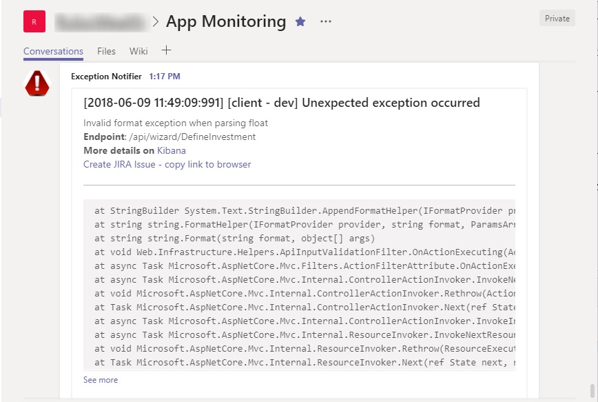

Over a year ago I heard for the first time about the `ELK stack`. Since then I've had an opportunity to help five teams to implements ELK as a part of their development process (one team is using it on production, the rest of them so far only in development environment). ELK stands for `ElasticSearch-Logstash-Kibana` and it's a set of services that helps to improve productivity in the area of logging, covering aspects of collecting, processing, storing and presenting log data. It is a very powerful tool because of its modular architecture. Each component is highly configurable and easy to extend, so it certainly allows you to make many productivity-boosting improvements in your development process. **If you are not using ELK (or any alternative) you should put it as the number one on your TODO list - especially if you are doing microservices.**. 

## Shorten the feedback loop

One of my ideas for increasing productivity of my team with ELK was to integrate it with `Microsoft Teams`. I wanted to shorten the feedback loop between error occurrence and diagnosis phase by notifying development team about the issue right after of the occurrence through the dedicated `Microsoft Teams Channel`. The recipe for this improvement is quite simple: `Microsoft Teams` can receive notification via webhook (I wrote a dedicated blog post about  [using webhooks to send notifications to MS Teams](/post/integrating-teamcity-with-msteams/)) and `Logstash` -  which is responsible for processing logs - ships with [http output plugin](https://www.elastic.co/guide/en/logstash/current/plugins-outputs-http.html) that allows sending data through HTTP protocol. The complete solution can be implemented in only two steps:

1. Acquire the MS Teams channel webhook URL ([detailed description here](https://docs.microsoft.com/en-us/microsoftteams/platform/concepts/connectors#setting-up-a-custom-incoming-webhook))
2. Add HTTP output plugin configuration to your Logstash config file. 

A sufficient Logstash HTTP plugin configuration for sending messages to MS Teams can look as follows:

```
output { 
   if ([level] == "ERROR"){
      http {
        url => "MSTEAMS_CHANNEL_WEBHOOK_URL"
        http_method => "post"
        content_type => "application/json"
        format => "json"
        mapping => [ "title", "MESSAGE_TITLE", "text", 'MESSAGE_DETAILS' ]
      }
  }
}
```
The `level` attribute contains information about log entry level (DEBUG, INFO, ERROR etc). From now on, every time Logstash processes error log entry, it will send a message to MS Teams.

## Notification shape

The notification sent to MS Teams channel should contain as much information as needed for fast diagnosis of the issue. In my implementation I used the following attributes:

- Precise date of the error occurence
- Application name (our system consists of two web applications)
- Environment name (we have a few testing environments for different purposes)
- Invoked Rest API endpoint URL
- Stacktrace 
- Link to Kibana filter for all entries from this API invocation (I filter by app, environment and request id)
- A link that helps to create JIRA issue

MS Teams accepts messages containing HTML and markdown, so you can format the message appropriately. A sample message looks as follows:




### Creating Kibana filter link
Adding a Kibana link filtering entry logs related to given issue is quite easy. In the first step, you have to go to Kibana `Discovery` tab and create a filter that presents data from given request: select appropriate index, select fields to present and add the filter by requestId (I assume that your logs contain some kind of id that correlates entries from given request together). Every time you change filter parameters Kibana updates browser URL to reflect those settings. Now copy the browser URL and parametrize it by replacing hardcoded request id with `%{requestId}` placeholder. If the filter link is too long and bloats the message, you can extract it to a separate field with `mutate filter` and use it as a reference in the message sent to MS Teams. This trick helped me to improve readability and maintainability of Logstash configuration.

```
filter {
    if [level] =="ERROR"{
       mutate {
          add_field => { 
              "filterUrl" => "http://kibana.elk.mydomain.com:5601/app/kibana#/discover/4cc251b0-0d9d-11e8-83b5-4d431ddda270?_g=()&_a=(columns:!(logger,level,logmessage,app_name,app_env),filters:!(('$state':(store:appState),meta:(alias:!n,disabled:!f,index:'8a4dc130-42dc-11e8-83b5-4d431ddda270',key:app_env,negate:!f,params:(query:%{app_env},type:phrase),type:phrase,value:%{app_env}),query:(match:(app_env:(query:%{app_env},type:phrase)))),('$state':(store:appState),meta:(alias:!n,disabled:!f,index:'8a4dc130-42dc-11e8-83b5-4d431ddda270',key:app_name,negate:!f,params:(query:%{app_name},type:phrase),type:phrase,value:%{app_name}),query:(match:(app_name:(query:%{app_name},type:phrase))))),index:'8a4dc130-42dc-11e8-83b5-4d431ddda270',interval:auto,query:(language:lucene,query:'requestId:%{requestId}'),sort:!('@timestamp',desc))"
          }
        }
    }
  } 
}

output {   
  if ([level] == "ERROR"){
      http {
        url => "MSTEAMS_CHANNEL_WEBHOOK_URL"
        http_method => "post"
        content_type => "application/json"
        format => "json"
        mapping => [ "title", "[%{timestamp}][%{app_name} - %{app_env}] Unexpected exception occurred", "text", '%{logmessage}<br/><strong>Endpoint: </strong> %{requestUrl}</br><strong>More details on</strong> <a href="%{filterUrl}">Kibana</a><br /><hr/><pre>%{exception}</pre>' ]
      }
  }
}
```

Those Kibana filter links are very useful but have one flaw. By default, Kibana shows entries from the last 15-minute time period, so when somebody opens the link after 15 minutes - he gets nothing. There are two solutions: inform your team members that they need to pay attention to time filter; or add the time-related attribute to your link and parametrize it. So far I've stayed with the first solution.

### Create JIRA issue link

I've also wanted to simplify the process of creating JIRA issue based on the data from the error notification. JIRA allows automating issue creation with REST API or by the special direct link.
Unfortunately, I wasn't able to embed the link that send POST request to JIRA API in MS Teams message (as far as I know, it is possible with [actionable message card](https://docs.microsoft.com/en-us/outlook/actionable-messages/actionable-messages-via-connectors) but there is a limitation of the Logstash HTTP plugin [issue#4](https://github.com/logstash-plugins/logstash-output-http/issues/4) that prevents to create nested arrays inside JSON message). I choose the [JIRA direct link](https://confluence.atlassian.com/jirakb/creating-issues-via-direct-html-links-159474.html) which should be in the following format:

```
https://jira.mydomain.com/secure/CreateIssueDetails!init.jspa?pid={PROJECT_ID}&issuetype={ISSUE_TYPE_ID}&summary={ERROR_MESSAGE}&description={STACKTRACE}
```

Values of *PROJECT_ID* and *ISSUE_TYPE_ID* can be retrieved through JIRA REST API by sending GET request to the following endpoint (replace XXX with the project key - the prefix of issue key from given project)

```plaintext
https://jira.mydomain.com/rest/api/2/project/XXXX
```

Now you can compose JIRA issue creation link in Logstash analogously as Kibana filter link.

Unfortunately, this solution is not perfect. It's not possible to create subtasks and the size of the information that can be attached is limited. On top of that, MS Teams has a problem with long hyperlinks in messages - they stop being clickable. The simple workaround was to add information that you have to copy this link ;) 

### Too much notifications

After connecting Logstash with MS Teams I observed I was getting too many notifications, to the point I stopped paying attention. This whole solution seemed useless. Having analyzed it again though, I discovered that only a subset of events was valuable. To deal with that I made a few optimizations.

The first step I took was introducing a new category for log entry - `FATAL`. So far we were using only INFO, DEBUG and ERROR levels. The ERROR entries contained information about an invalid situation which was foreseen and handled in the code as well as truly unexpected. I wanted to get notifications only about the scenarios which weren't handled and could cause inappropriate or unexpected behavior of our system. Extracting `FATAL` category for truly unexpected exceptions allowed me to filter out a lot of noise. **So now handled exceptions are logged with ERROR level and the unexpected one with FATAL.**

```
output { 
   if ([level] == "FATAL"){
      http {
        url => "MSTEAMS_CHANNEL_WEBHOOK_URL"
        http_method => "post"
        content_type => "application/json"
        format => "json"
        mapping => [ "title", "MESSAGE_TITLE", "text", 'MESSAGE_DETAILS' ]
      }
  }
}
```

The second optimization was introducing a throttling. If the same error occurs multiple times in given time window we want to get notification only once. This is possible with Logstash throttle plugin. In the following configuration I'm using throttle plugin to mark the first message in the 60s time frame, uniquely identified by "%{app_name}%{app_env}%{logmessage}%{exception}" key, with "throttled" tag. Afterwards, in the output section, I filter only messages containing "throttled" tag (the rest is ignored by HTTP plugin)


```
filter {  
    if [level] =="FATAL"{
        throttle{
          period => 60
          max_age => 120
          before_count => -1
          after_count => 1
          key => "%{app_name}%{app_env}%{logmessage}%{exception}"
          add_tag => "throttled"
      }
    }
  } 
}

output { 
   if ([level] == "FATAL")  and ("throttled" not in [tags]){
      http {
        url => "MSTEAMS_CHANNEL_WEBHOOK_URL"
        http_method => "post"
        content_type => "application/json"
        format => "json"
        mapping => [ "title", "MESSAGE_TITLE", "text", 'MESSAGE_DETAILS' ]
      }
  }
}
```


## Summary
Thanks to modularity and rich set of plugins ELK gives a lot of possibilities. As you can see it was quite easy to build Logstash-MsTeams integration. It enabled faster responding for app errors and detecting bugs which could normally remain unnoticed for a long period. I wonder if you have any other ideas - implemented already or not - for utilizing ELK which can help to improve productivity? I would appreciate if you could share them in the comment section.