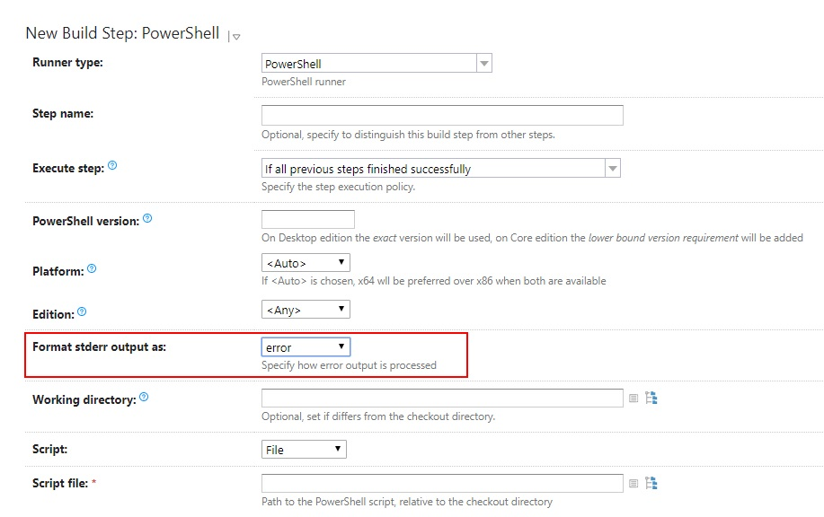
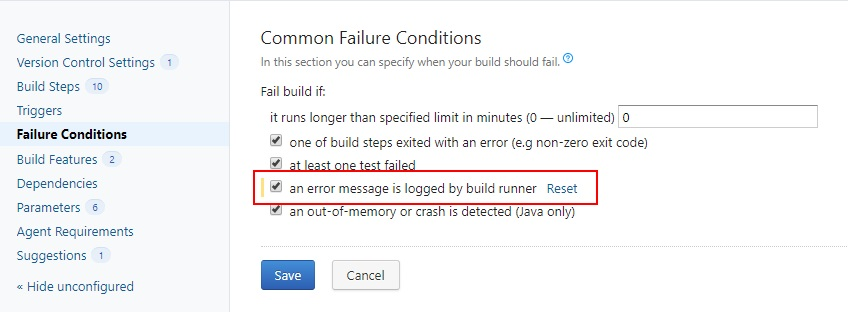

In the last few projects that I've attended, I was deeply involved in continuous integration. What I mean is that I was either fully in charge of setting up, configuring and maintaining CI or I was a consultant, helping other teams to deal with different problems related to this subject. All projects have been using TeamCity as a platform for continuous integration. It has a lot of predefined jobs that facilitate most common activities necessary to build pipelines, as well as rich UI that helps to easily configure it and examine pipeline results. For the more complicated and non-standard activities, I've been using `PowerShell` scripts. TeamCity has really good support for running `PowerShell` thanks to dedicated build step. However, it can cause some troubles if it's not configured correctly. After coming across the same mistakes and issues over and over again, I finally decided to write this article that shows how to use `PowerShell` properly, together with `TeamCity`. I hope you will find it useful.


## Proper error handling

The most common problem is that TeamCity disallows Powershell errors, at least with the default configuration. Event if PowerShell script fails, it's still considered as successful by TeamCity. This can have a serious ramification because the errors can occur unnoticed for months and can cost you a lot when you finally spot them. This is caused by default setting for `Format stderr output as` in PowerShell build step template, which is set to `warning`.  In order to propagate PowerShell errors to the TeamCity UI (mark the build step as failed), this should be set to `error` as the following screenshot shows.



However, after changing `Format stderr output as` option we can still observe the strange effect that can be a kind of surprise: event if the PowerShell build failed, the whole pipeline is reported as successful. To fix that and make it work according to the expectations, we need to adjust the build `Failure Conditions` by checking `an error message is logged by build runner` option as follows: 




Since now all PowerShell errors will be properly reported and will affect build status. Besides these two configuration options in TeamCity, there is one more thing related to the PowerShell errors to keep in mind - PowerShell error model. Powershell errors can be dived into two categories: terminating (mostly syntax errors) and non-terminating. The latter is not obvious and causes a lot of troubles for people without strong PowerShell foundations. Even if the `non-terminating` error occurs, the script execution is continued. This effect can be highly unwanted for scripts performing interlinked operations dependent on each other. Of course, we can change this behavior and turn all 'non-terminating' errors into 'terminating' ones by setting `$ErrorActionPreference` variable at the begging of our scripts:

```powershell
#Error Action Preference:
#
#PowerShell halts execution on terminating errors, as mentioned before. For non-terminating errors we have the option to tell PowerShell how to handle these situations. 
#This is where the error action preference comes in. Error Action Preference allows us to specify the desired behavior for a non-terminating error; it can be scoped at the command level or all the way up to the script level.
#
#Available choices for error action preference:
#
# SilentlyContinue – error messages are suppressed and execution continues.
# Stop – forces execution to stop, behaving like a terminating error.
# Continue - the default option. Errors will display and execution will continue.
# Inquire – prompt the user for input to see if we should proceed.
# Ignore – (new in v3) – the error is ignored and not logged to the error stream. Has very restricted usage scenarios.
# Example: Set the preference at the script scope to Stop, place the following near the top of the script file:
$ErrorActionPreference = "Stop"
```

This can also be configured for each CmdLet separately without the need to setup it globally. You can read more about CmdLet common parameters [here](https://docs.microsoft.com/en-us/powershell/module/microsoft.powershell.core/about/about_commonparameters?view=powershell-6)

## Protect yourself from accidental errors

Besides the error handling, it's good to write your scripts in a manner that protects you from accidental errors that can be very hard to detect. At first, you should turn all your functions into real `Cmdlets`. In order to do that, you should always define parameters with `param()` block and decorate it with `[CmdletBinding()]` parameter:

```powershell
function Verb-Noun {
    [CmdletBinding()]
    param (
     #parameters go here   
    )    
}
```

`[CmdletBinding()]` parameter protects your methods from invoking them with an undefined parameter. Every time when somebody uses undefined (or deleted) parameter or makes a typo in parameter name, this fact will be reported as PowerShell error.  If the method is not CmdLet the parameter names are not validated, making the problem hard to detect.

We can also detect potential errors caused by violation of best practices and coding rules by enabling strict mode. In order to do that, add the following code at the beginning of your script:

```powershell
Set-StrictMode -Version Latest
```

After turning on strict mode, PowerShell will report all uninitialized variables and properties with terminating error. You can read about all consequences of using strict mode [here](https://docs.microsoft.com/en-us/powershell/module/microsoft.powershell.core/set-strictmode?view=powershell-6)


And here's one more advice that should help you avoid dummy mistakes: 

> Always use a decent IDE to create and edit your PowerShell scripts. 

I'm currently working in VSCode with PowerShell plugin which seems to be more powerful than `PowerShell ISE`. It ships with a rich set of snippets, it is able to detect unused variables, allows to track method usages and provides a really nice experience in terms of debugging scripts. It also has integrated `PSScriptAnalyzer` module which helps to detect many issues related to the code correctness and quality. You can read about all features [here](https://code.visualstudio.com/docs/languages/powershell).


## Using scrips

The TeamCity PowerShell build step allows to run PowerShell scripts provided as inline source code as well as script files. For project specific scripts you should always use script file options. This allows you to keep your script under version control system together with the project source code and make it easier to edit your scripts (any IDE is better than textarea on the build configuration step page). Of course, you can keep your 'inline-scripts' versioned when you are using [Versioned settings](https://confluence.jetbrains.com/display/TCD10/Storing+Project+Settings+in+Version+Control) but it's very tedious to edit PowerShell scripts embedded inside the `XML files`.

For project non-specific scripts, when you want to re-use scripts between different projects, you have at least two options:

- put common scripts in a separate repository and share them via git sub-modules
- use an inline script and extract common meta-runner

The second option allows you to create a nice configuration UI for your scripts. However, versioning will be not possible anymore (as far as I know). You can find an example how to create meta-runner in my [previous article](/post/integrating-teamcity-with-msteams/).


## Always remember about Clean Code

You should always treat your CI/CD scripts equally as your project source code in terms of quality. __They should be versioned, reviewed and automatically tested__. It doesn't matter that these scripts are not run on production. They are helping you to properly prepare production artifacts and if they are of poor quality, you cannot expect good quality outcomes. Even if the code is written using scripting language - you should always remember about obeying [Clean Code](https://www.amazon.com/Clean-Code-Handbook-Software-Craftsmanship-ebook/dp/B001GSTOAM) rules. For PowerShell, there is a really good [Best Practices and Style Guide](https://github.com/PoshCode/PowerShellPracticeAndStyle) which you can find as an invaluable source of knowledge how to create scripts that are easy to read, understand and maintain. That may be surprising for some people, but CI/CD scripts can be unit-tested. PowerShell has its own unit test framework - [Pester](https://github.com/pester/Pester) which is very well supported by [VSCode](https://code.visualstudio.com/docs/languages/powershell#_pester). Pester helps to quickly create tests with `BDD` approach which can also serve as living documentation. By applying these rules, you will avoid a lot of problems and you will make your CI/CD more bulletproof.

## Summary

Together with TeamCity and PowerSHell you can build very powerful and flexible CI/CD system but without understanding basic concepts and mechanisms you can't obtain maximum benefits. Default configuration can be a trap, especially in terms of error handling and reporting. Besides the proper configuration there are additional tools and guidelines for PowerShell that you can leverage in order to make your process highly maintainable and less error-prone. Using decent IDE and applying programming rules and best practices for script development can save you a lot of troubles.