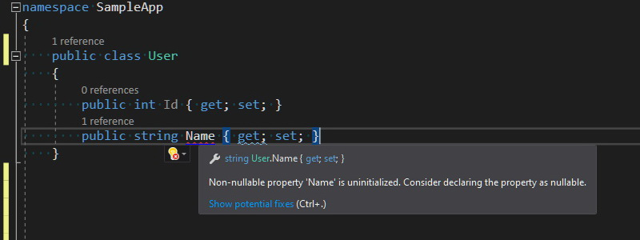
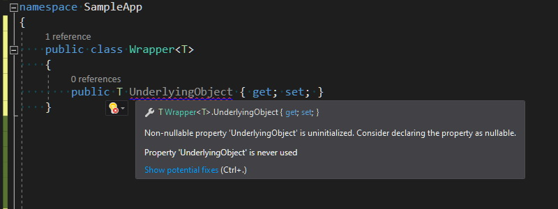
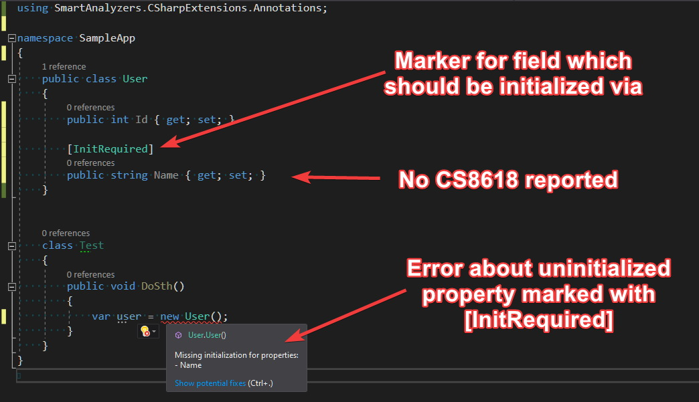
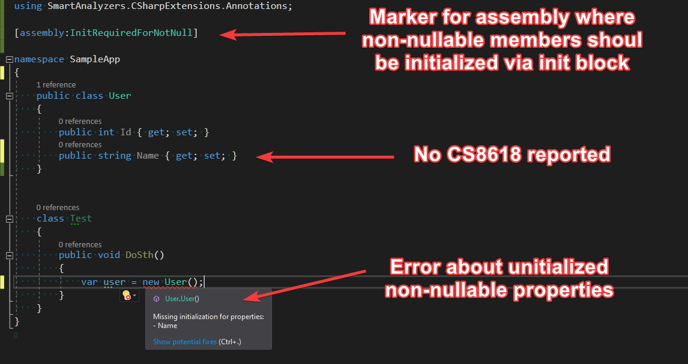
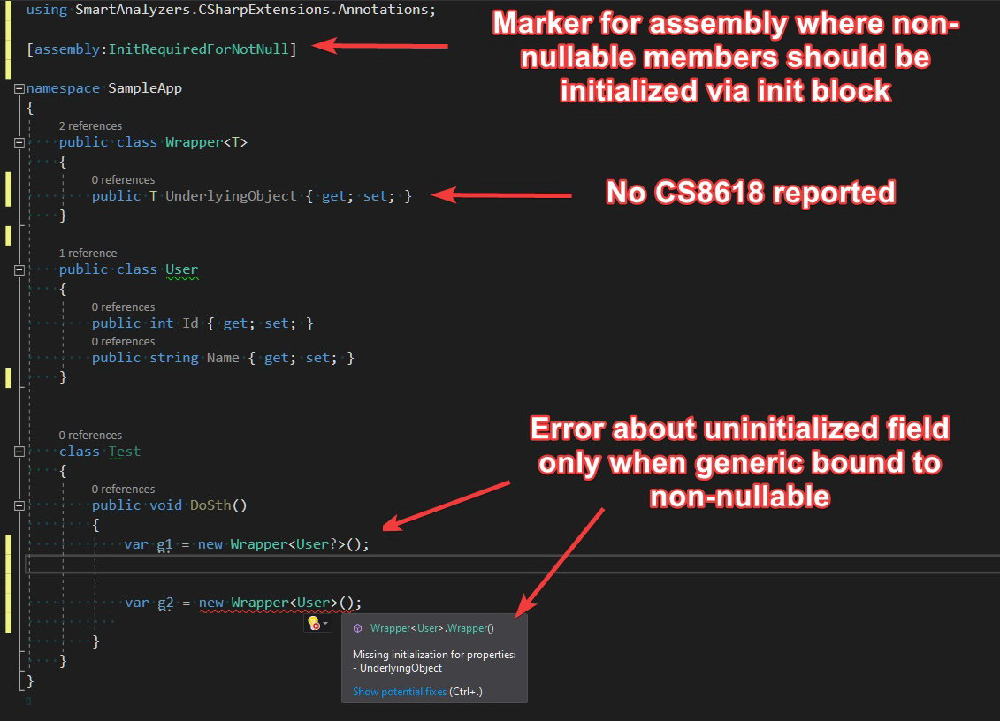

A few weeks ago I started using [non-nullable reference types](/post/non-nullable-references-in-dotnet-core/) - a new C# language feature which was shipped with version 8.0. It wasn't a completely new experience for me, because I was working before on projects that were heavily utilizing `[NotNull]` and `[CanBeNull]` [Resharper annotations](http://localhost:1313/post/hunt-your-bugs-design-time/). The way how non-nullable types are handled by Roslyn seems to be a little more complex in comparison to Resharper - there are around [40 different diagnostics](https://gist.github.com/cezarypiatek/f56c671c6f634aab285a88095488c1de) related to this area. This large amount of inspections is good because it very often brings your attention to the edge cases that you would probably overlook, but on the other hand, it sometimes makes the development more tedious. The project on which I'm working is a greenfield, so I enabled the `not-nullable` feature on the whole solution scope and set the severity level for all of those rules to `error`. After a couple of days working with such setup, I got the feeling that I needed to put in much more effort than I was getting out of it.


## Problems with non-nullable reference types

The main thing that started getting on my nerves was diagnostic `CS8618: Non-nullable field is uninitialized. Consider declaring as nullable.` This rule enforces on us mandatory field initialization to guarantee non-nullable value, which can be satisfied by providing the value directly in the field definition or through the containing type's constructor. In most cases, when there are no constraints to guard beside the nullability check, adding such constructor introduces unnecessary complexity to our codebase, especially for large POCO types.



The situation is especially confusing for generic types because `CS8618` is reported for generic fields too, even when there is no constraint that suggests the generic type parameter is a reference type.



There is a way to dismiss this diagnostic by initializing the field with `null!` for reference types and `default!` for generics:


But this is rather a dirty hack that hides the real problem instead of solving it. If we want to go that way, then we might as well completely disable `CS8618`, for example with the following entry in `.editorconfig`:

```editorconfig
[*.cs]

# CS8618: Non-nullable field is uninitialized. Consider declaring as nullable.
dotnet_diagnostic.CS8618.severity = none
```


## Proposition of improvements

Recently, I've been experimenting with Roslyn analyzer that could enforce mandatory initialization via initialization block for members decorated with special attributes. I've come up with two attributes `[InitRequired]` and `[InitOnly]` - you can read about them in my previous blog post [Immutable types in C# with Roslyn](/post/immutable-types-with-roslyn/). Those attributes basically move the responsibility for field initialization from class creator to class users. Everyone who wants to create a new class instance, is obligated to provide values for all non-nullable reference fields via initialization block. However, using those attributes solves the problem only partially because the compiler still keeps reporting `CS8618` diagnostic. To solve that issue, I implemented a dedicated [DiagnosticSuppressor](https://docs.microsoft.com/en-us/dotnet/api/microsoft.codeanalysis.diagnostics.diagnosticsuppressor?view=roslyn-dotnet) which discards `CS8618` for fields and properties marked with those properties. 



If we want to use that approach through the entire codebase, adding an additional attribute to every non-nullable reference field could result in unnecessary noise. It seemed to be an imperfect solution, so I decided to take it on the next level and I introduced `[InitRequiredForNotNull]` attribute. Applying this attribute on the assembly level results with required initialization via init block for all non-nullable reference fields and properties and automatic discard of `CS8618` for all those members.



This solution works pretty well also with generics because it enforces mandatory initialization only when the generic parameter is bound to non-nullable reference type:




> **Important:** If you like the idea of `[InitRequiredForNotNull]` attribute and you are going to use it in your project, please make sure that all your teammates know about it.


## Summary

All attributes and analyzers described here are available as a single Nuget package [SmartAnalyzers.CSharpExtensions.Annotations](https://www.nuget.org/packages/SmartAnalyzers.CSharpExtensions.Annotations/). The source code is published on `Github` under [CSharpExtensions](https://github.com/cezarypiatek/CSharpExtensions) project. Please let me know what you think about those extensions to C# language and if you encounter any problems with using it, feel free to report an issue on Github page.