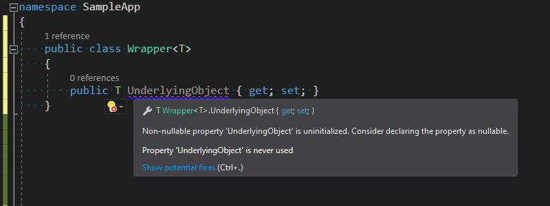

A few weeks ago I've started using [non-nullable reference types](/post/non-nullable-references-in-dotnet-core/) - a new C# language feature which was shipped with version 8.0. It wasn't a completely new experience for me, because I was working before on projects that were heavily utilizing `[NotNull]` and `[CanBeNull]` [Resharper annotations](http://localhost:1313/post/hunt-your-bugs-design-time/). The way how non-nullable types are handled by the Roslyn seems to be a little more complex contrary to the Resharper - there's around [40 different diagnostics](https://gist.github.com/cezarypiatek/f56c671c6f634aab285a88095488c1de) related to this area. This large amount of inspections is good because it very often brings your attention to the edge cases that you would probably overlook, but on the other hand it makes the development sometimes more tedious. The project on which I'm working is a greenfield so I enabled `not-nullable` feature on the whole solution scope and set the severity level for all of those rules to `error`. After a couple days working with such setup, I got the feeling that I need to put much more effort than I get the return.


## Problems with non-nullable reference types

The main thing that started getting on my nerves was diagnostic `CS8618: Non-nullable field is uninitialized. Consider declaring as nullable.` This rule enforces on us mandatory field initialization to guarantee non-nullable value, which can be satisfied by providing the value directly in the field definition or through the containing type's constructor. In most cases, when there is no constrains to guard besides the nullability check, adding such constructor introduce unnecessary complexity to our codebase, especially for large POCO types.


The situation is especially confusing for generic types, because `CS8618` is reported for generic fields too, even when there is no constraint that suggests the generic type parameter is a reference type.



There is a way to dismiss this diagnostic by initializing the field with `null!` for reference types and `default!` for generics:


But this is rather a dirty hack that hides the real problem instead of solving it. If we want to go that way then we might as well completely disable `CS8618`, for example with the following entry in `.editorconfig`:

```editorconfig
[*.cs]

# CS8618: Non-nullable field is uninitialized. Consider declaring as nullable.
dotnet_diagnostic.CS8618.severity = none
```

## Proposition of improvements