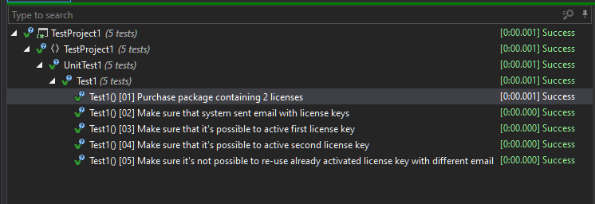
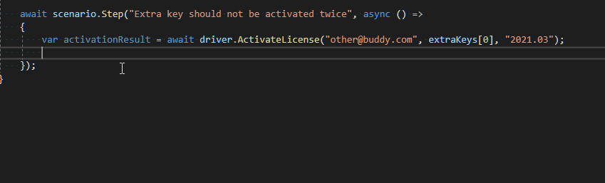

For the last year, I've had an opportunity to work quite a lot with `Component Tests` for microservices built with ASP.NET Core. The vocabulary related to testing is very vague and terms like `Unit`, `Component`, and `Integration` tests can be interpreted differently based on the context, so let me explain first what I mean by `Component Tests`. It's a kind of test that treats your whole service as a black box. You can communicate with your system during the tests only through the publicly available interfaces (REST API, GRPC, Messaging, etc.). You are also not allowed to mock anything besides the external dependencies. Those external dependencies can be mocked by replacing the real component with an in-memory counterpart inside the `DI container`. However, the preferred approach is to keep the communication through the actual interfaces and use mocking components that can operate outside the service runtime boundaries (for example for REST dependencies you can use [WireMock.Net](https://github.com/WireMock-Net/WireMock.Net)). Thanks to the limited application of mocks you have more freedom during the refactorings, as well as you gain a higher level of confidence during the deployments. Besides those technicalities, there's one more important thing about the Component tests that I really would like to emphasize here. Scenarios for Component Test should be written from the business perspective, they should express the business expectations and confirm that those expectations are met. They should represent realistic and valid business use cases. Scenarios of Component Tests are quite often more complex than the unit test scenarios so it's very important to keep the test script concise, clear, and readable. Approaches like [driver patter](https://github.com/grzesiek-galezowski/driver-pattern-demo/tree/main/DriverInFunctionalHttpApiTests) can definitely help with that, but from my experience, no matter how clear and expressive your test helpers are, your might have a problem with understanding the test script when you get back to it after a while.


## Annotations with comments
In the "classical unit tests" developers quite often use `Arrange/Act/Assert` or `Given/When/Then` comments to annotate the main parts of the test method script. It's quite good practice that improves the readability of the tests and helps the developers that are new to the project (and authors themselves, after a given period) to figure out what's going on. However, the test case scenarios in component tests tend to be more complex. The `Arrange` section could be more robust as there is a need to prepare more prerequisites and there might be more than one pair of `Act` and `Assert` sections. With such complexity, those simple notations don't fit anymore.

Let's take a look at a test case scenario for a system responsible for purchasing software licenses:

```cs
[Test]
public async Task should_handle_product_with_double_personal_license()
{
    // Arrange
    using var driver = await LicenseServerTestDriver.Create();
    var buyerEmail = "john@doe.com";
    var buddyEmail = "jane@doe.com";

    // Act
    await driver.RegisterPurchase(email: buyerEmail, product: "Personal license for MappingGenerator x2 Pack");

    // Assert
    var email = driver.TakeEmail();
    Assert.AreEqual(2, email.LicenseKeys.Length);
    Assert.AreEqual(buyerEmail, email.To);
    
    // Act
    var activationResult = await driver.ActivateLicense(email: buyerEmail, key: LicenseKeys[0]);
    // Assert
    Assert.AreEqual(true, activationResult.Activated);

    // Act
    var activationResult = await driver.ActivateLicense(email: buddyEmail, key: LicenseKeys[1]);    
    // Assert
    Assert.AreEqual(true, activationResult.Activated);

    // Act
    var activationResult = await driver.ActivateLicense(email: "other@buddy.com", key: LicenseKeys[0])
    // Assert
    Assert.AreEqual(false, activationResult.Activated);
}
```

As you can see, the scenario is quite complex. There are multiple Act and Assert sections and at the first glance, it's not clear what's going on. When I first came across this problem, I started using an improved notation with `STEP:` markers:

```cs
[Test]
public async Task should_handle_product_with_double_personal_license()
{
    using var driver = await LicenseServerTestDriver.Create();
    var buyerEmail = "john@doe.com";
    var buddyEmail = "jane@doe.com";    

    // STEP: Purchase package containing 2 licenses
    await driver.RegisterPurchase(email: "john@doe.com", product: "Personal license for MappingGenerator x2 Pack");

    // STEP: Make sure that system sent email with license keys
    var purchaseConfirmationEmail = driver.TakeLastEmail();
    Assert.AreEqual(2, purchaseConfirmationEmail.LicenseKeys.Length);
    Assert.AreEqual(buyerEmail, purchaseConfirmationEmail.To);
    
    // STEP: Make sure that it's possible to activate first license key
    var firstActivationResult = await driver.ActivateLicense(buyerEmail, purchaseConfirmationEmail.LicenseKeys[0]);
    Assert.AreEqual(true, firstActivationResult.Activated);

    // STEP: Make sure that it's possible to activate second license key
    var secondActivationResult = await driver.ActivateLicense(buddyEmail, purchaseConfirmationEmail.LicenseKeys[1]);    
    Assert.AreEqual(true, secondActivationResult.Activated);

    // STEP: Make sure it's not possible to re-use already activated license key with different email
    var thirdActivationResult = await driver.ActivateLicense("other@buddy.com", purchaseConfirmationEmail.LicenseKeys[0])
    Assert.AreEqual(false, thirdActivationResult.Activated);
}
```

Now we can easily figure out what the test is about, without even reading the actual code responsible for performing given steps. However, we might still struggle while investigating failed tests - it might not be obvious immediately which part failed, especially when we have quite cryptic assertion messages like `Expected true but was false`(yes, I know it can be partially addressed with assertion libraries like `FluentAssertion` or `Shouldy` but it's not the point here).


## xBehave.net
The next step on the way to solve the test readability issue was to introduce some kind of programmatic helpers for enforcing steps annotations. I came across an existing library called [xBehave.net](https://github.com/adamralph/xbehave.net) that tries to address this issue. Using the `xBehave.met`, our test can look as follows:


```cs
[Scenario]
public void should_handle_product_with_double_personal_license()
{
    var scenario = TestScenarioFactory.Default();
    using var driver = await LicenseServerTestDriver.Create();

    var buyerEmail = "john@doe.com";
    var buddyEmail = "jane@doe.com";
    
    "Purchase package containing 2 licenses".x(async () => 
    {
        await driver.RegisterPurchase(email: buyerEmail, product: "Personal license for MappingGenerator x2 Pack");
    });
    
    string[] licenseKeys;
    "Make sure that system sent email with license keys".x(async () => 
    {
        var email = driver.TakeLastEmail();
        Assert.AreEqual(2, email.LicenseKeys.Length);
        Assert.AreEqual(buyerEmail, email.To);
        licenseKeys = email.LicenseKeys;
    });
    
    "Make sure that it's possible to activate first license key".x(async () => 
    {
        var firstActivationResult = await driver.ActivateLicense(buyerEmail, licenseKeys[0]);
        Assert.AreEqual(true, firstActivationResult.Activated);
    });    

    "Make sure that it's possible to activate second license key".x(async () => 
    {
        var secondActivationResult = await driver.ActivateLicense(buddyEmail, licenseKeys[1]);    
        Assert.AreEqual(true, secondActivationResult.Activated);
    });
    
    "Make sure it's not possible to re-use already activated license key with different email".x(async () => 
    {
        var thirdActivationResult = await driver.ActivateLicense("other@buddy.com", licenseKeys[0])
        Assert.AreEqual(false, thirdActivationResult.Activated);
    });
}
```
(Careful readers might notice that asynchronous steps are not awaited. It's not a mistake here, this is how this library works.)

After running this test we can get a nice output in the test runner:



However, there are some downsides of the `xBahave.net` library:

- It's a `XUnit` plugin so its application is limited only to `xUnit` tests.
- The `x` extension method is quite cryptic and might confuse developers who are not familiar with the library at first countermen.
- There is no option to return anything from inside of the step which forces us to split declaration and definition resulting in a more cluttered code (sometimes there's a need to re-use data between steps).
- The project's Github repository is an archive and the most recent NuGet package with the library is marked as deprecated.

## NScenario

These limitations of `xBahave.net` are not acceptable for me. I really like the main idea though, so I decided to create my own alternative that is test framework independent. I called my solution `NScenario` and the source code is available on Github [cezarypiatek/NScenario](https://github.com/cezarypiatek/NScenario). With the `NScenario` our test case scenario can be written in the following way:

```cs
[Test]
public async Task should_handle_product_with_double_personal_license()
{
    var scenario = TestScenarioFactory.Default();
    using var driver = await LicenseServerTestDriver.Create();

    var buyerEmail = "john@doe.com";
    var buddyEmail = "jane@doe.com";

    await scenario.Step("Purchase package containing 2 licenses", async () => 
    {
        await driver.RegisterPurchase(email: buyerEmail, product: "Personal license for MappingGenerator x2 Pack");
    });
    
    var licenseKeys = await scenario.Step("Make sure that system sent email with license keys", () => 
    {
        var email = driver.TakeLastEmail();
        Assert.AreEqual(2, email.LicenseKeys.Length);
        Assert.AreEqual(buyerEmail, email.To);
        return email.LicenseKeys;
    });
    
    await scenario.Step("Make sure that it's possible to activate first license key", async () => 
    {
        var firstActivationResult = await driver.ActivateLicense(buyerEmail, licenseKeys[0]);
        Assert.AreEqual(true, firstActivationResult.Activated);
    });    

    await scenario.Step("Make sure that it's possible to activate second license key", async () =>
    {
        var secondActivationResult = await driver.ActivateLicense(buddyEmail, licenseKeys[1]);    
        Assert.AreEqual(true, secondActivationResult.Activated);
    });
    
    await scenario.Step("Make sure it's not possible to re-use already activated license key with different email", async () => 
    {
        var thirdActivationResult = await driver.ActivateLicense("other@buddy.com", licenseKeys[0])
        Assert.AreEqual(false, thirdActivationResult.Activated);
    });
}
```

It's also possible to create nested steps if necessary:

```cs
[Test]
public async Task should_handle_product_with_double_personal_license()
{
    var scenario = TestScenarioFactory.Default();
    using var driver = await LicenseServerTestDriver.Create();

    var buyerEmail = "john@doe.com";
    var buddyEmail = "jane@doe.com";

    await scenario.Step("Purchase package containing 2 licenses", async () => 
    {
        await driver.RegisterPurchase(email: buyerEmail, product: "Personal license for MappingGenerator x2 Pack");
    });
    
    var licenseKeys = await scenario.Step("Make sure that system sent email with license keys", () => 
    {
        var email = driver.TakeLastEmail();
        Assert.AreEqual(2, email.LicenseKeys.Length);
        Assert.AreEqual(buyerEmail, email.To);
        return email.LicenseKeys;
    });
    
    await scenario.Step("Make sure that it's possible to activate first license key", async () => 
    {   
        var activationResult = scenario.Step("Try to activate the license key", () => 
        {
            await driver.ActivateLicense(buyerEmail, licenseKeys[0])
        });
        
        await scenario.Step("Confirm that license activated successfully", () => 
        {
            Assert.AreEqual(true, activationResult.Activated);
        });
    });    

    await scenario.Step("Make sure that it's possible to activate second license key", async () => 
    {        
        var activationResult = scenario.Step("Try to activate the license key", ()=> 
        {
            await driver.ActivateLicense(buddyEmail, licenseKeys[1])
        });
        
        await scenario.Step("Confirm that license activated successfully", () => 
        {
            Assert.AreEqual(true, activationResult.Activated);
        });
    });
    
    await scenario.Step("Make sure it's not possible to re-use already activated license key with different email", async () =>
    {        
        var activationResult = scenario.Step("Try to activate the already used license key for somebody else", () => 
        {
            await driver.ActivateLicense("other@buddy.com", licenseKeys[0])
        });      
        
        await scenario.Step("Ensure that activation request was rejected", () => 
        {
            Assert.AreEqual(false, activationResult.Activated);
        });
    });
}
```

After running that test we get the following output in console:

```text
SCENARIO: should handle product with double personal license

STEP 1: Purchase package containing 2 licenses
STEP 2: Make sure that system sent email with license keys
STEP 3: Make sure that it's possible to activate first license key
	STEP 3.1: Try to activate the license key
	STEP 3.2: Confirm that license activated successfully
STEP 4: Make sure that it's possible to activate second license key
	STEP 4.1: Try to activate the license key
	STEP 4.2: Confirm that license activated successfully
STEP 5: Make sure it's not possible to re-use already activated license key with different email
	STEP 5.1: Try to activate the already used license key for somebody else
	STEP 5.2: Ensure that activation request was rejected
```

This kind of test scenario transcription has the following benefits:

- You can quickly understand what the scenario is about.
- You can easily validate the meaningfulness of the scenario. In case of any doubts, you can send the transcription to another developer or QA with a request for review/validation.
- When the test fails, you can trace the part that was broken much faster.


## Test Driven Development

With `NScenario` it's quite easy to do the classical TDD. You can start your work by writing a scenario sketch:

```cs
[Test]
public async Task should_handle_product_with_double_personal_license()
{
    var scenario = TestScenarioFactory.Default();

    await scenario.Step("Purchase package containing 2 licenses", async () => 
    {
        // TODO
    });
    
    await scenario.Step("Make sure that system sent email with license keys", () => 
    {
       // TODO
    });
    
    await scenario.Step("Make sure that it's possible to activate first license key", async () => 
    {   
        var activationResult = scenario.Step("Try to activate the license key", () => 
        {
           // TODO
        });
        
        await scenario.Step("Confirm that license activated successfully", () => 
        {
           // TODO
        });
    });    

    await scenario.Step("Make sure that it's possible to activate second license key", async () => 
    {        
        var activationResult = scenario.Step("Try to activate the license key", ()=> 
        {
            // TODO
        });
        
        await scenario.Step("Confirm that license activated successfully", () => 
        {
            // TODO
        });
    });
    
    await scenario.Step("Make sure it's not possible to re-use already activated license key with different email", async () =>
    {        
        scenario.Step("Try to activate the already used license key for somebody else", () => 
        {
            // TODO
        });      
        
        await scenario.Step("Ensure that activation request was rejected", () => 
        {
            // TODO
        });
    });
}
```

In the next step, you can provide actions required to perform given steps (complete TODO). Having a complete test implementation, you can finally start working on the implementation of the actual system. Of course, it's natural that during the actual feature implementation phase there might be a need to adjust the test script, especially in assertion parts. This `SCENARIO-FIRST` approach really helps to focus on the business aspects of the implemented features and validate the correctness and completeness of requirements.


## Snippet for NScenario

Some of you might say that `NScenario` adds more typing which might distract a little bit. My solution for this kind of problem is to create a code snippet for everything that is repeatable. If you are a `Resharper` user, then you can easily create a snippet for `NScenario` step definition using `Live Templates` (here's my article how to use LiveTemplates [Don't write dull code - Resharper Live Templates](/post/livetemplates/)). Thanks to the `step` snippet I can very quickly add other steps in my test script like that:




## Key takeaways

Here are my key advice for writing component tests:

- Write test scenario sketch first.
- Write meaningful step descriptions that are more business rather than technical oriented.
- Focus in the first place on happy pats and most common use cases.
- Ask other Developers or QAs for test scenario printout validation.
- Use code snippet for inserting step definition.