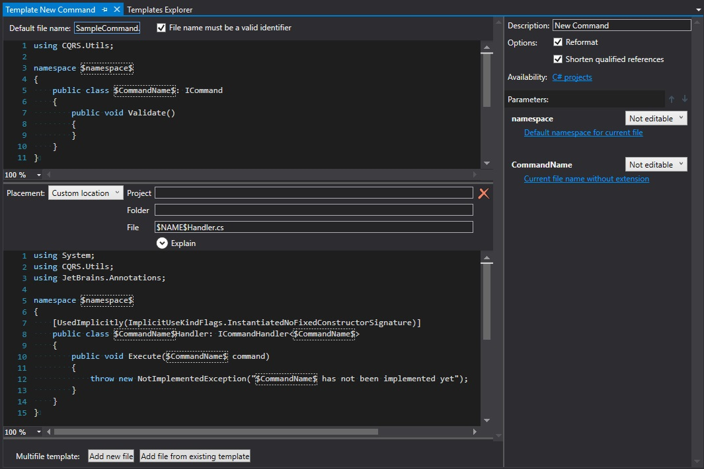
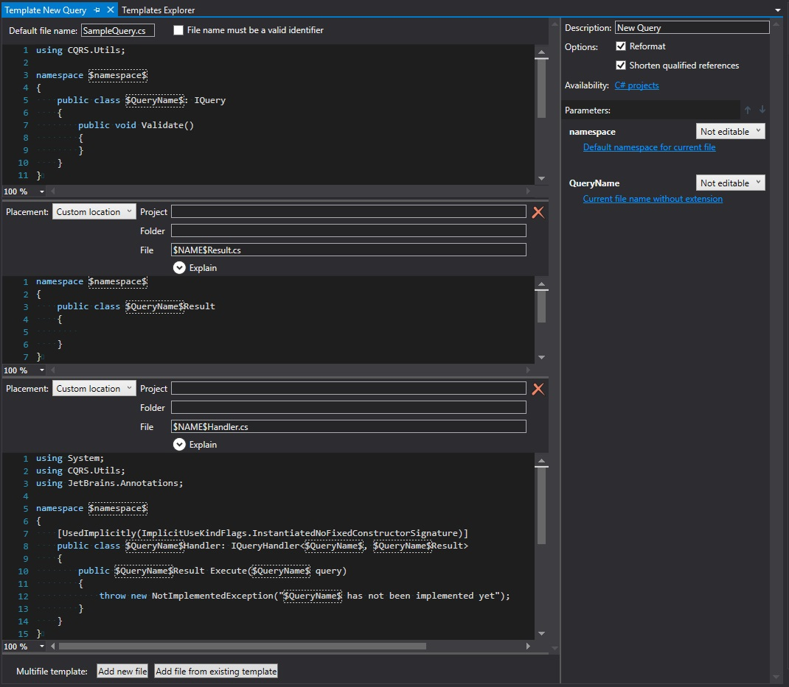
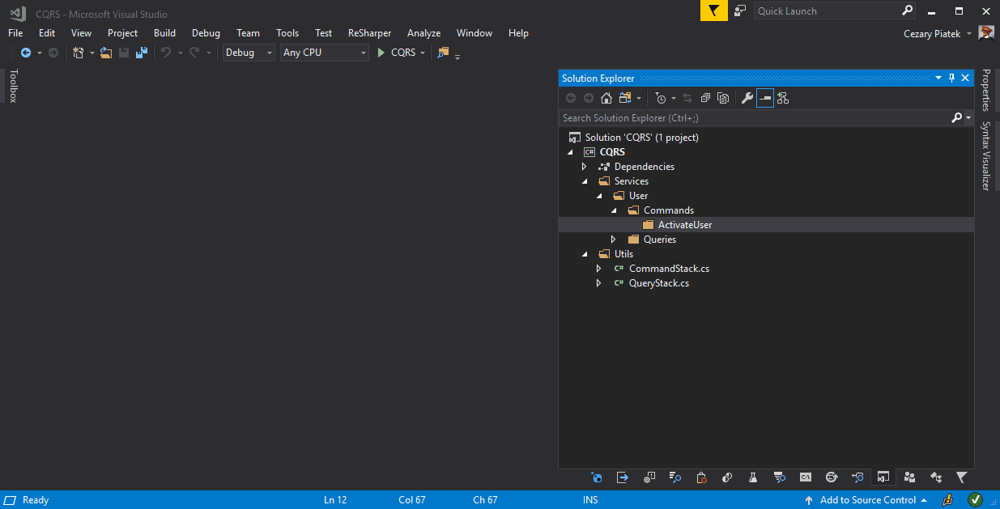
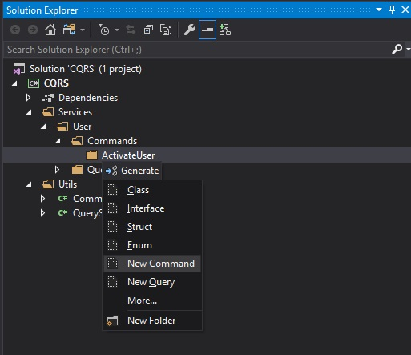

A year ago during my trip to the one of Software developer conference, I got a lot of opportunities to discuss the variety of topics related to software architecture. Most of them concerned `CQRS` and `CQS` patterns. I heard about it many times before but I've never got a chance to use it in practice. So after getting back from the conference I've decided to give a shot and try to introduce it in one of my existing private projects. There are existing libraries which facilitate building application with CQRS pattern but I wanted to implement it by myself from the scratches in order to better understand the concept. I've based my implementation on [CQRS – Simple architecture](https://www.future-processing.pl/blog/cqrs-simple-architecture/) article but the idea is also pretty clearly explained by Greg Young in his famous presentation [8 Lines of Code ](https://www.infoq.com/presentations/8-lines-code-refactoring)

## It's not all light and bright 

THE CQRS/CQS pattern works great, I immediately found a lot of benefits. It helps me to enforce separation of concers, single responsibility and consistency in my codebase as well as eliminate all that AOP magic with restoring full control over the code execution. Unfortunatelly, there is also a boring side of the implementing CQRS - **THE TYPING**. Everytime when I want to add new command I need to add 2 clasess (`Command` and `CommandHandler`) and for new query 3 classes (`Query`, `QueryResult` and `QueryHandler`) and there is a lot of `copy&paste` work to keep the naming consistency which is very important because of the `CommandDispatcher` and `QueryDispatcher` it is very hard to navigate throught the codebase. In order to make this tedious part of CQRS more convenient I've prepare a couple of snippets with Resharper's `LiveTemplates` which help to create, consume and test commands and queries. 

## Creating Commands and Queries

I started from creating templates for commands and queries definition. For building them I used multi-file template option which is availabla at `File Template` tab in `Templates Explorer`.

For `New Command` template we ned to crete two files: one for `Command` and one for `CommandHandler`. Each file share the two placeholders: `$CommandName$` with macro set to `Current file name without extension` and `$namespace$` with `Default namespace for current file` macro. You can see the complete configuration on the following screenshot:

`New query` template consists of tree files: `Query`, `QueryResult` and `QueryHandler`. There are two placeholders: `$QueryName$` and `$namespace$`. Macros are assigned analogously as for *New Command* template. A detailed configuration looks as follows:

Now we can easily add commadns and queries using predefined multi-file templates:

In order to save some clicking it's good to check "Add to quicklist" option in "Choose template" window. After that choosen template should be available in quick menu available after pressing "alt + insert" on selected directory:

## Dispatching 

## Testing

## Summary
Resharper LiveTemplates is a powerful mechanism that can easily relieve you of boring typing, helps to enforce naming consistency and allowing to focus on implementing business requirements. All snippets presented in this blog post are available here. You can import them as a separate layer in your Resharper configuration and easily adjust to your CQRS framework. If you are interested in how to configure and consume your own templates I recommend you to read my article [Don't write dull code - Resharper Live Templates](/post/livetemplates/)
