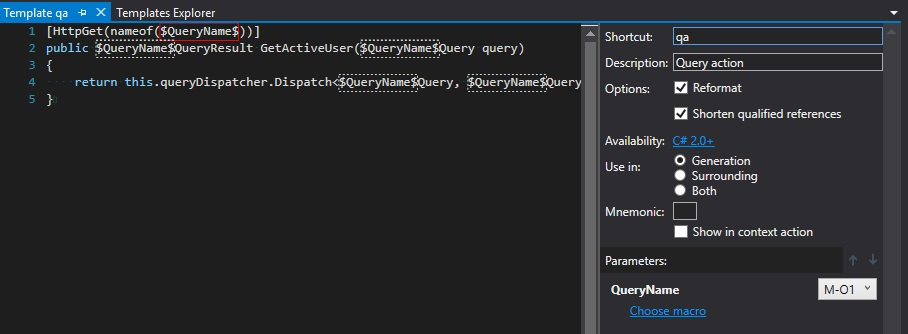
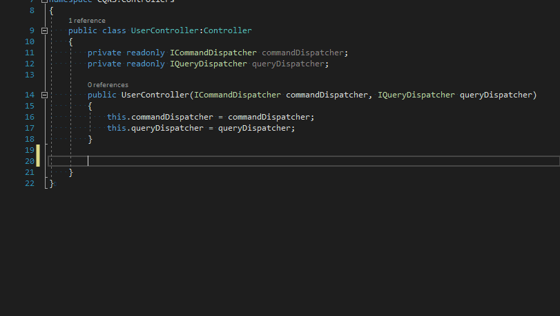
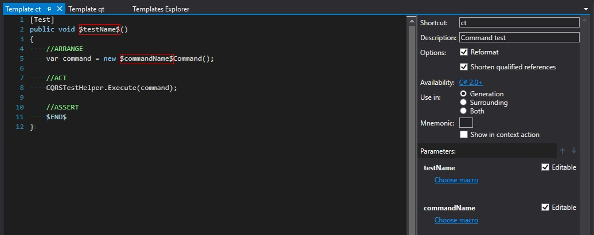
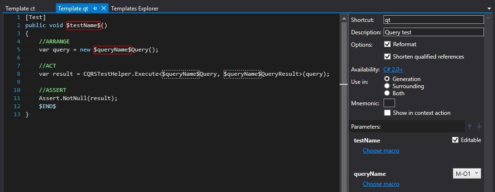
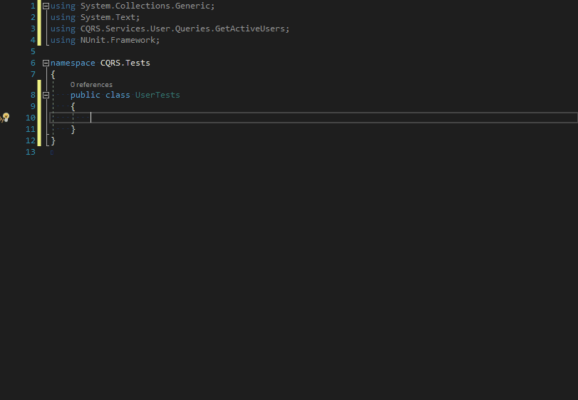

A year ago, during my trip to one of Software developer conferences, I got a lot of opportunities to discuss variety of topics related to software architecture. Most of them concerned `CQRS` and `CQS` patterns. I heard about them many times before but I've never had a chance to use them in practice. After getting back from the conference, I decided to give it a shot and try to introduce it in one of my private projects. There are existing libraries which facilitate building application with CQRS pattern but I wanted to implement it by myself from the scratch, in order to better understand the concept. I based my implementation on [CQRS – Simple architecture](https://www.future-processing.pl/blog/cqrs-simple-architecture/) article but the idea is also pretty clearly explained by Greg Young in his famous presentation [8 Lines of Code ](https://www.infoq.com/presentations/8-lines-code-refactoring)

## It's not all light and bright 

The CQRS/CQS pattern works great, I immediately found a lot of benefits. It helps me to enforce separation of concerns, single responsibility and consistency in my codebase, as well as eliminate all that AOP magic with restoring full control over the code execution. Unfortunately, there is also a boring side of implementing CQRS - **THE TYPING**. Every time I want to add new command, I need to add 2 classes (`Command` and `CommandHandler`) and for every new query 3 classes (`Query`, `QueryResult` and `QueryHandler`). There is a lot of `copy&paste` work to keep the naming consistency which is very important because `CommandDispatcher` and `QueryDispatcher` make it hard to navigate through the codebase. I prepared a couple of snippets with Resharper's `LiveTemplates` which help to create, consume and test commands and queries to make this tedious part of CQRS more convenient. 

## Creating Commands and Queries

I started by creating templates for commands and queries definition. For building them I used multi-file template option which is available at `File Template` tab in `Templates Explorer`.

For `New Command` template we need to create two files: one for `Command` and one for `CommandHandler`. Each file shares two placeholders: `$CommandName$` with the macro set to `Current file name without extension` and `$namespace$` with `Default namespace for current file` macro. You can see the complete configuration on the following screenshot:

`New query` template consists of three files: `Query`, `QueryResult` and `QueryHandler`. There are two placeholders: `$QueryName$` and `$namespace$`. Macros are assigned analogously as for *New Command* template. A detailed configuration looks as follows:

Now we can easily add commadns and queries using predefined multi-file templates:

In order to save some clicking, it's good to check "Add to quicklist" option in "Choose template" window. After that, chosen template should be available in quick menu after pressing `alt + insert` on selected directory:

## Dispatching 
Next set of snippets which could be helpful in CQRS codebase is one that allows dispatching commands and queries in controller's actions. It is an inline template which could be prepared using "Template Explorer -> Live Templates" tab. The definition of such template can looks as follows:

I assigned `ca` shortcut for `Command action` and `qa` for `Query action`. Now we can easily insert actions which dispatch commands and queries.

As you can see, these templates save me a lot of typing and ensure that I don't forget to decorate my actions with necessary attributes (`[HttpPost]` and `[FromBody]` for commands and `[HttpGet]` for queries). 

## Testing

The last template that I needed to work with CQRS was one that helps me with creating Unit Tests for commands and queries. The template definitions look as below:

Now using `ct` snippet for commands and `qt` snippet for queries we can easily create stubs for our tests:

## Summary
Resharper LiveTemplates is a powerful mechanism that can easily relieve you of boring typing, help to enforce code consistency and allow to focus on implementing what is important - the business requirements. All snippets presented in this blog post are available at Github [here](https://github.com/cezarypiatek/CQRSsnippets). You can import them as a separate layer in your Resharper configuration and easily adjust to your CQRS framework of choice. If you are interested in how to configure and consume your own templates, I recommend you to read my article [Don't write dull code - Resharper Live Templates](/post/livetemplates/) I'm curious if you have any other ideas for snippets that could help with CQRS apps. If you do, I would appreciate if you could share them in the comment section below.
