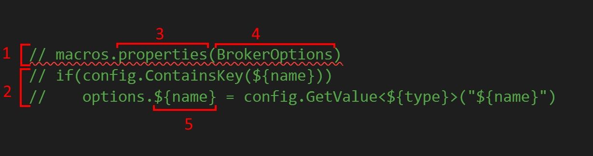
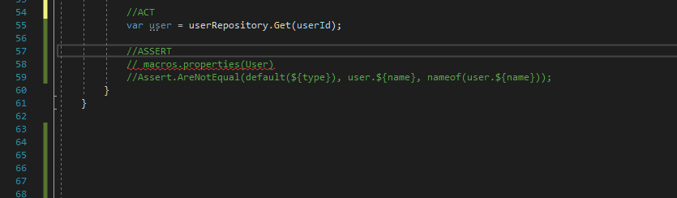
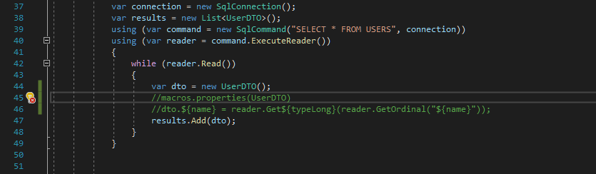

I'm a programmer but I don't like to write code. OK, it's not the whole truth. I don't like to write the code that is repeatable. Whenever I need to do something more than twice, I start thinking about automation. Hopefully, this problem can be addressed with `code snippets`. Visual Studio provides a predefined set of [snippets](https://docs.microsoft.com/en-US/visualstudio/ide/visual-csharp-code-snippets?view=vs-2019) that can be extended, but if you are a Resharper user you should definitely get to know [LiveTemplates](https://www.jetbrains.com/help/resharper/Templates__Index.html) because it's more powerful and easier to configure. For an easier start with `LiveTemplates`, I recommend reading my articles about practical usages of this tool [here](/tags/livetemplates/). However, sometimes snippets are not enough, especially when you need to insert them many times for repeatable code, or complete placeholders manually when they could be automatically calculated. To solve those issues, I came up with the idea of C# macros that could be executed during the design time right in the code editor. I created a simple POC with Roslyn API and happily confirmed that it was feasible. In this blog post, I will describe what I've achieved so far and what are the perspectives for the extension.

##  What is the CSharp macro?

The idea is very simple. It's a system that allows repeating and completing a given template for all values from a given set. The main advantage over snippets is the ability to repeat the template and define the function that generates the input set. Here's how the macro looks like:

1. Macro header.
2. Macro template - multiline text that will be repeated for every element generated by the macro function.
3. Name of the pre-defined function that generates input.
4. Parameter for the function.
5. Placeholder with the attribute's name of element generated by the function declared in the header.

So far I've implemented the following functions that generate input for the template:

* `properties` - returns list of the properties for a given type
* `methods` - returns list of the methods for a given type
* `implement` - returns all implementations of given interface
* `derived` - returns all class that derive from a given type
* `values` - returns values from the set defined as macro parameters

For detailed descriptions and usage examples please check the [CsharpMacros](https://github.com/cezarypiatek/CsharpMacros) project site at Github.

## Macros in action

C# macro can be used for example to scaffold assertions for all object properties

or generate code that reads values from SQL query and maps them to appropriate properties of a given entity:

There is also an option to transform the value of the attributes by applying filters like: `lowercase`, `uppercase`, `camelcase`, and `pascalcase`. The syntax for the placeholder with filter is the following: `${attribute_name | filter_name}`. The filters can be combined together by chaining them with `|` operator.

## Supported IDE

CSharp Macros mechanism consists of two parts: Roslyn analyzer and Roslyn codefix; so it should work with any IDE that supports analyzers and codefixes. I've tested it on `Visual Studio`, `JetBrains Rider` and `VSCode` and everything works in the same way. For Visual Studio the preferred way of usage is Visual Studio extension which can be downloaded and installed from the marketplace; you can also use it as a Nuget package. For `Rider` and `VSCode` the only option is to install it as a Nuget package - the downside is that you need to install it to every solution where you want to use it. To use Roslyn analyzers and VSCode, you need to unlock it in the editor settings - there is an option called `Enable support for Roslyn analyzers, code fixes and rulesets`.

- [Link to VisualStudio extension](https://marketplace.visualstudio.com/items?itemName=54748ff9-45fc-43c2-8ec5-cf7912bc3b84.csharpmacros2)
- [Link to Nuget package](https://www.nuget.org/packages/CsharpMacros)
- [Link to project site](https://github.com/cezarypiatek/CsharpMacros)

## Ideas for improvement and extension

- Add system for informing about errors in the macro definition.
- Implement some sort of stash or catalog of reusable macros.
- Implement `eval` macro function that evaluate function from the current solution or given DLL.
- Add intellisense for macro syntax.

## Summary

I am very curious about your thoughts regarding `CSharp Macro`. Do you like it? Do you find it useful? Do you have any ideas for improvement/extension?  I've had a couple of opportunities to use them in an action and they do simplify my work.  By having a tool that generates the code, you can avoid potential mistakes that can occur during `copy&paste&modify` process and focus on more important things.