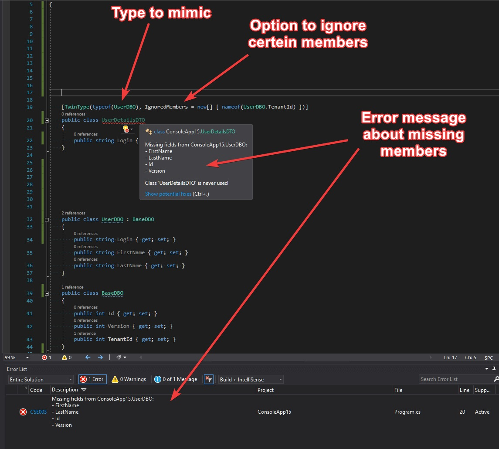
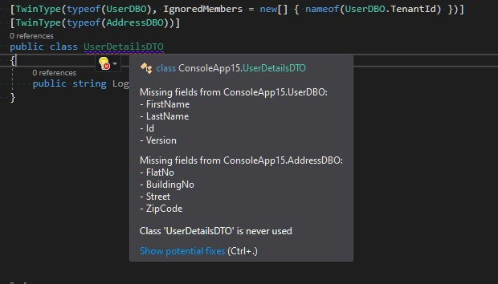
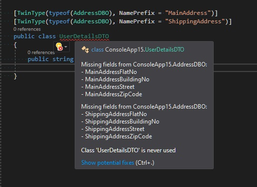

A couple of months ago I've started working on a simple `CRUD` service. A mix of `ASP Core` for `REST API` with `Dapper` for Database access - probably one of the most popular stacks for this kind of application. Very quickly it turned out that it's more complex than I expected and this "simple-boring" `CRUD` became more interesting and challenging. 

## The Problem 

One of the first problems that I came across was that I had a lot of types that looked very similar but had some differences and served different purposes, like:

- `DBO` - `Data Base Object` - types for mapping SQL query result to C# object.
- `DTO` (`Data Transfer Object`) for the read side -  quite similar to `DBO` but very often has a more complex shape, aggregates results from more than one DBO, contains additional metadata or pre-formatted data.
- `DTO` (`Data Transfer Object`) for the write side - similar to this one of the read side but without metadata required for UI and without read-only fields.

Those types require synchronization - when I add a new field to `DBO`, then it's very likely that I need to add its counterpart to both types of `DTO` as well (or at least to one of them). Similar situation in case of field renaming - it's an obvious expectation to keep the names consistent across all those types. This causes a need for some sort of mechanism that could help enforce that synchronization somehow automatically. The first thing that comes to mind is `inheritance` but it has some significant downsides:

- It introduces direct dependencies between types that we would like to avoid. It could be very strange that `DTO` inherits from `DBO` or the other way around.
- Sometimes types have fields with the same names but different types. This could be solved with generic type parameters, but with a lot of such fields we would end up with a very messy code.

The most important thing about inheritance, that programmers very often forget, is that it was invented to share behaviors, not a code (more precisely a state). Those `POCO` types have no common behaviors - only similar shapes. We can also try to address this issue by introducing an interface with common fields, but it has similar downsides as inheritance and we end up with an even bigger amount of places that require synchronization. When I add a new field to any of my `POCO` types, I need to remember to add this field to common interface in order to make this synchronization work - and properties declaration need to be repeated in all types that implement an interface, which results in even more code.

I didn't find a good solution for this problem using standard C# mechanisms, so I came up with the idea of `TwinTypes`.

## The Solution - Extending C# rules with custom analyzer

Because standard C# mechanisms don't provide any satisfying solution, I tried once again to take advantage of the Roslyn analyzers and extend language possibilities. The idea of `TwinType` is to introduce a marker that will express some sort of `"soft dependency"` between types. The whole solution consists of three parts:

- `[TwinType]` attribute to define this `"soft dependency"` or `"shape similarity"` with other types.
- Dedicated Roslyn analyzer that keeps track of related type changes and is able to report missing fields and properties.
- Additional code fix which can generate code of missing members.

Talk is cheap so let's see how it works in code:

`TwinTypeAnalyzer` verifies if type decorated with `[TwinType]` attribute has members (properties and fields) with the same names as the type declared to mimic. Members' types are ignored so it's possible to have the same field with different types on both sides. `[TwinType]` attribute can be applied multiple times on the same type so it's possible to achieve some sort of `mixins` or `multiple inheritance`:

It's also valid to have multiple twin relations with the same type using different name prefixes:

To make life a little bit easier I created a dedicated code fix which can generate declarations of those missing members:

## Summary

All attributes and analyzers described here are available as a single Nuget package [SmartAnalyzers.CSharpExtensions.Annotations](https://www.nuget.org/packages/SmartAnalyzers.CSharpExtensions.Annotations/). The source code is published on `Github` under [CSharpExtensions](https://github.com/cezarypiatek/CSharpExtensions) project. Please let me know what you think about those extensions to C# language and if you encounter any problems with using it, feel free to report an issue on Github page.