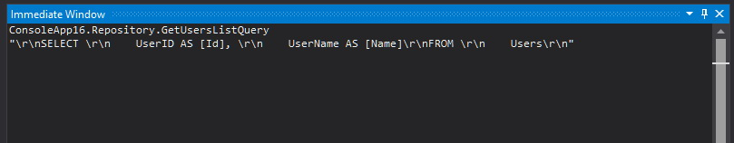
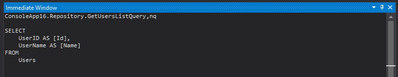
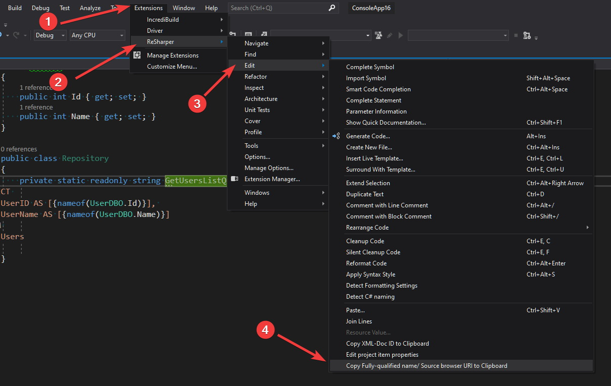

A year ago I started working on a set of projects that requires accessing data from a huge legacy database. There was a decision to use [Dapper](https://github.com/StackExchange/Dapper) to facilitate database access code. For those of you who are not familiar with Dapper, it's a set of extension methods to [IDbConnection](https://docs.microsoft.com/en-us/dotnet/api/system.data.idbconnection?view=netcore-3.1), which allows to easily map C# object to SQL query parameters, as well as SQL query result to C# objects. I was quite skeptical to use a library that requires writing `SQL queries` directly in the C# code, because I got used to relying always on ORMs (`NHibernate` in particular). Throughout the year, `Dapper` has proven to be the right tool for the job. In the meantime, I also discovered a couple of features and tricks that allow me to write quite concise and easy to maintain database access code, and I think it's worth sharing them here.

>  Key Takeaways:
>   
   - Always define aliases in SQL queries using `nameof()` operator
   - Use C# consts and enums in SQL queries instead of magic numbers
   - Use `FOR JSON PATH` to simplify fetching complex objects from database

## Resilient to refactoring

Dapper allows to easily map SQL query results to C# objects based on the naming convention. There's no problem if the database table columns' names match object fields' name - if there's a discrepancy, you can deal with it by adding aliases:

```sql
SELECT 
    UserID AS [Id], 
    UserName AS [Name]
FROM 
    Users
```

However, the naming convention approach is fragile to rename refactoring. Changing the object field's name will break your code and it can be hard to detect without an appropriate test suite. Fortunately, there's a way to shorten this feedback loop and solve this issue in the design time. We can make our code more resilient by defining aliases using `string interpolation` and `nameof()` operator:

```cs
private static readonly string GetUsersListQuery = @$"
SELECT 
    UserID AS [{nameof(UserDBO.Id)}], 
    UserName AS [{nameof(UserDBO.Name)}]
FROM 
    Users
"
```

This not only takes away the threat of breaking the code while renaming `DBO` fields but also gives better discoverability and navigability in the code. Using `find usage` option, we can also find where a given field is used in the SQL queries. And there's no performance penalty because the compiler can evaluate this string interpolation during the compilation, because all of the parameters are const. You can verify it by yourself with this [Sharplab.io example](https://sharplab.io/#v2:EYLgZgpghgLgrgJwgZwLQAdYwggdsgZgB8ABAJgEYBYAKHIAIBVZHAEQCEB5Wgb1voH0SBegEtcMegEkAJvR70A5hBgBueizX0Avv0HCxE+gDkoAWwjylK9ZvW6aD2gYYAlCOgD2yUTE8IAT3k9enQEUQA3WEsSCgA2eiQoGU9cABsg2IAGegBxFWYcZAAZUWQYAEU4HCCAXiESABIAIloAZQBRYo6AYQAVehCmFgQpVnoAQTb6AG0eXHMITzAACkKEDk4AOlkASm0AXQAaQZpBYZxTC0npuYWLZbWRza2riH2D2gAxV04AWVO53WyFozVUtG0QA)

But what if we want to get the result of the string interpolation without the need to run the whole program in debug mode? This is often needed when there's a bug in the query and we want to copy it and test in the `Management Studio`. This can be easily archived with `Immediate window` - yes, that's right, you can use `Immediate window` to evaluate the code in the design time. To evaluate the string, just enter fully qualified field name that holds the query into the `Immediate window`:



Unfortunately, the output is not well-formatted and contains additional characters for line endings. We can fix it by adding `nq` (no quote) suffix:



If you are using `Resharper` then you can avoid typing long `FQN` and copy it with a special option for this purpose:



## No magic numbers

Sometimes there is a need to use some sort of constant values in the SQL query (especially in the conditions). Queries with those cryptic values are very hard to review or even can cause a problem with understanding for the author himself after a while:

```cs
public class Repository {
   private static readonly string GetActiveUsersListQuery = @$"
SELECT 
    UserID, 
    UserName
FROM 
    Users
WHERE
    UserType = 135
";
}
```

This is a classical example of well known code smell called `magic numbers`. We can solve this problem again with string interpolation. __It's tempting to introduce an enum that represents a set of available values but unfortunately using an enum as a parameter for the interpolated string will prevent the compiler from evaluating expression during the compilation. The evaluation will occur in the runtime and will result in creating a new string in the memory whenever the code is executed.__ This can hurt the application performance especially when you define SQL queries as local variables. You can check it on this [Sharplab.io example](https://sharplab.io/#v2:EYLgZgpghgLgrgJwgZwLQAdYwggdsgZgB8ABAJgEYBYAKHIAIBVZHAEQCEB5Wgb1voH0SBegEtcMegEkAJvR70A5hBgBueizX0Avv0HCxE+gDkoAWwjylK9ZvW6ag+rQe0IuOGaYsEAFQCe6BC8egIAggDGMKIAbpYAvPQUBACsADSh0rhQUbEJSQQAbC60tAYMAEoQ6AD2yKIwNQj+8qHoCLGwliQUhfRIUDI1uAA2LT0ADPQA4irMOMgAMqLIMACKcDgtiSQkACQARLQAygCii6cAwr7OjoLzCFKsabdOD6YWtABiFZwAsq97j5kLQAOoACVOFVOmQeASC9ESPDhgQgADpItE4g4DqoXEA) If you need to keep strings with SQL queries as local variables then it's better to define those magic values as const: 

```cs
public class Repository {
    
    static class UserType
    {
        public const string Active = "135";
        public const string Inactive = "136";
    }
    
   private static readonly string GetActiveUsersListQuery = @$"
SELECT 
    UserID, 
    UserName
FROM 
    Users
WHERE
    UserType = {UserType.Active}
";
}
```
Those constants must be a string type even if they are numeric values, otherwise the compiler generates invocation of `System.String.Format()` instead of creating a single string.


## Bridge the gap between relational and object-oriented models 
Very often posts advertising micro ORMs present fairly simple examples where database data structures match almost 1-1 the C# structures. However, the reality is quite different and the discrepancy between relational and object-oriented model might be expensive and result with a large amount of code responsible for fetching and transforming data.

```cs
public class User
{
    public int Id {get; set;}
    public string FirstName { get; set; }
    public string LastName { get; set; }
    public Address MainAddress { get; set; }
}

public class Address
{
    public string City { get; set; }
    public string ZipCode { get; set; }
    public string Street { get; set; }
    public string FlatNo { get; set; }
    public string BuildingNo { get; set; }
}
```

In order to fetch complete user data we can use one of the following approaches:

We can introduce some sort of intermediate type for fetching a result of the SQL query and then map it to the destination type in the memory. I call those intermediate types `DBO - DataBase Object`:

```cs
public class UserDBO
{
    public int Id {get; set;}
    public string FirstName { get;  }
    public string LastName { get; private set; }
    public string City { get; set; }
    public string ZipCode { get; set; }
    public string Street { get; set; }
    public string FlatNo { get; set; }
    public string BuildingNo { get; set; }
}

public class UserRepository
{
    static readonly string GetAllUserDataSqlQuery = ""; /*TODO: Here comes query for fetching user basic data*/
    
    public async Task<User> GetUser(IDbConnection connection, int id)
    {
        var userDBO = await connection.QueryFirstOrDefaultAsync<UserDBO>(GetAllUserDataSqlQuery, new {UserId = id});
        if(userDBO == null)
        {
            return null;
        }
        return new User
        {
            Id = userDBO.Id,
            FirstName = userDBO.FirstName,
            LastName = userDBO.LastName,
            //TODO: If the address is optional then we should check if all attributes are not empty before creating an instance of Address
            MainAddress = new Address
            {
                City = userDBO.City,
                ZipCode = userDBO.ZipCode,
                Street = userDBO.Street,
                FlatNo = userDBO.FlatNo,
                BuildingNo = userDBO.BuildingNo
            }
        };
    }
}
```

This solution has several disadvantages: 

- It requires an intermediate DBO type.
- It requires additional mapping code to adjust fetched data to the desired structure
- If we change the relation between User and Address from one-to-one to one-to-many, it will result in data duplication.

Another option is to fetch direct attributes (Id, FirstName, LastName) with one query, fetch address data with another one and merge user with address in memory:

```cs
public class UserRepository
{
    static readonly string GetUserBasicDataSqlQuery = ""; /*TODO: Here comes query for fetching user basic data*/
    static readonly string GetAddressDataSqlQuery = ""; /*TODO: Here comes query for fetching address data*/

    public async Task<User> GetUser(IDbConnection connection, int id)
    {
        var user = await connection.QueryFirstOrDefaultAsync<User>(GetUserBasicDataSqlQuery, new {UserId = id});
        if(user == null)
        {
            return null;
        }
        user.MainAddress = await connection.QueryFirstOrDefaultAsync<Address>(GetAddressDataSqlQuery, new {UserId = id});
        return user;
    }
}
```

This approach requires two calls to a database, but it can be reduced by merging those two queries into a single string and executing it with `SqlMapper.GridReader`:

```cs
public class UserRepository
{
    static readonly string GetUserBasicDataSqlQuery = ""; /*TODO: Here comes query for fetching user basic data*/
    static readonly string GetAddressDataSqlQuery = ""; /*TODO: Here comes query for fetching address data*/

     static readonly string GetUserCompleteDataSqlQuery = @$"
        -- Fetch user basic data
        {GetUserBasicDataSqlQuery};
        -- Fetch address data
        {GetAddressDataSqlQuery};
    ";    

    public async Task<User> GetUser(IDbConnection connection, int id)
    {
        using var gridReader = await connection.QueryMultipleAsync(GetUserCompleteDataSqlQuery, new { UserId = id });
        var user = await gridReader.ReadFirstOrDefaultAsync<User>();
        if (user == null)
        {
            return null;
        }

        user.MainAddress = await gridReader.ReadFirstOrDefaultAsync<Address>();
        return user;
    }
}
```
Looks like this solution is much cleaner and requires less code than the option with the intermediate DBO object, but things can get really messy when we want to fetch data for more than one user and the relation between user and address is one-to-many:

```cs
public async Task<IReadOnlyCollection<User>> GetAllUsers(IDbConnection connection)
{
    using var gridReader = await connection.QueryMultipleAsync(GetUserCompleteDataSqlQuery);
    var users = (await gridReader.ReadAsync<User>()).ToList();
    var addresses =  await gridReader.ReadAsync<Address>();
    //INFO: Address entity needs to be extended with UserId in order to merge the data correctly
    var addressesByUserId = addresses.GroupBy(x => x.UserId).ToDictionary(x => x.Key, x => x);
    foreach (var user in users)
    {
        if (addressesByUserId.TryGetValue(user.Id, out var userAddresses))
        {
            user.Addresses = userAddresses.ToList();
        }
    }
    return users;
}
```

We can simplify it by taking leverage of JSON support in SQL Server. For the relation 1-1 between the `User` and `Address` our SQL query can look as follows:

```sql
SELECT
    u.UserId AS [Id],
    u.FirstName AS [FirstName],
    u.LastName AS [LastName]
    a.City AS [MainAddress.City],
    a.ZipCode AS [MainAddress.ZipCode],
    a.Street AS [MainAddress.Street],
    a.FlatNo AS [MainAddress.FlatNo],
    a.BuildingNo AS [MainAddress.BuildingNo],
FROM
    Users u 
    LEFT JOIN Addresses a ON a.UserId = u.UserID
FOR JSON PATH
```

or we can rewrite it to handle one-to-many relation using sub-query:

```sql
SELECT
    u.UserId as [Id],
    u.FirstName as [FirstName],
    u.LastName as [LastName]
    (
        SELECT
            a.City AS [City],
            a.ZipCode AS [ZipCode],
            a.Street AS [Street],
            a.FlatNo AS [FlatNo],
            a.BuildingNo AS [BuildingNo]
        FROM 
            Addresses a
        WHERE
            a.UserId = u.UserID
        FOR JSON PATH
    )  AS [Addresses]
FROM
    Users u 
```

But how can we fetch this JSON SQL query result using Dapper? The most common solution that we can come across on the internet is to create a custom type handler for our SQL query result:

```cs
public class JsonTypeHandler<TResult>: SqlMapper.TypeHandler<TResult>
{
    public override void SetValue(IDbDataParameter parameter, TResult value) => 
        throw new NotSupportedException($"Sending '{typeof(TResult).FullName}' type to database is not supported");

    public override TResult Parse(object value)
    {
        var jsonPayload = value?.ToString();
        if (string.IsNullOrWhiteSpace(jsonPayload))
        {
            return default;
        }
        return JsonConvert.DeserializeObject<TResult>(jsonPayload);
    }
}
```

After registering type handler with:

```cs
SqlMapper.AddTypeHandler(new JsonTypeHandler<User>());
```
we can query our data with `Dapper` query extension methods as usual. However, this approach with custom type handler has two disadvantages:

- We need to register `JsonTypeHandler<>` for every most outer type which we are querying
- __This won't work for larger objects__ because the SQL Server will split long JSON string across multiple rows. You can read more about that on MSDN in the section [Output of the FOR JSON clause](https://docs.microsoft.com/en-us/sql/relational-databases/json/format-query-results-as-json-with-for-json-sql-server?view=sql-server-ver15#output-of-the-for-json-clause)

We can solve both problems by executing SQL queries with the following extension method:

```cs
public static class SqlQueryExtensions
{
    public static async Task<TResult> QueryFromJson<TResult>(this IDbConnection connection, string sqlQuery, object param)
    {
        var chunks = await connection.QueryAsync<string>(sqlQuery, param);
        var completeJsonPayload = string.Concat(chunks);
        return JsonConvert.DeserializeObject<TResult>(completeJsonPayload);
    }
}
```

With this JSON SQL query approach I was able to very easily fetch quite complex object from the database. The only limitation I came across was lack of ability to fetch properties which are a list of primitive times. SQL Server always wraps sub-queries result in the object, even if they are based on a single column.


As you might notice - in SQL queries formatted as a JSON it's possible to define aliases with a dot notation like `[MainAddress.City]`. Unfortunately, there's no operator in C# like `nameof` which could return full member path, but we can simulate that with the following method that accepts expression tree:

```cs
public static class TypeExtensions<TType>
{
    public static string MemberPath<TMember>(Expression<Func<TType, TMember>> member)
    {
        var expressionText = member.Body.ToString();
        return expressionText.Substring(expressionText.IndexOf('.')+1);
    }
}
```
With this helper method we can rewrite our query to be resilient to refactoring in the following way:

```cs
public class UserRepository
{
        public static readonly string Query = @$"
SELECT
    u.UserId AS [{nameof(User.Id)}],
    u.FirstName AS [{nameof(User.FirstName)}],
    u.LastName AS [{nameof(User.Id)}]
    a.City AS [{TypeExtensions<User>.MemberPath(x=>x.MainAddress.City)}],
    a.ZipCode AS [{TypeExtensions<User>.MemberPath(x => x.MainAddress.ZipCode)}],
    a.Street AS [{TypeExtensions<User>.MemberPath(x => x.MainAddress.Street)}],
    a.FlatNo AS [{TypeExtensions<User>.MemberPath(x => x.MainAddress.FlatNo)}],
    a.BuildingNo AS [{TypeExtensions<User>.MemberPath(x => x.MainAddress.BuildingNo)}],
FROM
    Users u 
    LEFT JOIN Addresses a ON a.UserId = u.UserID
    WHERE  u.UserID = @UserId
FOR JSON PATH
";
}
```

The necessity to provide `TypeExtensions<User>` for every `MemberPath` invocation can make our query a little noisy. This can be simplified with `using static` or by defining short alias for generic type. We also have to keep in mind that the invocation of `MemberPath` function is evaluated in the runtime.