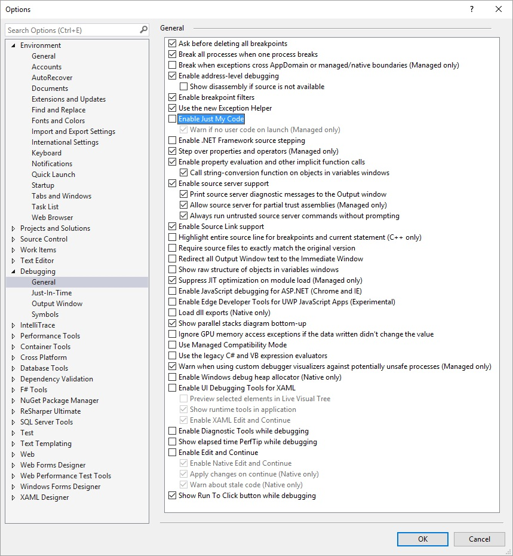
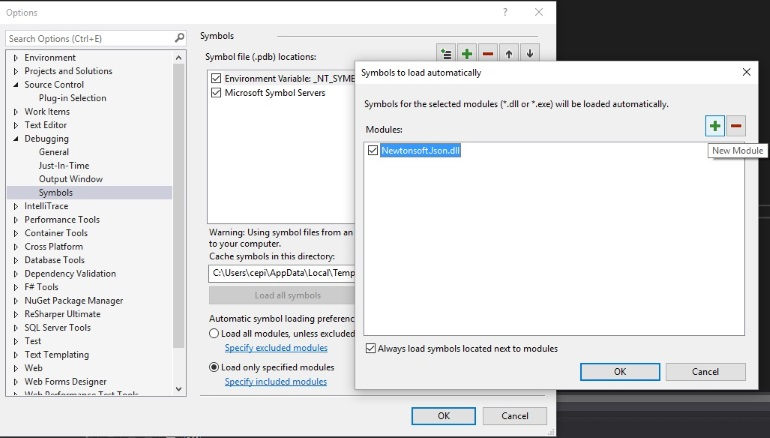
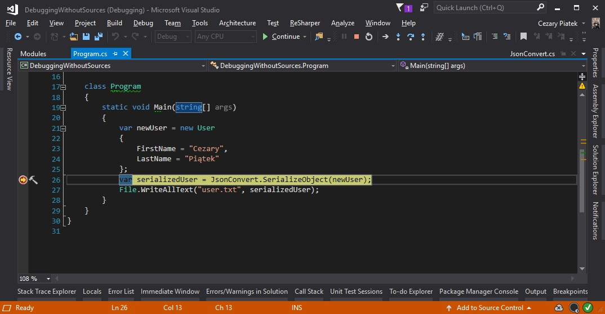
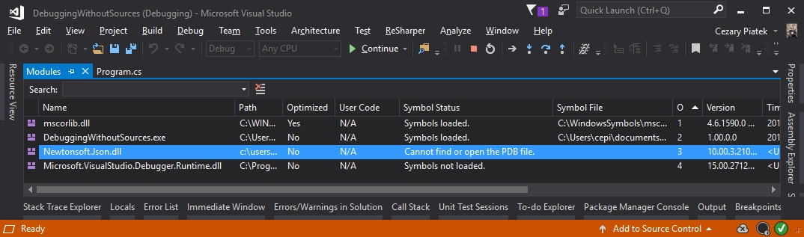
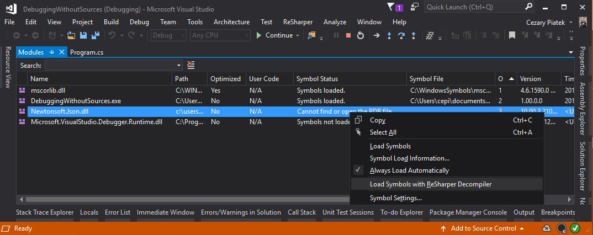
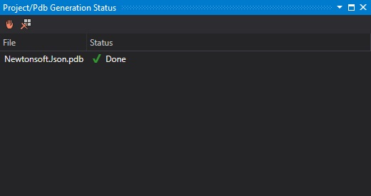
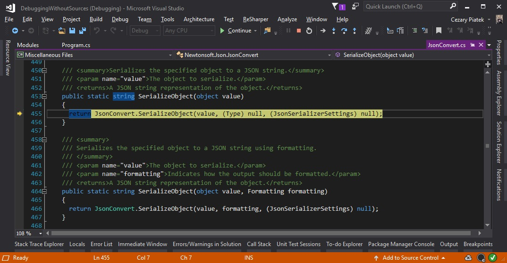

Some people used to say that a good programmer doesn't need to debug his own code.  However, sometimes we have a problem with third party libraries usage, for example: there is insufficient documentation or the module contains some bugs. Visual Studio has excellent debugging toolset but this is totally useless without symbols and sources (and this is often the case with third party libraries).  Thanks to Reshaper decompiler this shouldn’t be a problem anymore.

Before we start debugging we should make some changes in Debugging options (*Tools -> Options -> Debugging -> General*). Make sure that **"Enable Just My Code"** and **"Use manage Compatibility Mode"** options are unchecked. I'm not sure if this set is enough  so this is my complete working configuration:

Unchecking **"Enable Just My Code"** option could slow down debugging process because Visual Studio will try to load symbols for all modules. You can mitigate that by constraining the list of modules for which you need to load symbols. Go to *Debugging -> Symbols* tab in **Options** window, select **Load only specified modules** option and click **Specify included modules**  link to provide a list of libraries we are interested in.

Now we can set the breakpoint in our code and start program in debug mode.

When the execution breaks we should open **Modules** window (*Debug -> Windows -> Modules*) and find on the list library which we want to debug (in our case Newtonsoft.Json.dll). We see that our module is in **"Cannot find or open this PDB file"** status. 

Use the right click on our module and from the context menu select **"Load Symbols with Resharper Decompiler"**

A new Resharper window will be opened and we can observe the progress of generating PDB file for our library (it could take a minute). When the process is completed, status should be changed to **"Done"**.

Close this window and from the context menu in **"Modules"** window select **"Load symbol"** option. Module status should change to **"Symbols loaded"**. Now we can go back to our code and step into method from third party library (simply press F11). If everything went fine we should be moved to file with decompiled code and all debug tools should work as normal.

