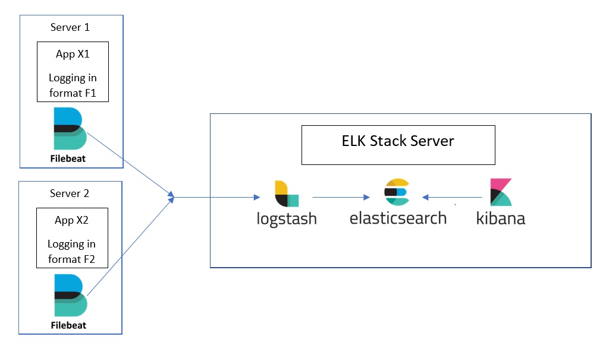
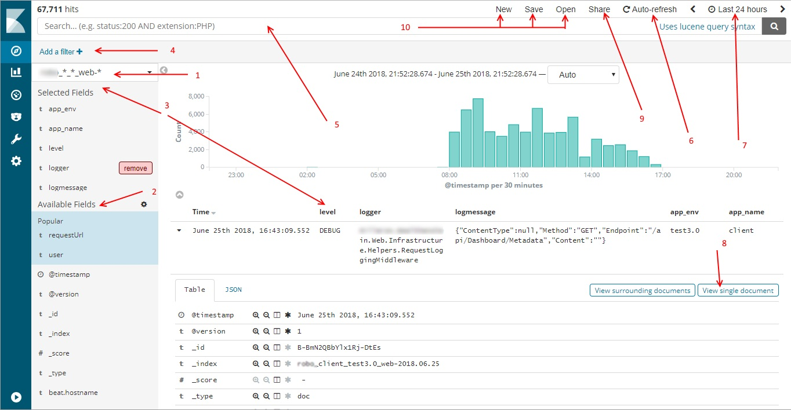
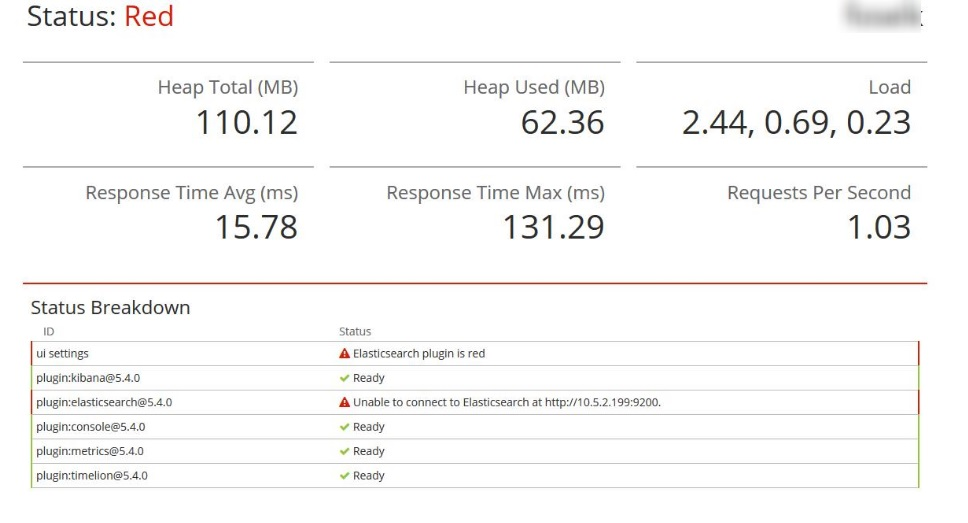
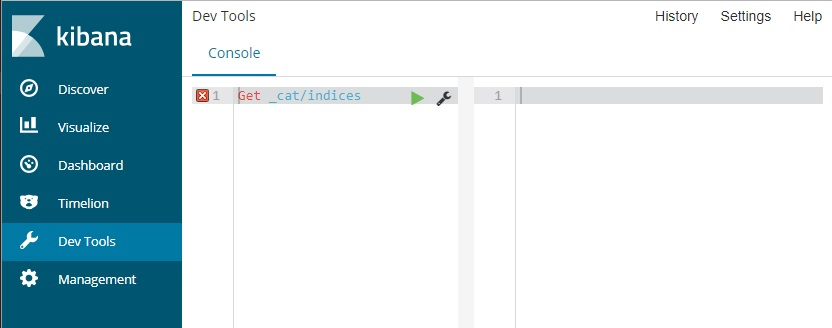

Let's assume that your system consists of a few microservices. Everything must have high availability so each microservice has at least two active instances on separate machines and everything must be multiplied by the number of testing and production related environments. When there is a situation that requires log analysis you have to skip from server to server looking for the file with desired information. You browse each file using some kind of notepad-based editor and if the files weight hundreds of megabytes it's quite a challenge. If it still sounds like your current job you should definitely adopt ELK stack. 

ELK stands for `ElasticSearch-Logstash-Kibana` and it's a set of services which helps to improve productivity in the area of logging, covering aspects of collecting, processing, storing and presenting log data. Because of its modular nature, for a basic solution, you have to install and configure four applications: Filebeat, Logstash, Elasticsearch, and Kibana. At first, it may sound overwhelming. The first time I tried to do that it took me a few days. In the last project (it was the fourth time) I was able to make it work in three hours. My application is built with ASP.NET framework hosted on IIS and logging with `log4net`, but it doesn't matter because ELK is able to collect, process, store and present logs which come in any format and from any source. The purpose of this blog post is to summarize my knowledge about setting up ELK stack. I hope you can find this note valuable and that it helps you save some time. I'm going to show you step by step how to implement ELK in your existing project without making any changes in your code base.


## ELK Stack quick overview



- Filebeat - responsible for collecting logs from files and forwarding it to Logstash
- Logstash - parse and transform log data that comes from different sources in different format
- ElasticSearch - storage for log data
- Kibana - web application that presents log data (searching and visualization)

## Setting up ELK Stack server

At first, you need a Linux server which will be responsible for processing and storing log data. You have to install there ElasticSearch, Logstash, and Kibana. You can do it manually by yourself or you can save a lot of time and use preconfigured docker images. In the docker path we have two options:

 - Single image https://elk-docker.readthedocs.io/ All services are packed into the single image. This is not an official release but the documentation is excellent.
 - Docker compose https://github.com/deviantony/docker-elk Every service comes as a separate official docker image combine together with docker compose file.

Because both solutions are very well documented it's needles to duplicate it here.


## Collecting logs with Filebeat

Filebeat is responsible for collecting log data from files and sending it to Logstash (it watches designated files for changes and sends new entries forward). Thanks to this tool you can add ELK stack to your existing project without the need to make any changes in your code base. In order to install Filebeat, download appropriate archive with binaries from https://www.elastic.co/downloads/beats/filebeat and extract it on the server where your logs are stored. I don't recommend choosing `c:\Program Files\` or `c:\Program Files (x86)\` paths because `user access control` makes it hard to update configuration file. After extracting archive, open `PowerShell` console, go to the directory with FileBeat binaries and execute the following script

```powershell
./install-service-filebeat.ps1
```

This should install `filebeat` as a Windows service. Use `Get-Service filebeat` to verify the current status of filebeat service. In the next step, you have to configure filebeat to harvest log data produced by your application. Filebeat harvesting configuration is located in `filebeat.yml` file and minimal configuration that works for me looks as follows:


```yml
filebeat.prospectors:
- input_type: log
  paths:
    - c:\inetpub\wwwroot\MyApp\logs\
  scan_frequency: 10
  encoding: utf-8
  multiline.pattern: '^(\d{4}-\d{2}-\d{2}\s)'
  multiline.negate: true 
  multiline.match: after  
  fields_under_root: true
  fields:
    app_env: test
    app_name: client
    type: web

output.logstash:  
  hosts: ["10.0.2.12:5044"]
  bulk_max_size: 1024
```

To make it work with your log data you should modify the following options:

 - `paths` should point to the location where your app is producing files with logs. Directory paths are accepted and concrete files as well (wildcards are accepted too).
 - `multiline.pattern` - regex pattern that matches the beginning of the new log entry inside the log file. In my case, I expect a line that starts with a date in the following format yyyy-MM-dd.
 - `fields` - a set of additional attributes that will be added to each log entry. I use it later to build ElasticSearch index name and identify the logs source.
 - `output.logstash` - `hosts` this is IP and port where the logstash is installed and listening.  

Filebat configuration is in the `yaml` format which is sensible for whitespace. I used `VisualStudioCode` with [yaml plugin](https://marketplace.visualstudio.com/items?itemName=redhat.vscode-yaml) to avoid potential problems caused by invalid indentation.
After updating Filebeat configuration, restart the service using `Restart-Service filebeat` powershell command. If you are not sure that Filebeat is working as expected, stop Filebeat service with `Stop-Service filebat` and run it in the debug mode using command `filebeat -e -d "publish"` where all events will be printed in the console. [Here](https://www.elastic.co/guide/en/beats/filebeat/1.1/enable-filebeat-debugging.html) you can read more about filebeat debugging.

Until you install ELK on production enviroment, you can set up Filbeat to watch one extra directory where you can put log files which ship from production. With this simple trick you get benefits immediately.

## Processing logs with Logstash
Another piece of our logging stack is Logstash. This service is responsible for processing log entries. Its configuration consists of three parts:

 - input 
 - filter 
 - output
 
In the `input` section we have to configure plugin that allows us to receive data from filebeat. The `filter` section is responsible for parsing and transforming log entries.
The `output` section allows to set up a plugin that sends structural logs to target storage (ElasticSearch in our case)

In order to parse logs, you have to use [Grok filter](https://www.elastic.co/guide/en/logstash/current/plugins-filters-grok.html). `Grok` is DSL that can be described as a regular expression on the steroids. It allows using standard `regexp` as well as predefined patterns (there is even an option to create your own patterns). A list of default patterns is available [here](https://github.com/elastic/logstash/blob/v1.4.2/patterns/grok-patterns). A pattern that handles multiline entries should start with `(?m)`. Sample multiline pattern can looks as follows:

```plaintext
(?m)%{TIMESTAMP_ISO8601:timestamp}~~\[%{NUMBER:thread}\]~~\[%{USERNAME:user}\]~~\[%{DATA:ipAddress}\]~~\[%{DATA:requestUrl}\]~~\[%{DATA:requestId}\]~~%{DATA:level}~~%{DATA:logger}~~%{DATA:message}~~%{GREEDYDATA:exception}\|\|
```

To test your grok pattern you can use the followings on-line grok debuggers:

- http://grokdebug.herokuapp.com/ - Works with multiline but handles only single entry
- http://grokconstructor.appspot.com/do/match - Works with multiple log entries but unfortunately doesn't accept `(?m)` at the beginnig (multiline switch can be used for subpatterns, check out this [example](http://grokconstructor.appspot.com/do/match?example=0))

Grok debbugger is also a part of Kibana X-Pack ([Grok debugger in X-Pack](https://www.elastic.co/guide/en/kibana/current/grokdebugger-getting-started.html)).

Sample logstash configuration with input listening to filebeat and output set to elasticsearch:

```
input {
  beats {
    port => 5044
  }
}
filter {
  grok {      
      match => { "message" => "(?m)^%{TIMESTAMP_ISO8601:timestamp}~~\[%{DATA:thread}\]~~\[%{DATA:user}\]~~\[%{DATA:requestId}\]~~\[%{DATA:userHost}\]~~\[%{DATA:requestUrl}\]~~%{DATA:level}~~%{DATA:logger}~~%{DATA:logmessage}~~%{DATA:exception}\|\|" }
      add_field => { 
        "received_at" => "%{@timestamp}" 
        "received_from" => "%{host}"
      }
      remove_field => ["message"]      
    }
  date {
    match => [ "timestamp", "yyyy-MM-dd HH:mm:ss:SSS" ]
  }
}

output { 
  elasticsearch {
    hosts => ["127.0.0.1:9200"]
    sniffing => true
    manage_template => false 
    index => "%{app_name}_%{app_env}_%{type}-%{+YYYY.MM.dd}"
    document_type => "%{[@metadata][type]}"
  }
}
```

Please note that besides the grok filter I've also used `date` filter to set date type for the field containing our timestamp (thanks to that Kibana will be able to use it for time filter).

Save your logstash config in `MyApp.conf` file and put under `/etc/logstash/conf.d` path (if you are using docker copy to the directory that is mapped to this volume). To copy files between Windows and Linux machine I use [WinScp](https://winscp.net/eng/download.php)

After updating logstash configuration you have to restart this service with command `systemctl restart logstash`. If there is a problem with restarting logstash you can check its logs in `/var/log/logstash` directory.

It's a good practice to keep ELK config files (Filebeat and Logstash) under version control.

## Presenting logs with Kibana
The last thing that left to do is to configure log presentation in Kibana. At first, we have to configure index pattern. Open Kibana in a web browser (type your ELK server address with port 5601) and go to `Management -> Index Patterns -> Create Index Patter`. In the `Step 1` provide your index name with the date replaced by a wildcard (this is the value defined in logstash configuration for `output.elasticsearch.index`). You need to inject data into elasticsearch before being able to configure it. If there is no index matching your pattern, make sure that the filebeat and logstash are working correctly. In the `Step 2` select `@timestamp` field for `Time Filter field name`. After successfully creating the index, you can go to `Discover` tab and start querying your new index.


### Brief overview of Kibana Discovery



1. Selected index 
2. List of available fields from your log entries
3. List of selected fields
4. Create a filter using the visual editor
5. Create filter using [lucene query syntax](http://lucene.apache.org/core/3_5_0/queryparsersyntax.html)
6. Switch 'Kibana discovery' into the Auto-Refresh mode (live monitoring for your logs)
7. Time filter - this is very important, define the period of your log data. 15 minutes by default!!! (If you don't see any log entries probably you have inappropriate time filter)
8. View single log entry. You can copy a link to this specific log entry
9. Create a link for current filter results (always remember about Time filter, it's best to switch it into absolute mode)
10. Manage your filter configuration (you can save or load predefined discovery configuration)

## Maintenance
ElasticSearch has a requirement for disk free space. If this limit is exceeded, ElasticSearch stops working and you get this screen in Kibana:
 


To prevent this situation you have to regularly remove old indices (be carefull not to drop `.kibana` index). You can manage existing indices through `Dev Tools` Kibana module (this is simple rest client).



Unfortunately, when `ElastiSeach plugin is read` Kibana goes down too and the `Dev Tools` tab is not available.
In this situation, you have to interact directly with ElasticSeach API using REST client such as [postman](https://www.getpostman.com/) or even PowerShell `Invoke-RestMethod` cmdlet.


Gettting list of all indices:

```powershell
Invoke-RestMethod -Method Get -Uri http://your-elk.domain.com:9200/_cat/indices
```

Delete indices which match given pattern

```powershell
Invoke-RestMethod -Method Delete -Uri http://your-elk.domain.com:9200/my_index_pattern-*
```

In order to bring back to life Kibana and ElasticSearch, after removing redundant indices, you have to restart Kibana and ElasticSearch services

```
/etc/init.d# ./elasticsearch restart
/etc/init.d# ./kibana restart
```

## The key to success
 
The Number-One rule of successful implementation of ELK in your project is:

```plaintext
Make sure that everyone in your team knows that you have ELK, where it's accessible and HOW TO USE IT.
```

This sounds very obvious but I've met a team where somebody devoted a lot of time to configure ELK, but there were no profits from this because he forgot to teach his colleges how to use it. So after you run ELK in your team, make a meeting and show everybody how to access and use it. I can guarantee you that if they know how to effectively use Kibana, they will quickly become addictied and never want to go back to manually searching through log files.