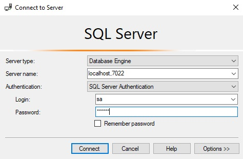

Docker is one of the buzzword in IT enviroment for the last few years. Supposedly, it works great on linux and it has been widely adopted by .Net core developers. But how the situation looks from the perspective of .NET Framework developers (I mean full .NET framework like 4.7 etc). I play for a while with windows containers and not everything works like it's described in marketing materials. In this post I will show you how the situation really looks, how to starts with windows containers and how we can utilize them.


## Docker 'on Windows' or 'for windows'


## Base images for windows containers


## Installing docker on Windows 2016
https://docs.microsoft.com/en-us/virtualization/windowscontainers/deploy-containers/deploy-containers-on-server

## Managing docker
TODO: Portainer https://portainer.io/


## Running app on IIS

Download `Runtime & Hosting Bundle`  from https://www.microsoft.com/net/download/dotnet-core/2.1
Save the file as `net_core_windows_server_hosting_bundle.exe` and put the same direcatory as `dockerfile` with the following content:

```
FROM microsoft/aspnet:4.7.1
SHELL ["powershell"]
ADD "dotnet-hosting-2.1.2-win.exe" "./net_core_windows_server_hosting_bundle.exe"
RUN ./net_core_windows_server_hosting_bundle.exe /quiet /install /norestart /log net_core_windows_server_hosting_bundle_log.txt ;\
    net stop was /y ;\
    net start w3svc 
RUN Import-Module WebAdministration ;\
    New-WebAppPool -Name AspCore ;\
    Set-ItemProperty -Path IIS:\\AppPools\AspCore -Name managedRuntimeVersion -Value $([string]::Empty) ;\ 
    Restart-WebAppPool AspCore;\
```

Build the image with command:

```
docker build -t aspnetcore:4.7.1_2.1 ./
```

This is your base image for ASP Core with .NET Framework 4.7.1 that will be hosted on IIS inside the docker. In order to create image with given application create docker file as follows:


```
FROM aspnetcore:4.7.1_2.1
RUN mkdir c:\app\  ;\
	Import-Module WebAdministration; \	
	Remove-WebSite -Name 'Default Web Site'; \
	New-Website -Name 'TestApp' -Port 80 -PhysicalPath 'c:\app' -ApplicationPool 'AspCore';
ADD dist\\ c:\\app
EXPOSE 80
```

Build and run the image

```
docker build -t testapp ./
docker run -p 7020:80 testapp ./
```

Website should be available on the host machine on port 7020. If the `localhost` address is not working then try with full host name.


## SQL Server on docker

There are two official docker images for SQL Server

- [mssql-server-windows-developer](https://hub.docker.com/r/microsoft/mssql-server-windows-developer/)
- [mssql-server-windows-express] (https://hub.docker.com/r/microsoft/mssql-server-windows-express/)


https://dzone.com/articles/docker-windows-sql-server-containers-and-database


```
FROM microsoft/mssql-server-windows-express:latest
ENV ACCEPT_EULA="Y" `  
    DATA_PATH="C:\data" `
    sa_password="N3rdD!Nne720^6"

ADD dist\\ c:\\scripts
	
RUN sqlcmd -i c:\\scripts\\CreateDb.sql
	
EXPOSE 1433
```

A sample script that create DB

```sql
USE [master]
GO

CREATE DATABASE [TestDB]

CREATE LOGIN [TestDBUser] WITH PASSWORD=N'PasswordSecret1234', DEFAULT_DATABASE=[master], DEFAULT_LANGUAGE=[us_english], CHECK_EXPIRATION=OFF, CHECK_POLICY=OFF
GO

USE [TestDB]
GO

CREATE USER [TestDBUser] FOR LOGIN [TestDBUser] WITH DEFAULT_SCHEMA=[dbo]
GO

EXEC sp_addrolemember N'db_owner', N'TestDBUser';
```


Now you have to build your image:

```
docker build -t testprojectdb  ./
```

And run the container 

```
docker run -p 1433:1433 testprojectdb
```

Now you should be able to connect to db from the app or using Management Studio. If you mapped container port 1433 to different port than 1433, for example:

```
docker run -p 7022:1433 testprojectdb
```

you should set server name in connection strin as `localhost,7022` (mind that the coma is a seperator)



## Mixed Windows and Docker containers

Running stack with mixed windows and linux based containers:

 - [Part 1](https://www.youtube.com/watch?v=ZfMV5JmkWCY)
 - [Part 2](https://www.youtube.com/watch?v=VbzwKbcC_Mg)
 - [Part 3](https://www.youtube.com/watch?v=I9oDD78E_1E&)


 ## Collecting logs
 
 TODO