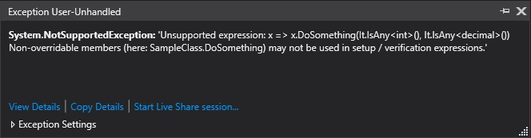
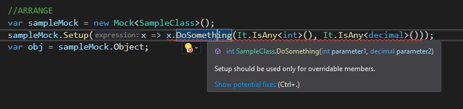
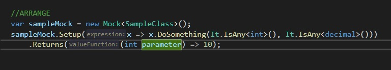
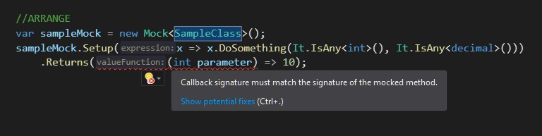
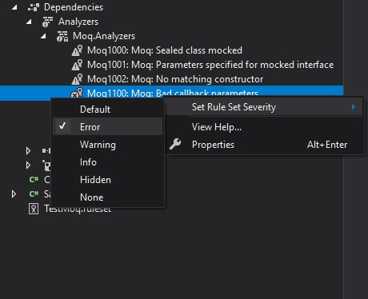

Recently, I've been asked if Roslyn can be used for helping with writing code that involves preparing mocks with `NSubstitute`. Of course, my answer was `"Yes"` but instead of rushing into creating a new project that will implement this functionality I performed small research. I checked [nuget.org](https://nuget.org) and [Visual Studio extensions marketplace](https://marketplace.visualstudio.com) and I discovered that there is a bunch of existing analyzers and extensions that facilitate working with mocks and not only for `NSubstitute` but for other mocking frameworks just like `Moq` or `Fake It Easy` too.  In this blog post, I will show you how these tools are helping to avoid common problems with mocking and boost your productivity by saving you a lot of typing. Presented examples will be mostly based on the `Moq` library because it's my favoring mocking package. 

## Moving runtime problems to design time
The idea behind mocking is to create in runtime a type that inherits from the mocked type and behaves in the way that we specify in mock configuration. The most common problem with mocking is that not everything related to mock preparation can be verified in design time and we need to compile and run our test in order to verify if the mock was constructed correctly. For example, from the semantical and syntactical point of view, it's possible to write code that creates mock of sealed class or for a non-overridable method (sealed or non-abstract or non-virtual). However, when we run a test that uses such kind of mock we've got the exception:



With [Moq.Analyzers](https://www.nuget.org/packages/Moq.Analyzers/) we can detect these problems in design time, right at the moment when we type the code that violates these rules.



Another problem with defining of expected behavior for the mocked method is that the delegate provided for `Returns()` should much the signature of the mocked method. There is no way to express such kind of constraint with `C#` syntax so this code will compile but won't work:



Thanks to Roslyn analyzer, the feedback loop can be shortened by moving this verification from runtime to design time:




Described here violations always result with runtime exception so it's good to set up the severity level of corresponding verification rules to `ERROR`:



If the `Moq` is not your mocking framework of choice don't worry, there's certainly a similar analyzer for your library. I was able to find also analyzers such as [NSubstitute.Analyzers.CSharp](https://www.nuget.org/packages/NSubstitute.Analyzers.CSharp/) and [FakeItEasy.Analyzer](https://www.nuget.org/packages/FakeItEasy.Analyzer/)

##  Less typing to create a mock
Besides all those traps with mocking rules, preparing mocks involves a lot of typing which is a dummy work. For example, to mock a method with three parameters (without carrying for their values) we need to write code like that:

```csharp
var mock = new Mock<ISampleInterface>();
mock.Setup(m => m.DoSomething(It.IsAny<int>(), It.IsAny<decimal>(), It.IsAny<string>()))
    .Returns((p1, p2, p3)=>  EXPECT_VALUE);
```

Typing repeatable `It.IsAny<>()` and trying to match the method signature in `Returns()` is quite boring and error-prone. Happily, these issues can be solved with Visual Studio extension - [Moq.Autocomplete](https://marketplace.visualstudio.com/items?itemName=AndreyLipatkin.moqautocomplete) that can propose and insert the whole code for us.

<div class="video-container">
<iframe width="853" height="480" src="https://www.youtube.com/embed/cTZR66mgt8Y?rel=0" frameborder="0" allow="autoplay; encrypted-media" allowfullscreen></iframe>
</div>

If the suggestions are not appearing after pressing `ctr+space` you should try to press `ctr+j` (yes, I lost a couple of hours before I discovered that). [Moq.Autocomplete](https://marketplace.visualstudio.com/items?itemName=AndreyLipatkin.moqautocomplete) works only for `Moq` and Visual Studio 2019. However, if you are using other mocking frameworks or still working on Visual Studio 2017 you can try [Mocking.Helpers](https://marketplace.visualstudio.com/items?itemName=mrluje.mocking-helpers) extension - it works for `NSubstitute`, `FakeItEasy` and `Moq` too but only provides suggestions for mocked method parameters.


If you need to return from the mock a sample object that has many properties that should be initialized with sample values you can use [MappingGenerator](https://github.com/cezarypiatek/MappingGenerator) that can easily scaffold object initialization:

