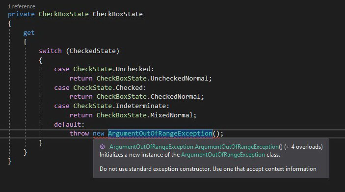

Over a year ago I've written a blog post about [designing exceptions](/post/the-art-of-designing-exceptions/). I found this article very useful by myself and I used it as a reference few times during code review. However it's almost impossible to expect that anybody after reading recommended resource will start to apply described rules immediately and will remember about it all the time - it's a learning process and it will take some time. A while ago I got interested with Roslyn (I've even got a public presentation about it - [polish recording available here](https://www.youtube.com/watch?v=wi1XHpUhx1Y)) and there is a really cool thing about Roslyn analyzers that can solve this problem - they help to actively introduce best practices into your codebase. Besides detecting all violation of given rule, Roslyn analyzers are able to provide a detailed explanation why given code can be harmful. With analyzer can be associated a `CodeFix` which can automatically rewrite suspicious code into the proper one. By adding roslyn analyzers into your solution you are helping your team to gain knowledge about best practices as well as to avoid potential code quality issues they are not aware of - and all of that happen via the shortest feedback loop - just in time of writing code. There are a plenty of already implemented rules (mostly free and open-sourced) such as:

- [Roslynator](https://github.com/JosefPihrt/Roslynator)
- [Refactoring Essentials](http://vsrefactoringessentials.com/)
- [Code Cracker](http://code-cracker.github.io/) 
- [DotNetAnalyzers](https://github.com/DotNetAnalyzers) 

If there is no analyzer that meets your expectations you can always create your own. You can easily find many tutorials in the web that teach how to start your journey as a analyzer creator. If you need a comprehensive introduction I'm highly recommending to read  [Roslyn Cookbook](https://www.amazon.com/gp/product/1787286835/ref=as_li_tl?ie=UTF8&tag=cezarypiatekg-20&camp=1789&creative=9325&linkCode=as2&creativeASIN=1787286835&linkId=eb7d6a30d8c770bbb5110e858f00ad97) by `Manish Vasani`
(I used this book for preparing my talk about roslyn analyzers and I'm also using this as a reference when I create my own analyzers.) 

I wanted to automated my advices from the article about exceptions designs by creating roslyn analyzers. I also asked on twitter in [this thread](https://twitter.com/cezary_piatek/status/1116270781254852613) what kind of automatic verifications related to the exceptions would be useful and I've got a few inspirations from [@dhermyt](https://twitter.com/dhermyt) and [@marcinwachulski](https://twitter.com/marcinwachulski). In this article I describe all those ideas as well as implementation of roslyn analyzers for detecting issues related to the exceptions usages.

##  Be more specific

The first remark related to the exceptions usages was about the exception types. `Throw` statements should not use directly types such as `Exception`, `SystemException` and `ApplicationException` because they are too vague and don't have information about the reason of failure. The actual role of the `ApplicationException` is not clear and should be completely avoided. According to the [msdn documentation](https://docs.microsoft.com/en-us/dotnet/api/system.applicationexception?redirectedfrom=MSDN&view=netframework-4.8) it was originally intended as a base class for application's custom exceptions but there is [additional remarks](https://docs.microsoft.com/en-us/dotnet/api/system.applicationexception?redirectedfrom=MSDN&view=netframework-4.8#remarks) that advice to derive custom exceptions directly from the `Exception` class. Throwing and catching `SystemException` is also discourage by the [msdn](https://docs.microsoft.com/en-us/dotnet/api/system.systemexception?view=netframework-4.8#remarks). You should always use more specific types of exceptions from `BCL` or create your own types of exceptions that describe given exceptional situation. It's a common practice to persist in logs type of exception so having a specific type for all types of failures makes logs filtering and aggregating much easier. Custom exception types allows also to convey in semantic form more contextual information inside the exception object.
To guard a codebase against using generic types of exceptions I've created [UseMoreSpecificExceptionTypeAnalyzer](https://github.com/smartanalyzers/ExceptionAnalyzer/blob/master/src/ExceptionAnalyzer/ExceptionAnalyzer/Rules/UseMoreSpecificExceptionType/UseMoreSpecificExceptionTypeAnalyzer.cs) which enforce using more specific types of exceptions in `throw` statements and expressions.


**EXAMPLE:** Taken from [gitextensions](https://github.com/gitextensions/gitextensions). Generic type of exception with totally meaningless error message. No way to investigate this problem without digging into source code.

##  Context will save you

The huge problem with the exceptions is that they very often don't contains enough information for investigating a failure. I guess you at least once saw a code when somebody throw an exception with very vague or even meaningless message. This lack of enough attention focused on the message can cause a lot of problems and can be very expensive. After finding that exception in the logs it was highly probable necessary to add additional logging and redeploy the application in order to collect crucial information that allows to solve the problem. In order to avoid that and save a lot of time it's worth to think every time when we are writing `throw` statements - what information about current context could be necessary to investigate this problem when it will occur. For this kind of affliction I've created [UseContextAwareConstructorAnalyzer](https://github.com/smartanalyzers/ExceptionAnalyzer/blob/master/src/ExceptionAnalyzer/ExceptionAnalyzer/Rules/UseContextAwareConstructor/UseContextAwareConstructorAnalyzer.cs) which enforce using context aware constructors in throw statements by forbidding constructors with the following signatures:

- ()
- (`String message`)
- (`String message`, `Exception innerException`)
- (`SerializationInfo info`, `StreamingContext context`)

In order to obey this rule you have to mark constructor that accept `message` as a private and add public constructor (or static factory method) that accept contextual information which can be used for constructing appropriate error message. This information can be also added as a exception object members - it can be helpful for testing purpose (help to avoid writing assertion based on the error message). This constructor signature restriction should force you to think what will be necessary for investigate potential failure - to make it obvious even for person who didn't develop this part of application. It should also simplify error massage management in your codebase because you don't need anymore think error message up every time when you throw given exception.



**EXAMPLE:** Taken from [gitextensions](https://github.com/gitextensions/gitextensions). The `ArgumentOutOfRangeException` is created without any parameter giving no clue what went wrong to the method consumer. Besides this method (property) has no argument so it's even more confusing.

## Parameters validation

`BCL` contains predefined exceptions intended for parameter's validation such as: `ArgumentException`, `ArgumentNullException` and `ArgumentOutOfRangeException`. Every of this exception types has a constructor tha accept a string representing the name of the parameter that violate the contract of our method. The mandatory of providing this parameter should be enforce by the [UseContextAwareConstructorAnalyzer](https://github.com/smartanalyzers/ExceptionAnalyzer/blob/master/src/ExceptionAnalyzer/ExceptionAnalyzer/Rules/UseContextAwareConstructor/UseContextAwareConstructorAnalyzer.cs), however it's important to provide valid parameter name. Even if we do so, our code could become easily outdated especially if we don't use `nameof()` expression. I've also seen a code where arguments related exceptions were used for reporting invalid values of local variables or current object members which is in my opinion a symptom of improper design. In order to prevent those issues I've created [ArgumentExceptionParameterNameAnalyzer](https://github.com/smartanalyzers/ExceptionAnalyzer/blob/master/src/ExceptionAnalyzer/ExceptionAnalyzer/Rules/ArgumentExceptionParameterName/ArgumentExceptionParameterNameAnalyzer.cs) which is responsible for verification if the value of the exception constructor's parameter with name `parameterName` match the name of any current method parameter.


**EXAMPLE:** Taken from [nhibernate-core](https://github.com/nhibernate/nhibernate-core). Somebody confused `parameterName` with `message` parameter.

## Original culprit

I come across many times on the code when somebody catches exception and from the `catch` clause throw a new one without supplying the original exception as the inner exception parameter. Re-throwing exception from the `catch` clause should be for providing more context information (example with validation and files) instead of hiding the original reason. Maybe some programmer are doing it purposely advocating it with security concerns but this aspect should be rather handled on the service boundary (errors are a part of contract). The original exception in the logs certainly helps you investigate the problem and find faster the reason of the failure. In order to detect this code smell I've created [ProvideInnerExceptionInCatchAnalyzer](https://github.com/smartanalyzers/ExceptionAnalyzer/blob/master/src/ExceptionAnalyzer/ExceptionAnalyzer/Rules/ProvideInnerExceptionInCatch/ProvideInnerExceptionInCatchAnalyzer.cs). This analyzer searches for all `throw` statements inside the `catch` clause which don't pass caught exception as a `inner exception` parameter for the new exception.


**EXAMPLE:** Taken from [nhibernate-core](https://github.com/nhibernate/nhibernate-core). The original reason of the error is swallowed.

## Exception Driven Logic

What is the `Exception Driven Logic`? It's a kind of code where business flows are implemented using exceptions mechanism (`try-catch`) instead of condition statements (`if-else`). It can be easily identified because in the same method given exception is throw and catch, something like that:


```cs
try
{
	// do sth
	if(condition)
	{
	   throw new SpecificException();
	}
	// do sth
}
catch(SpecificException e)
{
	// do sth
}
```
This approach makes the code harder to analyze and has a huge impact on the performance. According to 
[Writing High-Performance .NET Code](https://www.amazon.com/gp/product/0990583457/ref=as_li_tl?ie=UTF8&tag=cezarypiatekg-20&camp=1789&creative=9325&linkCode=as2&creativeASIN=0990583457&linkId=fa07e52bebc6240c4c889eea6b23c76b) by `Ben Watson` it can be even XX times slower. Exceptions are for exceptional situation (when you don't know how to react for given conditions) and should not be used for well known business workflow. In order to prevent this kind of violation in code I've implemented [ExceptionDrivenLogicAnalyzer](https://github.com/smartanalyzers/ExceptionAnalyzer/blob/master/src/ExceptionAnalyzer/ExceptionAnalyzer/Rules/ExceptionDrivenLogic/ExceptionDrivenLogicAnalyzer.cs) which is able to spot places where the same exception is thrown and caught inside the code of same method.


**EXAMPLE:** Taken from [nhibernate-core](https://github.com/nhibernate/nhibernate-core). This additional level of indirection seems to be redundant.

## Summary
This is a first experimental implementation of analyzers so they might report false positives. I would be appreciate if you could try it and let me know if it was able to spot a real problems in your code base or all those reported diagnostics were wrong. The analyzers can be installed from `nuget`[SmartAnalyzers.ExceptionAnalyzer](https://www.nuget.org/packages/SmartAnalyzers.ExceptionAnalyzer/) and the source code is available on `Github` as a [ExceptionAnalyzer](https://github.com/smartanalyzers/ExceptionAnalyzer) project.