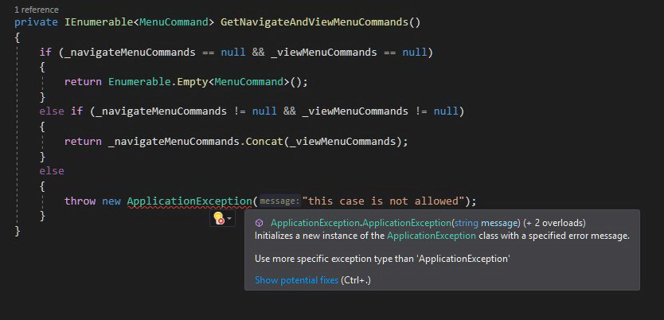

Over a year ago I wrote a blog post about [designing exceptions](/post/the-art-of-designing-exceptions/). I found this article very useful by myself and I used it as a reference a few times during code review. However, it's almost impossible to expect that, after reading the recommended resource, anybody would start to apply described rules immediately and remember about them all the time. It's a learning process and it takes some time. A while ago I got interested with Roslyn (I even delivered a public presentation about it - [polish recording available here](https://www.youtube.com/watch?v=wi1XHpUhx1Y)) and there is a really cool thing about Roslyn analyzers that can solve this problem - they help to actively introduce best practices into your codebase. Besides detecting all violations of a given rule, Roslyn analyzers are able to provide a detailed explanation of why given code can be harmful and - thanks to associated `CodeFix` - can automatically rewrite suspicious code into the proper one. By adding Roslyn analyzers into your solution, you are helping your team to gain knowledge about best practices as well as to avoid potential code quality issues they are not aware of. All of that happens via the shortest feedback loop - just in time of writing code. There are plenty of already implemented rules (mostly free and open-sourced) such as:

- [Roslynator](https://github.com/JosefPihrt/Roslynator)
- [Refactoring Essentials](http://vsrefactoringessentials.com/)
- [Code Cracker](http://code-cracker.github.io/) 
- [DotNetAnalyzers](https://github.com/DotNetAnalyzers) 

If there is no analyzer that meets your expectations, you can always create one of your own. You can easily find many tutorials on the web that teach how to start your journey as an analyzer creator. If you need a comprehensive introduction, I highly recommend to read  [Roslyn Cookbook](https://www.amazon.com/Roslyn-Cookbook-Compiler-Service-Analysis-ebook/dp/B0719Q2KHT/) by `Manish Vasani`
(I used this book for preparing my talk about Roslyn analyzers and I also use it as a reference when I create my own analyzers.) 

I wanted to automate my advice from the article about the exception designs by creating Roslyn analyzers. I also asked on Twitter in [this thread](https://twitter.com/cezary_piatek/status/1116270781254852613) what kind of automatic verifications related to the exceptions would be useful and I got a few inspirations from [@dhermyt](https://twitter.com/dhermyt) and [@marcinwachulski](https://twitter.com/marcinwachulski). In this article, I describe all those ideas as well as the implementation of Roslyn analyzers for detecting issues with the exception usage.

##  Be more specific

The first remark related to the exception usage was about the exception types. `Throw` statements should not directly use types such as `Exception`, `SystemException` and `ApplicationException` because they are too vague and don't have information about the failure reason. The actual role of the `ApplicationException` is not clear and should be completely avoided. According to the [msdn documentation](https://docs.microsoft.com/en-us/dotnet/api/system.applicationexception?redirectedfrom=MSDN&view=netframework-4.8) it was originally intended as a base class for application's custom exceptions but there are [additional remarks](https://docs.microsoft.com/en-us/dotnet/api/system.applicationexception?redirectedfrom=MSDN&view=netframework-4.8#remarks) that advice to derive custom exceptions directly from the `Exception` class. Throwing and catching `SystemException` is also discouraged by the [msdn](https://docs.microsoft.com/en-us/dotnet/api/system.systemexception?view=netframework-4.8#remarks). You should always use more specific types of exceptions from `BCL` or create your own that represents given exceptional situation. It's a common practice to persist the type of exception in logs, so having a specific types for all types of failures makes logs filtering and aggregating much easier. Custom exception types allow also to convey in semantic form more contextual information inside the exception object.
To guard a codebase against using generic types of exceptions I've created [UseMoreSpecificExceptionTypeAnalyzer](https://github.com/smartanalyzers/ExceptionAnalyzer/blob/master/src/ExceptionAnalyzer/ExceptionAnalyzer/Rules/UseMoreSpecificExceptionType/UseMoreSpecificExceptionTypeAnalyzer.cs) which enforces using more specific types of exceptions in `throw` statements and expressions.



**EXAMPLE:** Taken from [gitextensions](https://github.com/gitextensions/gitextensions). The generic type of exception with a totally meaningless error message. No way to investigate this problem without digging into the source code.

##  Context will save you

The huge problem with the exceptions is that they very often don't contain enough information for investigating a failure. I guess you saw a code when somebody throws an exception with a very vague or even meaningless message at least once. This lack of proper attention focused on the message can cause a lot of problems and can be very expensive. After finding that exception in the logs, it's highly probable that it will be necessary to add additional logging and redeploy the application in order to collect crucial information that allows solving the problem. In order to avoid that and save a lot of time, it's worth to think every time when we are writing `throw` statements - what information about the current context could be necessary to investigate this problem when it occurs. For this kind of affliction I've created [UseContextAwareConstructorAnalyzer](https://github.com/smartanalyzers/ExceptionAnalyzer/blob/master/src/ExceptionAnalyzer/ExceptionAnalyzer/Rules/UseContextAwareConstructor/UseContextAwareConstructorAnalyzer.cs) which enforces using context-aware constructors in throw statements by forbidding constructors with the following signatures:

- ()
- (`String message`)
- (`String message`, `Exception innerException`)
- (`SerializationInfo info`, `StreamingContext context`)

In order to obey this rule, you have to mark constructor that accepts `message` as private and add public constructor (or static factory method) that accepts contextual information which can be used for constructing appropriate error message. This information can also be added as exception object members - it can be helpful for testing purposes (help to avoid writing assertions based on the error message). This constructor signature restriction should force you to think about what will be necessary to investigate potential failure - to make it obvious even for a person who didn't develop this part of the application. It should also simplify error message management in your codebase because you don't need to think error message up every time you throw given exception.


**EXAMPLE:** Taken from [gitextensions](https://github.com/gitextensions/gitextensions). The `ArgumentOutOfRangeException` is created without any parameter giving no clue to the method consumer what went wrong. Besides this method (property) has no argument so it's even more confusing.

## Parameters validation

`BCL` contains predefined exceptions intended for parameter's validation such as: `ArgumentException`, `ArgumentNullException` and `ArgumentOutOfRangeException`. Each of these types has a constructor that accepts a string representing the name of the parameter that violates the contract of our method. The obligation of providing this parameter should be enforced by the [UseContextAwareConstructorAnalyzer](https://github.com/smartanalyzers/ExceptionAnalyzer/blob/master/src/ExceptionAnalyzer/ExceptionAnalyzer/Rules/UseContextAwareConstructor/UseContextAwareConstructorAnalyzer.cs). However, it's important to provide a valid parameter name. Even if we do so, our code can become easily outdated especially if we don't use `nameof()` expression. I've also seen a code where argument related exceptions were used for reporting invalid values of local variables or current object members which is, in my opinion, a symptom of improper design. In order to prevent those issues I've created [ArgumentExceptionParameterNameAnalyzer](https://github.com/smartanalyzers/ExceptionAnalyzer/blob/master/src/ExceptionAnalyzer/ExceptionAnalyzer/Rules/ArgumentExceptionParameterName/ArgumentExceptionParameterNameAnalyzer.cs) which is responsible for verification if the value of the exception constructor's parameter with name `parameterName` matches the name of any current method parameter.


**EXAMPLE:** Taken from [nhibernate-core](https://github.com/nhibernate/nhibernate-core). Somebody confused `parameterName` with `message` parameter.

## Original culprit

On numerous occasions I come across a code where somebody catches an exception and from the `catch` clause throws a new one, without supplying the original exception as the `innerException` parameter. Re-throwing exception from the `catch` clause should serve for providing more context information instead of hiding the original reason. Some developers may be doing it on purpose, advocating it with security concerns but this aspect should be rather handled on the service boundary. The original exception in the logs certainly helps you investigate the problem and find the failure reason faster. In order to detect this code smell I've created [ProvideInnerExceptionInCatchAnalyzer](https://github.com/smartanalyzers/ExceptionAnalyzer/blob/master/src/ExceptionAnalyzer/ExceptionAnalyzer/Rules/ProvideInnerExceptionInCatch/ProvideInnerExceptionInCatchAnalyzer.cs). This analyzer searches for all `throw` statements inside the `catch` clause which don't pass caught exception as an `innerException` parameter for the new exception.


**EXAMPLE:** Taken from [nhibernate-core](https://github.com/nhibernate/nhibernate-core). The original reason of the error is swallowed.

## Exception Driven Logic

What is the `Exception Driven Logic`? It's a kind of code where business flows are implemented using exceptions mechanism (`try-catch`) instead of condition statements (`if-else`). It can be easily identified because in the same method given exception is thrown and caught, something like that:


```cs
try
{
	// do sth
	if(condition)
	{
	   throw new SpecificException();
	}
	// do sth
}
catch(SpecificException e)
{
	// do sth
}
```
This approach makes the code harder to analyze and has a huge impact on performance. According to 
[Writing High-Performance .NET Code](https://www.amazon.com/Writing-High-Performance-NET-Code-Watson-ebook/dp/B07BF68842/) by `Ben Watson` it can be even **thousands of times slower** (For more details on that I recommend reading chapter: "General Coding and Class Design - Exceptions"). Exceptions are for exceptional situations (when you don't know how to react on given conditions in the current context) and should not be used for well-known business workflow. In order to prevent this kind of violation in the code I've implemented [ExceptionDrivenLogicAnalyzer](https://github.com/smartanalyzers/ExceptionAnalyzer/blob/master/src/ExceptionAnalyzer/ExceptionAnalyzer/Rules/ExceptionDrivenLogic/ExceptionDrivenLogicAnalyzer.cs) which is able to spot places where the exception is thrown and caught inside the code of the same method.


**EXAMPLE:** Taken from [nhibernate-core](https://github.com/nhibernate/nhibernate-core). This additional level of indirection seems to be redundant.

## Summary
This is the first experimental implementation of analyzers so they might report false positives. I would appreciate if you could try it and let me know if it was able to spot real problems in your code base or all those reported diagnostics were wrong. The analyzers can be installed from `nuget` [SmartAnalyzers.ExceptionAnalyzer](https://www.nuget.org/packages/SmartAnalyzers.ExceptionAnalyzer/) and the source code is available on `Github` as the [ExceptionAnalyzer](https://github.com/smartanalyzers/ExceptionAnalyzer) project.