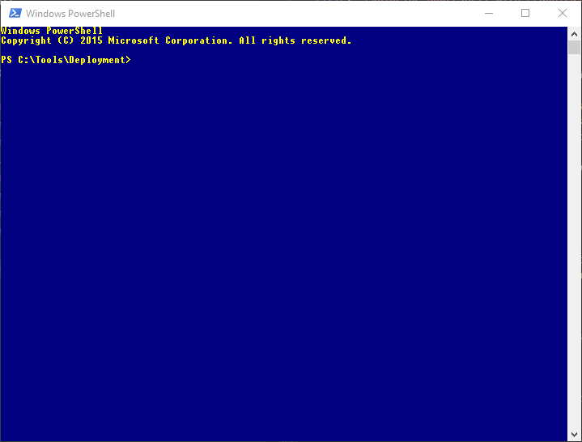
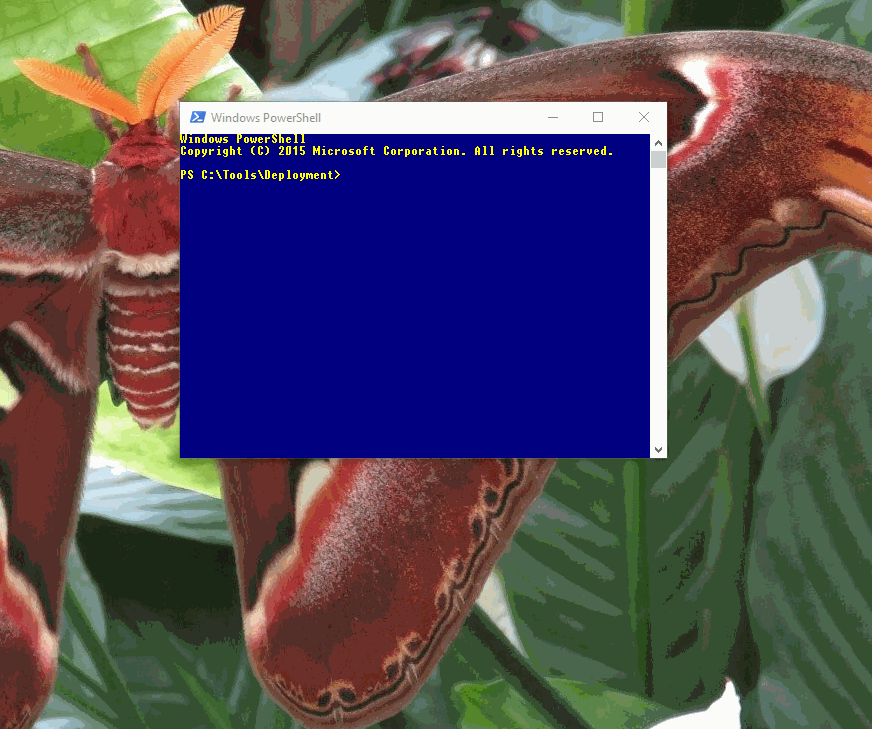

I've recently watched a preatty decent tutorial about DSC on Microsoft Virtual Academy. I'm not huge fan of video tutorials because it always takes more time to watch it than read book/blog post (you can hack it by indreasing video speed) but sometimes there is additional beneficial side effect - the presenter can show you (accidentaly or not) some tips and tricks not strictly related to the core subject of the video. This post is an attemopt of summarizing tricks from DSC tutorial and my former knowledged about GUI tools related to powershell. I find it useful when preparing powershell scripts and it should be helpful for people who starts to exploring powershell.

Mentioned DSC tutorial can be found under the following links:

[Getting Started with PowerShell Desired State Configuration (DSC)](https://mva.microsoft.com/en-us/training-courses/getting-started-with-powershell-desired-state-configuration-dsc--8672?l=ZwHuclG1_2504984382)

[Advanced PowerShell Desired State Configuration (DSC) and Custom Resources](https://mva.microsoft.com/en-US/training-courses/advanced-powershell-desired-state-configuration-dsc-and-custom-resources-8702?l=3DnsS2H1_1504984382)

### Powershell and Windows explorer
The first tip is about switching between powershell console and windows explorer back and forth with keeping working directory context. This is the most trivial but at the same time very useful operation.
In order to open windows explorer with current directory simpply type:
```powershell
> explorer .
```
... and to open powershell console with working directory set to currently open folder within windows explorer type **powershell** command in address bar.


<video controls>
  <source src="explorer.mp4" type="video/mp4">  
  Your browser does not support the video tag.
</video>


### Browsing scripts in console
When you are working in console enviroment and you want to check script content you can use **Get-Content** command to print script into screen in raw format or use **Get-ColorizedContent** to print formatted script with line numbers and syntax highlighting. This cmdlet comes from [PowerShellCookbook module](https://www.powershellgallery.com/packages/PowerShellCookbook/1.3.6) which could be easily installed with **Install-Module** cmdlet from [Powershell gallery](https://www.powershellgallery.com).



### Opening Powershell ISE from powershell console
There is no out-of-the-box editor which allows you to edit scripts right inside the powershell console. You can install [third-party console editors](https://stackoverflow.com/questions/11045077/edit-a-text-file-on-the-console-in-64-bit-windows) or use Powershell ISE which comes with Windows Management Framework. Simply type **ise** command with file path as the parameter to open it with ISE (you can skip file parameter to open a new instance of ISE with context set to current directory). In order to open another script in new ISE tab use **psedit** command (this command works only inside the ISE console).



Powershell ISE is very usefull to play around with powershell scripts because it allows you to execute your script partialy (simply select parts of you code and press F8 to send it to powershell console)


### Opening Visual Studio Code from powershell console
A good alternative to Powershell ISE could be [Visual Studio Code with pluggin for powershell](https://marketplace.visualstudio.com/items?itemName=ms-vscode.PowerShell). I find VSCode better than ISE in term of support for static analysis and debugging. 


When VSCode is your powershell editor of choice too, you can also easily switch from console to this environment. Just execute **code** command with filepath as a parameter to open given script with VSCode or replace the filepath parameter with "." (dot sign) to load current directory as a workspace inside VSCode.

### Filtering result list with Out-GridView
When your command or script returs long list it could hard to spot interesting positions by scrolling throught console. You can make it a lot easier by redirectig the result to **Out-GridView** cmdlet (use **ogv** alias for shorten). The Out-GridView outputter presents data using grid control and allows to sort and filter results by defining complex criteria based on data attributes.

<video controls>
  <source src="outgridview.mp4" type="video/mp4">  
  Your browser does not support the video tag.
</video>

You can also use Out-GridView to select elements by providing  **OutputMode** parameter


### Executing CmdLet with different parameters set
Sometimes it's hard to remember all methods parameters (especially when we use it very rare). You can check the list of available parameters by displaying method documentation inside the console with **Get-Help** command or utilyzing dedicated form which could be created with **Show-Command** cmdlet.

```powershell
> Show-Command Invoke-WebRequest 
```
If you don't remember the exact name of the method you can skip it and **Show-Command** cmdlet opens a window which allows you to search command by name. When you select a specific command all available parameters sets will be presented as a tabs. You can select a given parameter set, provide values of parameters with dediced form and click *Run* button to execute method. You can always get the method manual by clicking *help* button.

<video controls>
  <source src="showcommand.mp4" type="video/mp4">  
  Your browser does not support the video tag.
</video>

### Inspecting complext objects

Another interesting cmdlet that we can find in *PowerShellCookbook* module is **Show-Object**. This command presents complex objects in the form of tree. This expandable tree allows us to drill down and explore nested properties. It's extreemly usefull when we have to deal with unknown objects.

<video controls>
  <source src="showobject1.mp4" type="video/mp4">  
  Your browser does not support the video tag.
</video>

