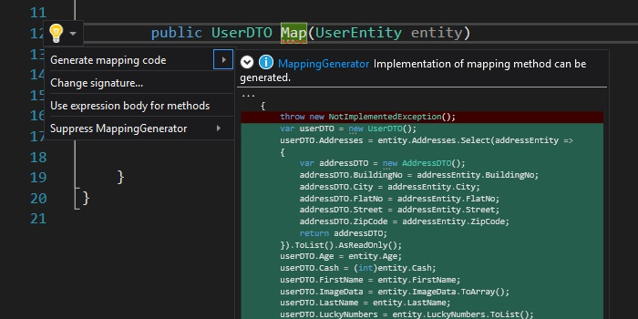

A few weeks ago I posted about negative aspects of negative espects of applying AutoMapper. As an alternative I suggested typing all mapping code by hand or utilaiz some kind of generator like [T4Scaffoling](https://www.nuget.org/packages/T4Scaffolding/) or something Roslyn based. In the past I experimented with T4Scaffoling but it was quite tedious. It requires preparation of templates in [T4](https://msdn.microsoft.com/en-us/library/bb126445.aspx) syntax, referencing it to the project, writing some PowerShell code to provide data for templates and there was issue with assembly locking. I also tried to generate code with PowerShell and [EnvDTE](https://docs.microsoft.com/en-us/dotnet/api/envdte). It worked but It has some limitation and it wasn't enought convenient to start using it on daily basis. I gave one more try  and after publication of mentioned post I started looking for existing, Roslyn-based solution that could be a relly nice substitution for AutoMapper and I found [ObjectMapper](https://github.com/nejcskofic/ObjectMapper) project. At first it looked promissing but after analysis I found a few limitation. It requires referencing additional library which contains attribute and interfaces used to mark mapping methods. In practice this means that I need to install additional nuget package to every project in which I want to use mapping generation feature which is quite uncomfortable. So I've tried to create my own version which will be distributed in the form of Visual Studio Extension and using conventions to locate condidates for potential mapping methods. I was interested in generating implementation for the following kinds of methods:

- Pure mapping method - non-void method that takes single parameter

  ```csharp
  public UserDTO Map(UserEntity entity)
  {
      throw new NotImplementedException();
  }
  ```
- Updating method - void method that takes two parameters

  ```csharp
  public void Update(UserDTO source, UserEntity target)
  {
      throw new NotImplementedException();
  }
  ```
- Mapping Constructor - constructor that takes single parameter

  ```csharp
  public UserDTO(UserEntity user)
  {
      
  }
  ```
- Updating member method - void member method that takes single parameter

  ```csharp
  public void UpdateWith(UserEntity en)
  {
      throw new NotImplementedException();
  }
  ```

//TODO: few words about playing with Roslyn

  There is a lot of things that could be improved such as:

  - reusing existing mapping method to map complex properties
  - extracting method for mapping complex properties
  - using initialization block to create new objects
  - updating collection instead of replacing content completely
  
  I've publish source code on [github](https://github.com/cezarypiatek/MappingGenerator) and if you are interesting in using it in action you can install it as Visual Studio Extension from [Visual Studio Marketplace](https://marketplace.visualstudio.com/items?itemName=54748ff9-45fc-43c2-8ec5-cf7912bc3b84.mappinggenerator).