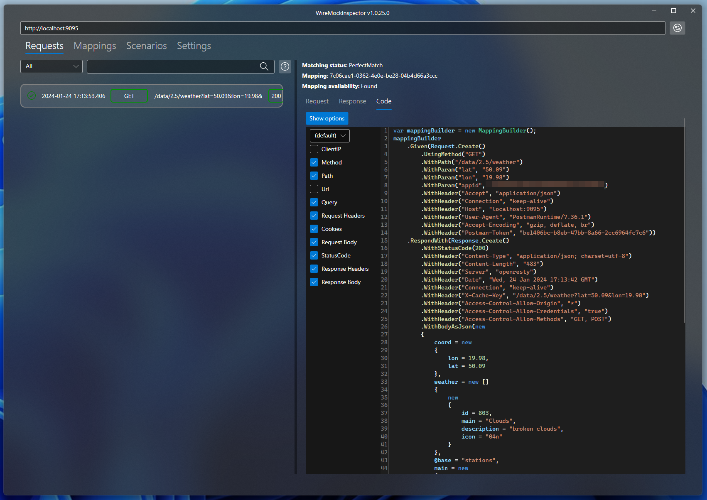

In my journey through the nuances of API testing, I've often encountered the challenges and time-consuming aspects of creating accurate WireMock mappings. As developers, we often get bogged down in the details of the anatomy of inter-service communication, not to mention the frustrating typos that lead to inaccurate mappings. In this blog post, I will introduce a powerful solution: the WireMock.NET proxy. This feature completely changes the way we approach mapping preparation, significantly reducing both workload and debugging time. Let's explore how it can streamline our development process, making our work more efficient and effective.

## Generate mapping with proxy


WireMock.NET proxy allows for generating request stubs automatically based on the request to the actual downstream service. It's very easy to configure:
- run WireMockServer with enabled Admin interface
- configure your app by pointing your downstream service address to WireMock
- define a special mapping that acts as a proxy to a real downstream service. The matcher can be very simple, for example a path with a wildcard.


```cs
[Test]
public async Task test_proxy()
{
    // INFO: Start WireMock.NET with admin interface
    var wireMock = WireMockServer.StartWithAdminInterface(port:9095);
    
    // INFO: Setup your app, set WireMock as downstream service address
    await using var appFactory = new WebApplicationFactory<Program>()
    .WithWebHostBuilder(builder =>
    {
        builder.ConfigureAppConfiguration((context, configuration) =>
        {
            configuration.AddInMemoryCollection(new Dictionary<string, string?>
            {
                ["ExternalServices:WeatherService"] = wireMock.Url
            });
        });
    });

    // INFO: Defined proxy
    wireMock
        .Given(
            Request.Create()
                .WithPath("/data/2.5/*")
        )
        .RespondWith(
            Response.Create()
                .WithProxy(new ProxyAndRecordSettings
                {
                    Url = "https://api.openweathermap.org/",
                    SaveMapping = true
                })
        );

    // INFO: call an endpoint in your app that use the downstream service
    _ = await appFactory.CreateClient().GetAsync("/api/sample-endpoint");

    // INFO: Hold the process to inspect WireMock.NET admin api from the browser or WireMockInspector
    await Task.Delay(TimeSpan.FromDays(1));
}
```

WireMock.NET should automatically generate mapping based on the forwarded request and its response. You can find generated mapping definition by inspecting the result of `http://localhost:9095/__admin/mappings` endpoint. Additionally, if you set `ProxyAndRecordSettings.SaveMappingToFile` to true, WireMock.Net will automatically save generated mapping definitions into separate files under `/__admin/mappings/` in your output dir. 

But what if you prefer defining your mappings directly in C# code rather than loading from files? This can be automatically generated for you too. Just take the GUID of generated mapping and call `http://localhost:9095/__admin/mappings/code/MAPPING_GUID` endpoint.

## Get your mappings with WireMockInspector

Generated mapping definition, as well as the C# code, can be easily retrieved also by using [WireMockInspector](https://github.com/WireMock-Net/WireMockInspector). Just install `WireMockInspector` dotnet tool and instead of holding your tests with `Task.Delay`, use `Inspect` extension method from [WireMock.Net.Extensions.WireMockInspector](https://www.nuget.org/packages/WireMock.Net.Extensions.WireMockInspector) nuget package.

The code that is provided by the `__admin/mappings/code/MAPPING_GUID` endpoint is available on the `Code` tab for selected mapping.


WireMockInspector features also its own engine for generating C# code to configure WireMock.NET mappings. This engine works slightly differently to the one built into WireMock.NET by operating directly on the request and response data rather than on the generated mapping. It also offers customization options. By providing your own liquid templates, you can completely alter the shape of the output code. This should be very useful if you have your own wrappers around WireMock.NET. You can access this feature from the `Code` tab for a selected request.



More information about code generation for WireMock mappings can be found [here](https://github.com/WireMock-Net/WireMockInspector?tab=readme-ov-file#code-generator).

## Create proxy to multiple downstream services

Things get a little more complicated when our application uses multiple external dependencies and we want to define a proxy for more than one downstream service. My solution for this is to add an extra suffix to the service address to distinguish it from other services. Actually, I use this approach whenever I test with WireMock.NET. It simplifies a lot of things like endpoint address clash, etc. Having a common prefix for all endpoints under a given service allows for the creation of a generic path matcher. However, there's a small catch: if you add an extra suffix to the service address, WireMock.NET will pass that suffix to the actual service and we'll end up with a 404 error response code. Fortunately, this can be overcome by using `ProxyUrlReplaceSettings`, which allows us to strip the extra suffix before passing the request to the downstream service. An example working configuration for two downstream services looks like this:

```cs
[Test]
public async Task test_proxy()
{
    // INFO: Start WireMock.NET with admin interface
    var wireMock = WireMockServer.StartWithAdminInterface(port:9095);
    
    // INFO: Setup your app, set WireMock as downstream service address
    await using var appFactory = new WebApplicationFactory<Program>()
    .WithWebHostBuilder(builder =>
    {
        builder.ConfigureAppConfiguration((context, configuration) =>
        {
            configuration.AddInMemoryCollection(new Dictionary<string, string?>
            {
                ["ExternalServices:ServiceA"] = $"{wireMock.Url}/ServiceA",
                ["ExternalServices:ServiceB"] = $"{wireMock.Url}/ServiceB",
            });
        });
    });

    // INFO: Defined proxy for Service A
    wireMock
    .Given(
        Request.Create()
            .WithPath("/ServiceA/*")
    )
    .RespondWith(
        Response.Create()
            .WithProxy(new ProxyAndRecordSettings
            {
                Url = "http://serviceA.test.local",
                SaveMapping = true,
                ReplaceSettings = new ProxyUrlReplaceSettings
                {
                    OldValue = "/ServiceA",
                    NewValue = ""
                }
            }));
    
    // INFO: Defined proxy for Service B
    wireMock
    .Given(
        Request.Create()
            .WithPath("/ServiceB/*")
    )
    .RespondWith(
        Response.Create()
            .WithProxy(new ProxyAndRecordSettings
            {
                Url = "http://serviceB.test.local",
                SaveMapping = true,
                ReplaceSettings = new ProxyUrlReplaceSettings
                {
                    OldValue = "/ServiceB",
                    NewValue = ""
                }
            }));

    // INFO: call an endpoint in your app that use the downstream service
    _ = await appFactory.CreateClient().GetAsync("/api/sample-endpoint");

    // INFO: Hold the process to inspect WireMock.NET admin api from the browser or WireMockInspector
    await Task.Delay(TimeSpan.FromDays(1));
}
```
