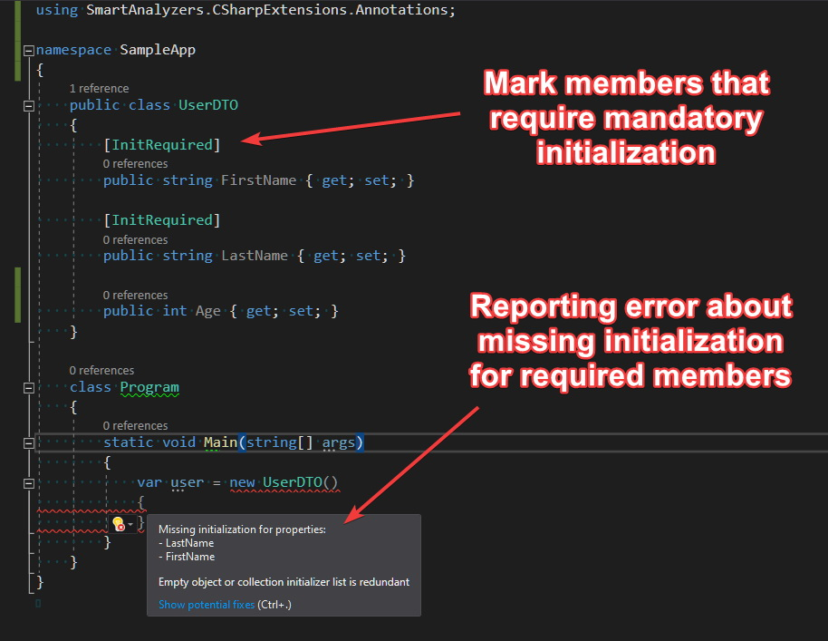
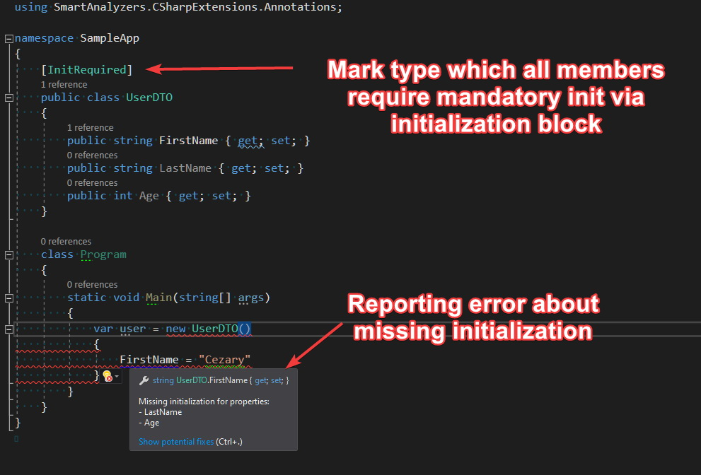
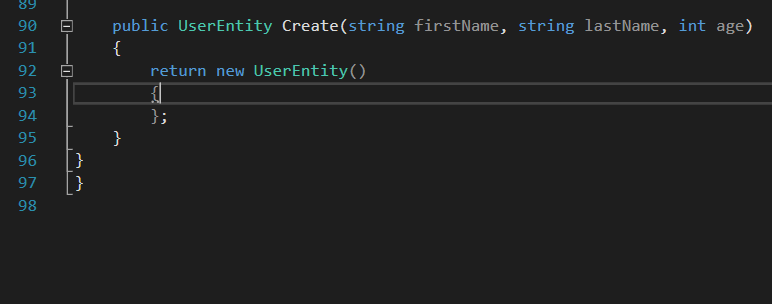
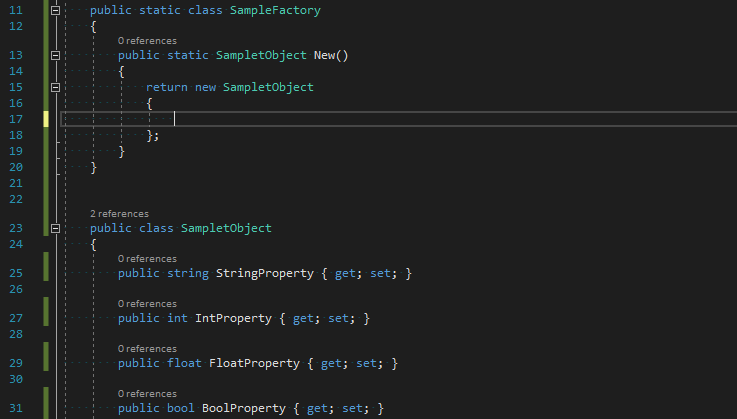
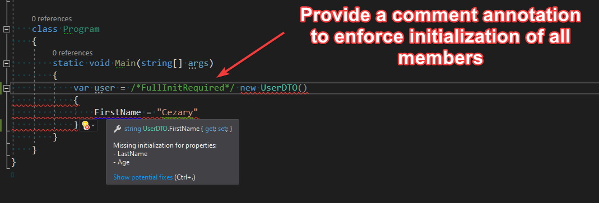
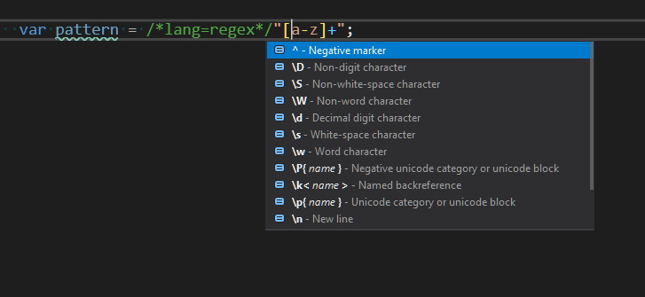
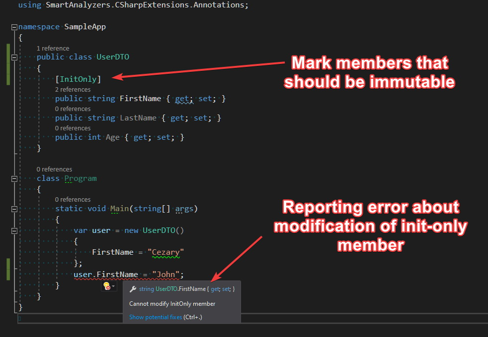
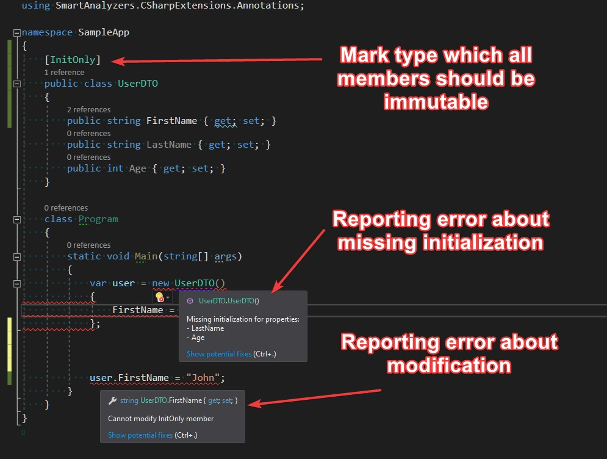

Some time ago I came across Jimmy Bogard's article ["Immutability in DTOs?"](https://jimmybogard.com/immutability-in-dtos/) about the pros and cons of using immutable type pattern/approach. I fully agree with the author - the idea of immutable types is great but without the proper support from the language syntax it might not be worth applying. C# allows creating immutable types by adding `readonly` keyword to fields or by removing setter from properties. We are obligated then to initialize those readonly members from the constructor or directly in the member's definition. This results in a large amount of boilerplate code, causes problems with ORMs and serializers which require a default constructor, and makes the object instantiation cumbersome (or at least less readable). I'm a huge fan of `Roslyn` so I've started thinking about how to utilize Roslyn's API to avoid all those problems with immutable types and improve coding experience while working with them. In this article, I'm going to present the results of my experiments with Roslyn analyzers that simulate types immutability.

## Convenient initialization

As I've mentioned before, in order to make a class immutable we need to remove setters, add a dedicated constructor for initializing those properties and then always use this constructor to instantiate our immutable class. A sample code snippet just to remind you how cumbersome it is:

```csharp
public class UserDTO
{
    public string FirstName { get;}
    public string LastName { get;}
    public int Age { get; }

    public UserDTO(string firstName, string lastName, int age)
    {
        FirstName = firstName;
        LastName = lastName;
        Age = age;
    }
}

class Program
{
    static void Main(string[] args)
    {
        var user = new UserDTO("John", "Doe", 20);
    }
}
```

It would be more convenient if we didn't need to define a constructor and initialize members using the initialization block. However, there's no mechanism that allows enforcing mandatory initialization in the init block. So, let's introduce `[InitRequired]` attribute inspired by `initonly` keyword from [C# records proposal](https://github.com/dotnet/csharplang/blob/master/proposals/recordsv2.md#mutability):



If we want to enforce mandatory initialization via initialization block for all members, we can mark our type with `[InitRequired]` attribute.



Of course, the property to be able to initialize via init block it must meet certain conditions:

- must have a setter
- the setter needs to be available in a given context (accessibility)
- cannot be a part of explicit interface implementation.

In order to avoid missing initialization caused by the conditions mentioned above, I would recommend always keeping those properties on the same accessibility level as the containing type.


> **Pro Tip:** You can use [MappingGenerator](https://marketplace.visualstudio.com/items?itemName=54748ff9-45fc-43c2-8ec5-cf7912bc3b84.mappinggenerator) to complete initialization block with local accessible values 

or to scaffold this initialization with sample values



If you don't have access to the source code or you want to enforce full initialization only for given instance, you can do that by adding `/*FullInitRequired*/` comment marker:



To ensure that full object graph is initialized, use `/*FullInitRequired:recursive*/` comment marker. I think this may be especially useful for methods performing mapping or deep clone. I got the idea of those comment markers from a discussion about [String Hints
#2796](https://github.com/dotnet/csharplang/issues/2796#issuecomment-530525044). This kind of annotation is already used for marking string literals with regex pattern:



## Full immutability

`[InitRequired]` attribute enforces only mandatory initialization via initialization block. To achieve immutability, we need to forbid modification outside the init block. For that purpose, I've introduced `[InitOnly]` attribute. Basically, it works in the same way as `[InitRequired]` but additionally it verifies if members decorated with it are not modified after initialization.



You can enforce immutability for all members by putting `[InitOnly]` attribute on the type level.




Thanks to `[InitOnly]` attribute and corresponding analyzer we can achieve full immutability without writing redundant boilerplate code.

> **Important:** If you like the idea of `[InitRequire]` and `[InitOnly]` attributes and you are going to use them in your project, please make sure that all your teammates know about it.


## Summary

All attributes and analyzers described here are available as a single Nuget package [SmartAnalyzers.CSharpExtensions.Annotations](https://www.nuget.org/packages/SmartAnalyzers.CSharpExtensions.Annotations/). The source code is published on `Github` under [CSharpExtensions](https://github.com/cezarypiatek/CSharpExtensions) project. Please let me know what you think about those extensions to C# language and if you encounter any problems with using it, feel free to report an issue on Github page.