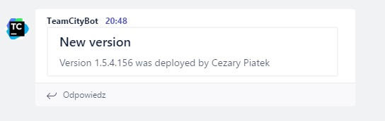
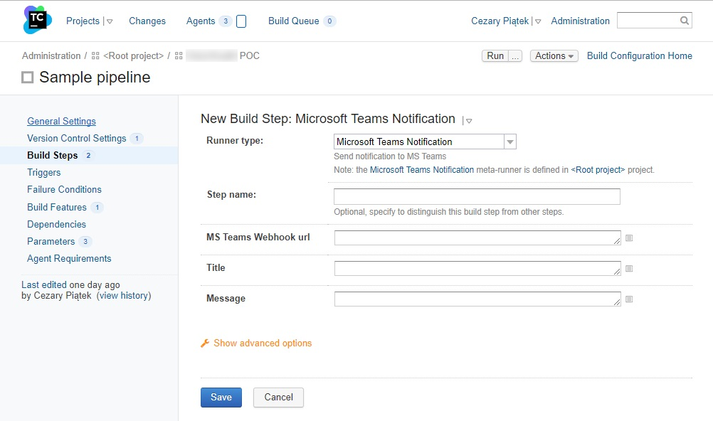
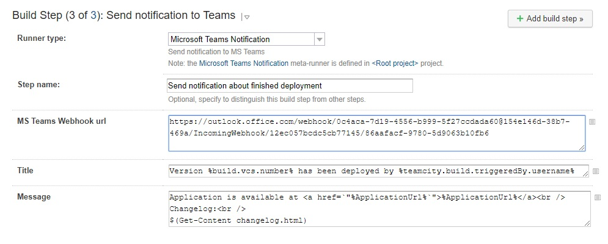

With the beginning of new year I joined a new team where I help with project bootstrapping. I've been configuring TeamCity, Gitlab and webservers. It's the first time for me to work with Gitlab, so I started looking around and checking what opportunities come to me with that tool. One of my discoveries was the "Integration" bookmark, allowing me to connect Gitlab with other systems. I checked a list of possible integrations and found that it could communicate with Microsoft Teams chat. In my company MS Teams is the basic communication channel, so I gave it a shot and tried to connect the two systems. The configuration was very easy - Gitlab communicates with MS Teams via webhooks - and as result my team receives notification related to merge request on MS Teams channel. This is really cool, but it would be more useful if my continuous integration system could send notifications to my team's channel too. I checked all available build steps in TeamCity and there was noting related to MS Teams. Fortunately, nothing was lost - webhooks are pretty easy concepts so I was able to create this integration with little amount of work. For those who don’t know webhooks mechanism, it is nothing more than REST API. I checked [MS Teams documentation](https://docs.microsoft.com/en-us/microsoftteams/platform/concepts/connectors) and in order to send message to MS Teams channel we have to submit POST request to given webhook url with json payload in the following format:

```javascript
{
    title: "Message title",
    text: "Message content"
}
``` 
The "text" field can accept html markup.  In order to generate webhook url use right click on given MS Teams channel, click "Connectors" from the context menu and select "Incoming webhook" on the "Configuration" list. The rest is pretty intuitive and easy. We've got all required data but how can we send a web request from TeamCity? The easiest way without using third party tools is to use PowerShell build step. Powershell has [Invoke-WebRequest](https://docs.microsoft.com/en-us/powershell/module/microsoft.powershell.utility/invoke-webrequest?view=powershell-5.1) cmdlet which allows us to send webrequest very easily. The whole code required to send a message to MS Teams channel can look as follows:

```powershell
$body = @{
    title= "Message Title";
    text= "Message content"
} | ConvertTo-Json
Invoke-WebRequest -Method Post -Uri "http://my_ms_teams_channe_webook_url" -Body $body -ContentType "application/json" -UseBasicParsing
```

You have to remember about adding **UseBasicParsing** switch to *Invoke-WebRequest* cmdlet - without it you will get a weird error related to InternetExplorer. In order to run this in TeamCity pipeline add PowerShell build step and past the code from above.

<video controls>
  <source src="create_powershell_buildstep.mp4" type="video/mp4">  
  Your browser does not support the video tag.
</video>

When we run build with this step we should get the following message on our MS Teams channel:



Alright, it was very easy. But how about reusability? I'm not going to copy&paste this Powershell script every time I need to send a message to MS Teams channel from TeamCity. For example, I need to send that notification twice during my deployment build: once to inform my team that I started deployment and the test environment will be not available for the next couple of minutes; and the second time when the deployment finished, notifying about that fact as well as version and changelog. Happily, TeamCity development team anticipated this requirement and provided [meta runners](https://confluence.jetbrains.com/display/TCD10/Working+with+Meta-Runner) mechanism which allows to convert existing build step configuration into new reusable build step template. Before we convert our build step into meta runner we have to make it more generic by parametrization. Message title, content and webhook url will differ depending on the use case, so we can replace these values with TeamCity configuration parameters (parameter names should start and end with percentage sign). 

```powershell
$body = @{
    title= "%MSTeams_MessageTitle%";
    text= "%MSTeams_MessageContent%t"
} | ConvertTo-Json
Invoke-WebRequest -Method Post -Uri "%MSTeams_WebhookUrl%" -Body $body -ContentType "application/json" -UseBasicParsing
```
After saving these changes a new parameter should appear in the "Parameters" tab in build configuration. You can tweak parameter options by editing it. You can define label and input type which will be used to present this parameter on the build step configuration form.

 <video controls>
  <source src="teamcity_parameters.mp4" type="video/mp4">  
  Your browser does not support the video tag.
</video>

Now you are ready to create meta runner based on your build step. In order to do that select "Extract meta-runner..." from the "Actions"  menu.

 <video controls>
  <source src="extract_metarunner.mp4" type="video/mp4">  
  Your browser does not support the video tag.
</video>

Be careful because TeamCity creates meta runner based not on given build step but on our whole pipeline from current build configuration. To change that we have to modify our meta runner xml definition by deleting redundant nodes: **/meta-runner/settings/build-runners/runner** and **/meta-runner/settings/parameters/parameter**. Meta runner definition after these changes should look as follows:

```xml
<?xml version="1.0" encoding="UTF-8"?>
<meta-runner name="Microsoft Teams Notification">
  <description>Send notification to MS Teams</description>
  <settings>
    <parameters>
      <param name="MSTeams_MessageContent" value="" spec="text display='normal' label='Content' validationMode='any'" />
      <param name="MSTeams_MessageTitle" value="" spec="text display='normal' label='Title' validationMode='any'" />
      <param name="MSTeams_WebhookUrl" value="" spec="text display='normal' label='MS Teams Webhook Url' validationMode='any'" />
    </parameters>
    <build-runners>     
      <runner name="Send Teams Notification" type="jetbrains_powershell">
        <parameters>
          <param name="jetbrains_powershell_errorToError" value="true" />
          <param name="jetbrains_powershell_execution" value="PS1" />
          <param name="jetbrains_powershell_noprofile" value="true" />
          <param name="jetbrains_powershell_script_code"><![CDATA[$body = @{
    title= "%MSTeams_MessageTitle%";
    text= "%MSTeams_MessageContent%t"
} | ConvertTo-Json
Invoke-WebRequest -Method Post -Uri "%MSTeams_WebhookUrl%" -Body $body -ContentType "application/json" -UseBasicParsing]]></param>
          <param name="jetbrains_powershell_script_mode" value="CODE" />
          <param name="teamcity.step.mode" value="default" />
        </parameters>
      </runner>
    </build-runners>
    <requirements />
  </settings>
</meta-runner>
```
From now your meta runner should be available as a new runner type in build step configuration.



This powershell-based meta runner has a very interesting feature. All parameters of this runner are passed as a string parameters to powershell cmdlet, hence the string interpolation should work. Simply speaking, any powershell expression wrapped in **$()** should be evaluated. Somebody can say that this can be used to Powershell Injection attacks but I think this is not the case as long as you control the environment. For me this is a really nice point of extensions which gives me a lot of possibilities. For example, if we want content of given file embedded in our message, we can achieve this by adding the following code in our message field:

```powershell
$(Get-Content -File file_with_additional_info.txt)
```

I used this hack in my deployment notification to add changelog from file to the message. Complete configuration of build step based on our new meta runner can look as follows:



The changelog file is generated by another powershell meta runner in the same build which is responsible for creating a package with application and wired up with deployment build via artifacts dependency. Definition of this meta runner can be found on my github in file [ChangelogGenerator.xml](https://github.com/cezarypiatek/TCMetaRunnersPowerPack/blob/master/src/ChangelogGenerator.xml)


## TL;DR
TeamCity can send messages to MS Teams channel via webhooks mechanism. Use PowerShell build step to invoke webhook endpoint (send webrequest with [Invoke-WebRequest](https://docs.microsoft.com/en-us/powershell/module/microsoft.powershell.utility/invoke-webreques) cmdlet). You can make it reusable by converting this build step into [meta runner](https://confluence.jetbrains.com/display/TCD10/Working+with+Meta-Runner). All meta runners presented here are available on my Github project [TCMetaRunnersPowerPack](https://github.com/cezarypiatek/TCMetaRunnersPowerPack)
