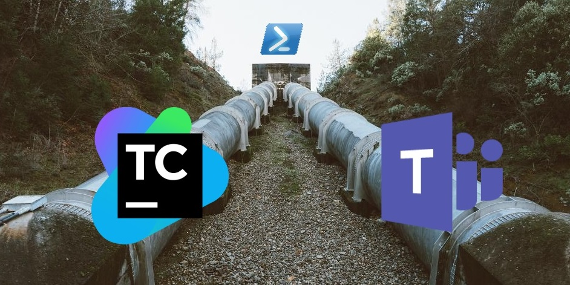

With the begining of the new year I joined new (old) team and we started new project (It looks like 3xNew), so I spend recent weeks on project boostrapping. I've been configuring TeamCity, Gitlab and creating new ASp.net core projects. It's te first time when I've got chance to work with gitlab, so I had started looking arround and checking what opportunitis comes to me with that tools.  One of my discoveries was "Integration" bookmarks which allows me to connect Gitlab with other systems. I check list of possible integration and I found that it could communicate with Microsoft Teams chat. In company where I'm working MS Teams is the basic communication channel so gave a shot and tried to connect this two systems. The configuration was very easy - Gitlab communicate with MS Teams via webhoooks - and as the results my team receices notification related to merge request on MS Teams channel. This is really cool, but it would be more useful if my continous integration system (I'm using TeamCity) could send this sort of notification to my team's channel too. I had checked in TeamCity all available build steps and there was noting related to MS Teams. Fortunetelly noting lost - webhooks are preaty easy concepts so I should be able to create this integration with little amount of work. For this who dont't know webooks mechanism it is noting more than REST API. I had checked MS Teams documentation and in order to send message to MS Teams channel we have to send POST request to given webhook url with json payload in the following format:

```javascript
{
    title: "Message title",
    text: "Message content"
}
``` 
The "text" field can accept html markup.  In order to generate webhook url use right click on given MS Teams channel, click "Connectors" from the context menu and select "Incomming webhook" on the "Configuration" list. The rest is preaty intuitive and easy. We've got all required data but how can we send web request from TeamCity? The easiest way witout using third party tools is to use PowerShell build step. Powershell has **Invoke-WebRequest** commandlet which allows us to send very easily webrequest. So the whole code required to send message to MS Teams channel can looks as follows:

```powershell
$body = @{
    title= "Message Title";
    text= "Message content"
} | ConvertTo-Json
Invoke-WebRequest -Method Post -Uri "http://my_ms_teams_channe_webook_url" -Body $body -ContentType "application/json" -UseBasicParsing
```

You have to remember about adding **UseBasicParsing** switch to *Invoke-WebRequest* cmdlet - without it you will get weird error related to InternetExplorer. In order to run this in TeamCity pipeline add PowerShell build step and past the code from obove.

<video controls>
  <source src="create_powershell_buildstep.mp4" type="video/mp4">  
  Your browser does not support the video tag.
</video>

When we run build with this step we should get the following message on our MS Teams channel:


Alright, it was very easy. But how about reusability? I'm not going to copy&paste this Powershell script everytime when I need to send message to MS Teams channel from TeamCity. For example I need to send that notification twice during my deployment build: once to inform my team that I started deployment and the test enviroment will be not available for the next couple of minutes and the second time when the deployment finish notifing about that fact as well as version and changelog. Happily TeamCity development team anticipated this requiremt and provided meta runners mechanism which allows to convert existing build step configuration into new reusable build step template. Before we convert our bild step into meta runner we have to maka it more generic by parametrization. Message title, content and webhook url wil differe depends on the usecase so we can replace this values with TeamCity configuration parameters (parameters names shoudl starts and ends with percentage sign). 

```powershell
$body = @{
    title= "%MSTeams_MessageTitle%";
    text= "%MSTeams_MessageContent%t"
} | ConvertTo-Json
Invoke-WebRequest -Method Post -Uri "%MSTeams_WebhookUrl%" -Body $body -ContentType "application/json" -UseBasicParsing
```
After saving this changes a new parameters should appear in "Parameters" tab in build configuration.


 You can tweek parameter options by editing it. You can define label and the input type which will be used to present this parameter on the build step configuration form.

 <video controls>
  <source src="teamcity_parameters.mp4" type="video/mp4">  
  Your browser does not support the video tag.
</video>

Now you are ready to create meta runner based on your build step. In order to do that select "Extract meta-runner..." from the "Actions"  menu.


Be carefull because TeamCity creates mata runner based not on given build step but on our whole pipeline from current build configuration. To change that we have to modify our meta runner xml definition. Simply delete redundant **/meta-runner/settings/build-runners/runner** nodes as well as **/meta-runner/settings/parameters/parameter**. Meta runner definition after this edit should looks as follows:

```xml
<?xml version="1.0" encoding="UTF-8"?>
<meta-runner name="XXX">
  <description>asdasd</description>
  <settings>
    <parameters>
      <param name="MSTeams_MessageContent" value="" spec="text display='normal' label='Content' validationMode='any'" />
      <param name="MSTeams_MessageTitle" value="" spec="text display='normal' label='Title' validationMode='any'" />
      <param name="MSTeams_WebhookUrl" value="" spec="text display='normal' label='MS Teams Webhook Url' validationMode='any'" />
    </parameters>
    <build-runners>     
      <runner name="Send Teams Notification" type="jetbrains_powershell">
        <parameters>
          <param name="jetbrains_powershell_errorToError" value="true" />
          <param name="jetbrains_powershell_execution" value="PS1" />
          <param name="jetbrains_powershell_noprofile" value="true" />
          <param name="jetbrains_powershell_script_code"><![CDATA[$body = @{
    title= "%MSTeams_MessageTitle%";
    text= "%MSTeams_MessageContent%t"
} | ConvertTo-Json
Invoke-WebRequest -Method Post -Uri "%MSTeams_WebhookUrl%" -Body $body -ContentType "application/json" -UseBasicParsing]]></param>
          <param name="jetbrains_powershell_script_mode" value="CODE" />
          <param name="teamcity.step.mode" value="default" />
        </parameters>
      </runner>
    </build-runners>
    <requirements />
  </settings>
</meta-runner>
```

TODO:

1. Show how to use our meta-runner
2. Mention about string interpolation and possibilitis which comes from that
3. Possible extensions (embeding changelong)
4. TCMetaRunnersPowerPack project

## TL;DR
TeamCity can send messages to MS Teams channel via webhooks mechanism. Use PowerShell build step to invoke webhook endpoint (send webrequest with [Invoke-WebRequest](https://docs.microsoft.com/en-us/powershell/module/microsoft.powershell.utility/invoke-webreques) cmdlet). You can make it reausable by converting this build step into [meta runner](https://confluence.jetbrains.com/display/TCD10/Working+with+Meta-Runner). All meta runners presented here are available on my Github project [TCMetaRunnersPowerPack](https://github.com/cezarypiatek/TCMetaRunnersPowerPack)