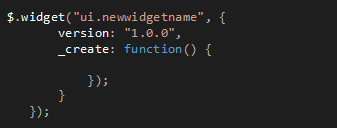

One of the greatest features of Resharper are Live Templates. They can speed up your code typing and help you focus only on what is most important (you don’t need to remember and retype anymore long ‘dull’ code constructions). Live Templates are similar to Visual Studio code snippets but are easier to define and introduce smart parameters that help you in faster code completion.

## Template Explorer
You can manage Live Templates in Templates Explorer from RESHARPER menu (RESHARPER -> Template Explorer...).

Templates Explorer window contains three tabs that allow you to manage three different kinds of templates: Live Templates, Surround Templates and File Templates. The first one – Live Templates – allows you to browse, add and delete inline code snippets. Surround templates allow you to manage code transformation to selected code. The last one - File Templates – as the name indicates, allows you to create templates for whole files. Each kind of template has predefined scopes that allows to filter templates depending on context in which we are currently working (file extension or Solution type). Next to Scopes we have also User Categories that allow us to define custom categories for each scope. In the right column of the Templates Explorer we have a list of shortcuts of defined templates with names of categories (if any was defined). After clicking on given shortcut we can see a definition of template in the bottom of Templates Explorer. After double-click we run edition of given template.

In edition mode we have an editor to define body of our template and panel to configure template behavior. We should define a Shortcut for our templates – it’s a string that identifies our template and allows us to apply template in code fast (we type only shortcut then press Tab key and resharper immediately inserts our template and begins code completion). We can simply defined parameter for template by starting and ending parameter name with $ sign. There is one predefined parameter $END$ that serves to mark place where the cursor will be moved after code completion. For each parameter we can assign a macro that simplifies a code completion with smart restriction. To assign or change macro, simply click a link below parameter name in Parameters section (if no macro was assigned there should be text “Choose macro”, otherwise there should be name of chosen macro)

We have a rich list of predefined macros. After we have defined a parameter, we can reuse it in the template. The parameter definition is surrounded with red border (this may vary due to color theme selected). We can set which occurrence is the parameter definition (that occurrence will be editable during code completion) using the M-OX dropdown in parameter configuration (remaining parameter occurrences will repeat inserted value)

We can also control the order in which the parameters will be completed, simply by using up and down arrows (the arrows are active when you select given parameter)

Ok. Let’s go back to Template Explorer. On the top of the explorer we’ve got a menu that allows us to manage the templates.

We can find there buttons to create new template, create new category, edit existing template, delete existing template and import/export templates. There’s also a combo that allow as to select a resharper layer in which the templates will be placed. That simply helps us to hide or share our templates.

## About Layers

Resharper introduces four layers: "Smart", "Solution personal", "Solution team-shared" and "This computer". This four layers help you organize your templates. They are especially helpful when you want to have some common templates  for all project or different templates for particular projects. Settings (and templates definition as well) for the ‘Solution “XXX” team-shared’ layer are persisted in 'XXX.DotSettings' file, settings of ‘Solution “XXX” personal’ are in 'XXX.DotSettings.user' (where XXX is the solution name). The files are in your solution folder. All the templates that you want to share with your project mates should be placed in “team-shared” layer and the 'XXX.DotSettings' file should be managed by version control system (if you use one). Templates localized in person layer are available only for you, and file 'XXX.DotSettings.user' should be ignored by version control system (otherwise you override you team mates' private settings). "This computer" contains templates available for all solutions developed on your machine. "Smart" layer presents effective templates set. It’s a union of all templates from all layers filtered by priority (the highest priority has "personal" layer, and the lowest priority has "this computer" layer). You can find more about resharper layers in reshareper doc (Reference: [Settings Layers](http://www.jetbrains.com/resharper/webhelp/Reference__Settings_Layers.html) and [Sharing Configuration Options](http://www.jetbrains.com/resharper/webhelp/Sharing_Configuration_Options.html)).

## Template inserting

Using Live Templates is pretty easy. In order to insert an inline Live Template you just need to write  a shortcut of given template in the code and press the Tab key. To wrap a code in Surround Template select a code that you wan to wrap, press alt+enter and select from the "Surround with.." menu a template that you want to use. The table below shows some useful shortcuts that helps you with template inserting:

|Command                    |Visual Studio |IntelliJ IDEA/ReSharper|
|---------------------------|--------------|-----------------------|
|Insert live template       |Ctr+E,L       |Ctr+J                  |
|Surround with template     |Ctr+E,U       |Ctr+Alt+J              |
|Create file from template  |Ctr+Alt+Insert|Ctr+Alt+Insert         |

## Create own templates
### Example 1: Inline Live Template

It’s time to show you how you can define your own live template. I’ll start with live template for inline completion. I want to create a template that speeds up creating a jquery widget using widget factory. Without live template, every time I created widget I had to start with writing the following code:

It’s just a little boring to type that code over and over again. To create a template first of all we have to choose scope. I want to use that template only in *.js files, so I select “JavaScript” scope and click new template Next we should complete Shortcut (and optionaly Description) fields.

My template has one custom parameter – widget name. After saving the changes templates should be ready to use. You can test it by typing keyword ‘widget’ and pressing tab key inside javascript file. To move between parameters press the tab key again. That’s all. Pretty easy, isn’t it?

### Example 2: Surround Template

Now we create a surround template. It will be a template to insert MiniProfiler section inside existing code. Every time I want to use Miniprofiler I have to wrap my code in using section as the following code shows:

To create template select Surround Templates tab in Templates Explorer, select C# scope and click New Template button. Surround Templates does not have shortcut, only description field. In template editor type the following code:

Our template has two parameters: one custom and one predefined. $SELECTION$ parameter is predefined and represents code that is selected during template inserting. To insert our template we should select some code that we want to wrap by our template and press alt+enter.

Resharper context menu should be displayed. In ‘Surround with…’ submenu we see all available Surround Templates but there is a lack of our new template. We should select “More…” option form submenu.

In ‘Choose Template’ window select ‘Mini profiler section’ and check ‘Add to quicklist’ option. Click ‘Ok’ and our template will be inserted. From now, ‘Mini profiler section’ option should be available in ‘Surround with…’ submenu.

### Example 3: File Template

Let’s say we have a web application and all edit forms are displayed in popup. Every time we want to create edit form we have to previously create file and write the same constant code construction, for example something like the following code:

All edit forms have the following parts:

1. Popup title
2. Include popup layout
3. Create Ajax form with confirmation
4. Hidden fields for Id and Version
5. Submit button

Typing that code every time is a total waste of time. We can create File template that will help us to create edit forms. In Templates Explorer on File Templates tab select “Razor (C#)” scope and click “New Template” button. In template editor we change “Default file name” file extension to “cshtml”. Our template has the following structure:

We have four custom parameters and one predefined. For $model$, $action$ and $controller$ I am going to set macro that make completion easier. In Parameters section under model parameter click “Choose macro”. In “Choose Macro” window, from “Available macros” list choose “Execute type completion” option and click ok. For “action” parameter choose “ASP.NET MVC Action” macro, and for “controller” parameter set “ASP.NET MVC Controller” macro.

In order to use our new template click on view folder and from the context menu select Add->New from template -> More…

In “Choose Template” window select “Razor C#” scope and our new template should be visible on templates list. Select “Add to quicklist” and click “Ok” button. From now on our template should be available in “New from Template” menu list.

## Summary
As you have seen above, Live Templates is a very powerful tool that is easy to configure and use . It allows you to save some time and makes coding more fun. Additionally, using templates makes it easier to keep naming and code structure conventions as well as avoid copy&paste mistakes.