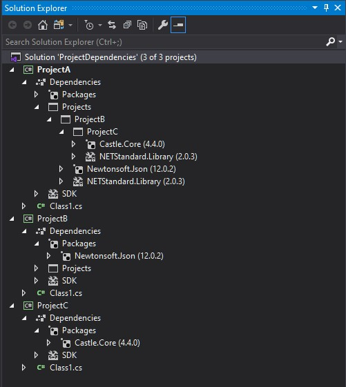
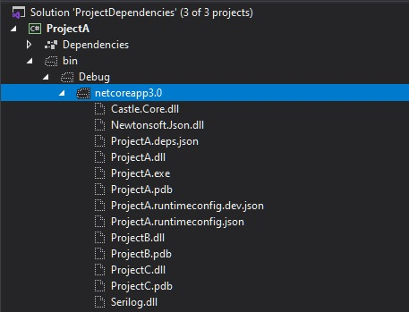
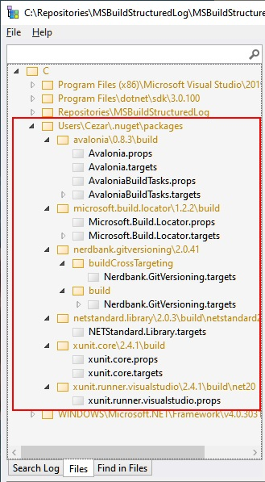
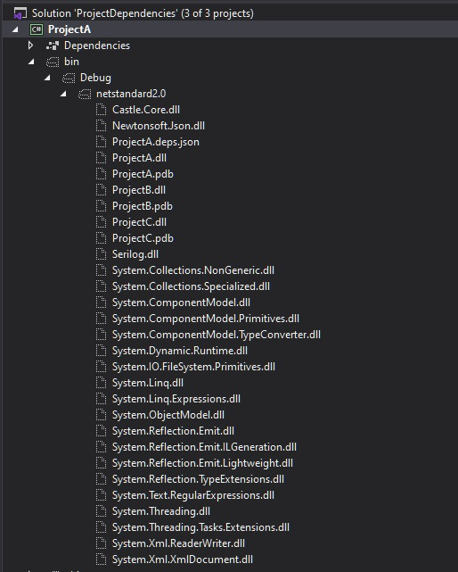

Before the era of SDK projects - in order to create Nuget package we need to use `nuspec` file and `nuget CLI`.  With the new project's format things get simplified and we can now create nuget package even easier and quicker. We don't need anymore `nuspec` file and we can control package metadata and content using dedicated properties inside the project file. If we need a Nuget package with a "standard" shape or rather say the default configuration is good enough for use we just need to run `dotnet build` and `dotnet pack` command or only `dotnet build` if we previously set `GeneratePackageOnBuild=true`. However, if we need to build something non-standard, for example `tool package` or change how the package dependencies are shipped we need to tweak a couple of different properties. Documentation for new `csproj` format as well as for `Nuget` related properties is scattered across different MSDN documents so I decide to create this blog post as a reference to what I've recently learn and discovered about the project's options that affect the content of nuget package shape as well as control content of the output directory. 

## Controlling what's in the output directory

### An example solution

Let's take the sample solution with the following projects and references structure:



### The default setup

By default references to the other projects are added with the following entry in the `csproj` file:

```xml
<ItemGroup>
  <ProjectReference Include="..\ProjectB\ProjectB.csproj" />
</ItemGroup>
```

After we compile our solution the `*.dll` files of the referenced projects are copied to the output directory - by default `bin\$(Configuration)\$(TargetFramework)`. The output location can be change by defining `OutputPath` parameter or if you only need to skip the `$(TargetFramework)` part just set `AppendTargetFrameworkToOutputPath=false`.  We can see the output for the default settings on the following screenshot:


As you probably notice, the library files from referenced nuget packages are not copied to the output dir. If our project would be a program (not a library) with the following configuration:

```xml
  <PropertyGroup>
    <OutputType>Exe</OutputType>
    <TargetFramework>netcoreapp3.0</TargetFramework>
  </PropertyGroup>
```

the output should contain also libraries from the all nuget packages (referenced directly and non directly too):



### Enriching the output dir

Sometimes you might notice that despise what I told you in the previous paragraph some libraries form nuget package are copied to the the output directory. This can be caused by custom build scripts that are shipped together with given nuget package - you can find them in `build` directory inside the nuget package (they must obey naming convention `PackageId.props` or `PackageId.target`). An example could be [NUnit3TestAdapter](https://www.nuget.org/packages/NUnit3TestAdapter/) package:


You can also verify what you are getting extra from all your nuget dependencies in single place using [MSBuildStructuredLog Viewer](https://github.com/KirillOsenkov/MSBuildStructuredLog)



This tool is very helpful for investigating issues when you are experiencing unexpected behaviors during the build process. To prevent loading build scripts from dependent packages just set `ExcludeAssets=build` on the `PackageReference`.

```xml
<ItemGroup>
  <PackageReference Include="Microsoft.Build.Locator" Version="1.2.6">
    <ExcludeAssets>build</ExcludeAssets>
  </PackageReference>
</ItemGroup>
```


If we wan to enforce copying nuget dependencies to the output directory for the library projects we can do that by setting `CopyLocalLockFileAssemblies=true`:

```xml
<Project Sdk="Microsoft.NET.Sdk">
  <PropertyGroup>
    <TargetFramework>netstandard2.0</TargetFramework>
    <CopyLocalLockFileAssemblies>true</CopyLocalLockFileAssemblies>    
  </PropertyGroup>
</Project>
```
However, this has a one unexpected side effect - it copies also shared framework assets too and the output directory looks as follows:




Unfortunately, I haven't found any working solution or workaround for this problem.

### Putting the output dir on the diet

As you saw in the paragraph about default setup, the `dll` files of the referenced project are copied to the output dir. This default behavior can be change by setting `Private=False` property on the `ProjectReference`.

```xml
<ItemGroup>
  <ProjectReference Include="..\ProjectB\ProjectB.csproj" >
      <Private>False</Private>
  </ProjectReference>
</ItemGroup>
```

`Private` metadata is responsible for controlling well know `Copy Local` property for the dependent project assembly file. Here's an excerpt of comment from [Microsoft.Common.CurrentVersion.targets](https://referencesource.microsoft.com/#MSBuildFiles/C/ProgramFiles(x86)/MSBuild/14.0/bin_/amd64/Microsoft.Common.CurrentVersion.targets,1742) definition:

```
The 'Private' attribute on the reference corresponds to the Copy Local flag in IDE.
The 'Private' flag can have three possible values:
    - 'True' means the reference should be Copied Local
    - 'False' means the reference should not be Copied Local
    - [Missing] means this task will decide whether to treat this reference as CopyLocal or not.
```

This option can be used to optimized build performance. Switching it to `False` should reduce the amount of `IO` during the build. If we would like to applied this behavior to all library projects in the solution this can be achieve by adding the following code into `Directory.Build.targets`:

```xml
<Target Name="SetAllProjectReferenceAsPublic"
        AfterTargets="AssignProjectConfiguration" 
        BeforeTargets="ResolveProjectReferences" 
        Condition="'$(OutputType)' == 'Library' and '$(CopyLocalLockFileAssemblies)' != 'true' and $(AssemblyName.EndsWith('Tests')) == 'false' ">
  <ItemGroup>
    <ProjectReferenceWithConfiguration Update="@(ProjectReferenceWithConfiguration)" >
      <Private>false</Private>
    </ProjectReferenceWithConfiguration>
    <ProjectReference Update="@(ProjectReference)" >
      <Private>false</Private>
    </ProjectReference>
  </ItemGroup>
</Target>
```

This custom target is run after `AssignProjectConfiguration` because earlier the `ProjectReference` item group contains only direct project references - updating `ProjectReference` earlier will result with some dependencies still be copied to the output. Besides the `ProjectReference` group it also updates `ProjectReferenceWithConfiguration` because this one is used later by `GetCopyToOutputDirectoryItems` to determine which files should be copied to the output directory (actually this collection goes through the following conversions `ProjectReferenceWithConfiguration -> _MSBuildProjectReference -> _MSBuildProjectReferenceExistent` in the meantime). For our purpose updating `ProjectReferenceWithConfiguration` should be enough but I wanted to preserve the consistency. It took me two evenings to come up with this working solution ;) If you are going to use it, please pay attention on the `Condition` attribute - maybe this should be adjusted to your needs.


Although the library B is not copied to the output it's still a dependency for library A. If it's a for example design time dependency and we what to get rid of it from runtime dependencies we can achieve it by setting `ReferenceOutputAssembly` property to `false`:


```xml
<ItemGroup>
  <ProjectReference Include="..\ProjectB\ProjectA.csproj" >
      <ReferenceOutputAssembly>false</ReferenceOutputAssembly>
  </ProjectReference>
</ItemGroup>
```

## Controlling what's in the Nuget package

To our surprise, none of those attributes described in the previous paragraph affect the content of the Nuget package. By default the `lib` content of the package contains only `.dll` file of the project that has been packed - even if we switched the `CopyLocalLockFileAssemblies` properties. Referenced nuget packages as well as projects became a nuget references. We can verify it by unpacking `nupkg` file. There should be a `nuspect` file inside with the package definition. Dependencies should be defined in the `//package/dependencies/` node as follows:

```xml
<dependencies>
    <group targetFramework=".NETCoreApp3.0">
        <dependency id="ProjectA" version="1.0.0" exclude="Runtime,Build,Native,Analyzers,BuildTransitive" />
    </group>
</dependencies>
```

Every `dependency` entry has `exclude` or `include` attribute. The value of these attributes are controlled by the following properties applied to `ProjectReference` and `PackageReference`:

```xml
<IncludeAssets>
<ExcludeAssets>
<PrivateAssets>
```

Sometimes it doesn't have sense to publish referenced project as a speared nuget package and we want to publish everything as a single complete package.

Even if we set `IncludeAssets` to `all` value (which is actually the default value), the `exclude` attribute will be still set to `Build,,Analyzers` because this is default value for `PrivateAssets`. You can check the default values for all those three attributes in [Controlling dependency assets](https://docs.microsoft.com/en-US/nuget/consume-packages/package-references-in-project-files#controlling-dependency-assets) section of [Package references (PackageReference) in project files](https://docs.microsoft.com/en-US/nuget/consume-packages/package-references-in-project-files) documentation. By setting `PrivateAssets=all` the project dependency is removed from the `Nuget` package manifest. Another interesting thing is when we set ``PrivateAssets=none` then the `dependency` entry looks as follows:

```xml
 <dependency id="ProjectA" version="1.0.0" include="All" />
```


Let's say we don't want to reference `ProjectA` as nuget package - we want to make it a part of `ProjectB` nuget package. This can be achieved in different ways:

**Options 1:** 


This can be achieved with the reference defined as follows:

```xml
 <ItemGroup>
    <ProjectReference Include="..\ProjectB\ProjectA.csproj" >
        <PrivateAssets>all</PrivateAssets>
    </ProjectReference>
  </ItemGroup>
```


//TODO: https://dev.to/wabbbit/include-both-nuget-package-references-and-project-reference-dll-using-dotnet-pack-2d8p

Nuget content https://docs.microsoft.com/en-us/nuget/create-packages/creating-a-package 

TODO: https://stackoverflow.com/questions/41979310/including-referenced-project-dlls-in-nuget-package-net-core-rc3-csproj-file


TODO: Sample package
https://docs.microsoft.com/en-us/nuget/create-packages/creating-a-package-msbuild#choose-a-unique-package-identifier-and-set-the-version-number


 <!-- PrivateAssets="All" means exclude from publish, unless Publish metadata is specified separately -->