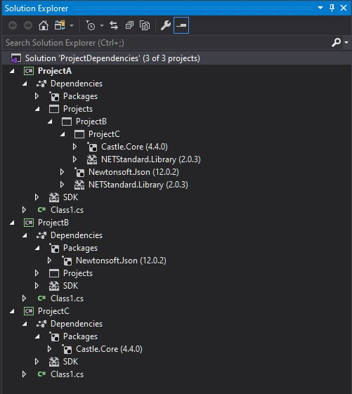
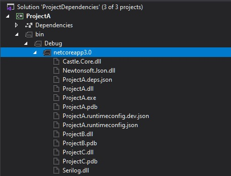
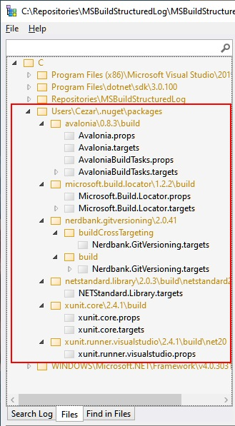

With the new SDK format for .NET projects, it's much easier to manage with the project's dependencies. 
In most scenarios references added with standard mechanism (Visual Studio or `dotnet cli`) result in sufficient content in the output directory. However, sometimes we want to do something non-standard that requires a slightly different set of components in the output dir - simply speaking we expect to see there either more or fewer files. The content of the output directory can be controlled with different properties inside the project file. Documentation for new `csproj` format, as well as for `Nuget` related properties, is scattered across different MSDN documents, so I decided to create this blog post as a reference to what I've recently learned and discovered about the project's options that affect the content of the output directory. 

## An example solution

Let's take a sample solution with the following projects and references structure:



## The default setup

By default, references to other projects are added with the following entry in the `csproj` file:

```xml
<ItemGroup>
  <ProjectReference Include="..\ProjectB\ProjectB.csproj" />
</ItemGroup>
```

After we compile our solution, the `*.dll` and `*.pdb` files of the referenced projects are copied to the output directory - by default `bin\$(Configuration)\$(TargetFramework)`. The output location can be changed by defining `OutputPath` parameter or, if you only need to skip the `$(TargetFramework)` part, just set `AppendTargetFrameworkToOutputPath=false`.  We can see the output for the default settings on the following screenshot:


As you probably notice, the library files from referenced NuGet packages are not copied to the output dir. If our project was a program (not a library) with the following configuration:

```xml
  <PropertyGroup>
    <OutputType>Exe</OutputType>
    <TargetFramework>netcoreapp3.0</TargetFramework>
  </PropertyGroup>
```

the output should contain libraries from the all NuGet packages (referenced directly and non-directly) as well:



## Enriching the output dir

Sometimes you might notice that, despite what I told you in the previous paragraph, some libraries form NuGet package are copied to the output directory. This can be caused by custom build scripts that are shipped together with given NuGet package - you can find them in `build` directory inside the NuGet package (they must obey naming convention `PackageId.props` or `PackageId.target`). An example could be [NUnit3TestAdapter](https://www.nuget.org/packages/NUnit3TestAdapter/) package:


You can also verify what you are getting extra from all your NuGet dependencies in a single place using [MSBuildStructuredLog Viewer](https://github.com/KirillOsenkov/MSBuildStructuredLog)



This tool is very helpful for investigating issues when you are experiencing unexpected behaviors during the build process. You can, of course, control what IS and what IS NOT consumed from the NuGet package with `IncludeAssets` and `ExcludeAssets` properties - please check [Controlling dependency assets](https://docs.microsoft.com/en-US/nuget/consume-packages/package-references-in-project-files#controlling-dependency-assets) for more details. To prevent loading build scripts (`props` and `targets`) from the dependent packages just set `ExcludeAssets=build` on the `PackageReference`.

```xml
<ItemGroup>
  <PackageReference Include="Microsoft.Build.Locator" Version="1.2.6">
    <ExcludeAssets>build</ExcludeAssets>
  </PackageReference>
</ItemGroup>
```

If we want to enforce copying NuGet dependencies to the output directory for the library projects, we can do that by setting `CopyLocalLockFileAssemblies=true`:

```xml
<Project Sdk="Microsoft.NET.Sdk">
  <PropertyGroup>
    <TargetFramework>netstandard2.0</TargetFramework>
    <CopyLocalLockFileAssemblies>true</CopyLocalLockFileAssemblies>    
  </PropertyGroup>
</Project>
```

After rebuild, the output directory should look as follows:


To our surprise, `msbuild` copied also a couple of `System.*.dll` files into the output. These libraries come (directly and indirectly) from `NETStandard.Library` and `Microsoft.NETCore.App` (depends on the selected `TargetFramework`) packages which are referenced implicitly.


If you want to copy all framework and runtime dependencies as well, you have to set `SelfContained` and `RuntimeIdentifier` properties:

```xml
<PropertyGroup>    
    <OutputType>Exe</OutputType>
    <SelfContained>true</SelfContained>
    <RuntimeIdentifier>win-x64</RuntimeIdentifier>
    <TargetFramework>netcoreapp3.0</TargetFramework>    
  </PropertyGroup>
```

You can read more about `Self-contained deployments (SCD)` in the [.NET Core application deployment]( https://docs.microsoft.com/en-us/dotnet/core/deploying/index) article.

## Putting the output dir on the diet

As you saw in the paragraph about the default setup, the `*.dll` files of the referenced projects are copied to the output dir. This default behavior can be changed by setting `Private=False` property on the `ProjectReference`.

```xml
<ItemGroup>
  <ProjectReference Include="..\ProjectB\ProjectB.csproj" >
      <Private>False</Private>
  </ProjectReference>
</ItemGroup>
```

`Private` metadata is responsible for controlling well known `Copy Local` property for the dependent project assembly file. Here's an excerpt of comment from [Microsoft.Common.CurrentVersion.targets](https://referencesource.microsoft.com/#MSBuildFiles/C/ProgramFiles(x86)/MSBuild/14.0/bin_/amd64/Microsoft.Common.CurrentVersion.targets,1742) definition:

```
The 'Private' attribute on the reference corresponds to the Copy Local flag in IDE.
The 'Private' flag can have three possible values:
    - 'True' means the reference should be Copied Local
    - 'False' means the reference should not be Copied Local
    - [Missing] means this task will decide whether to treat this reference as CopyLocal or not.
```

This option can be used to optimize build performance. Switching it to `False` should reduce the amount of `IO` during the build. If we would like to apply this behavior to all library projects in the solution, it can be achieved by adding the following code into `Directory.Build.targets`:

```xml
<Target Name="SetAllProjectReferenceAsPublic"
        AfterTargets="AssignProjectConfiguration" 
        BeforeTargets="ResolveProjectReferences" 
        Condition="'$(OutputType)' == 'Library' and '$(CopyLocalLockFileAssemblies)' != 'true' and $(AssemblyName.EndsWith('Tests')) == 'false' ">
  <ItemGroup>
    <ProjectReferenceWithConfiguration Update="@(ProjectReferenceWithConfiguration)" >
      <Private>false</Private>
    </ProjectReferenceWithConfiguration>
    <ProjectReference Update="@(ProjectReference)" >
      <Private>false</Private>
    </ProjectReference>
  </ItemGroup>
</Target>
```

This custom target has to be run after `AssignProjectConfiguration` because before that the `ProjectReference` item group contains only direct project references - updating `ProjectReference` earlier will result with some dependencies still being copied to the output. Besides the `ProjectReference` group, it also updates `ProjectReferenceWithConfiguration`, because this one is used later by `GetCopyToOutputDirectoryItems` to determine which files should be copied to the output directory (actually this collection goes through the following conversions `ProjectReferenceWithConfiguration -> _MSBuildProjectReference -> _MSBuildProjectReferenceExistent` in the meantime). For our purpose, updating `ProjectReferenceWithConfiguration` should be enough but I wanted to preserve the consistency. It took me two evenings to come up with this working solution ;) If you are going to use it, please pay attention to the `Condition` attribute - maybe this should be adjusted to your needs.


Although the library B is not copied to the output, it's still a dependency for library A. If it is, for example, a design-time dependency and we what to get rid of it from runtime dependencies, we can achieve it by setting `ReferenceOutputAssembly` property to `false`:


```xml
<ItemGroup>
  <ProjectReference Include="..\ProjectB\ProjectA.csproj" >
      <ReferenceOutputAssembly>false</ReferenceOutputAssembly>
  </ProjectReference>
</ItemGroup>
```

## Summary
As you saw, there are multiple mechanisms that allow controlling what is in the output directory. It's good to be aware of their existence to avoid surprises and losing hours for fighting with something that appears in our output dir in spite of our expectations.