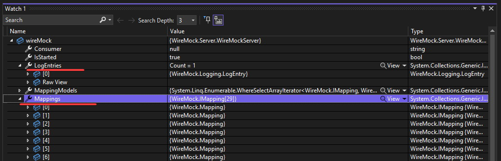

In the second installment of my blog post series on WireMock.NET, I will be discussing some of the most common problems that developers encounter while using the library. WireMock troubleshooting can be quite time consuming, especially when you don't know the drill. I hope that my guideline will save you a lot of time.  <!--more-->  If you are completely new to WireMock, I highly recommend reading my [WireMock.NET - Introduction](/post/mocking-outgoing-http-requests-p1/)

## Troubleshooting

One of the most common issues when working with WireMock.NET are incorrectly defined mappings. If you are receiving the 404 code instead of the expected response, that indicates your stub doesn't match the request made by the tested app. To troubleshoot this issue, you can use the debugger to investigate requests that reached WireMock server by checking `WireMockServer.LogEntries` and comparing requests' parameters with mappings defined in `WireMockServer.Mappings` objects. 



However, checking those objects with a debugger can be cumbersome because they contain items related to Admin interface. An alternative approach is to open the WireMock server's admin interface in a web browser by visiting [http://localhost:1080/__admin/requests](http://localhost:1080/__admin/requests). This will show you all the requests that have been received by WireMock. You should search for the `RequestMatchResult` section of a given request, and all elements from `MatchDetails` with a score below 1 could indicate a problem.

```json
[
  {
    "Guid": "7b7331a3-e142-40dd-86c0-8f12c8acd530",
    "Request": {
      "ClientIP": "::1",
      "DateTime": "2023-03-26T15:10:17.3587479Z",
      "Path": "/api/v1.0/weather",
      "AbsolutePath": "/api/v1.0/weather",
      "Url": "http://localhost:1080/api/v1.0/weather?lat=10.99&lon=44.34",
      "AbsoluteUrl": "http://localhost:1080/api/v1.0/weather?lat=10.99&lon=44.34",
      "Query": {
        "lat": [
          "10.99"
        ],
        "lon": [
          "44.34"
        ]
      },
      "Method": "GET",
      "Headers": {
        "Host": [
          "localhost:1080"
        ],
        "traceparent": [
          "00-c4d2eaf4ac470b56b1a24397286c7a95-5308e95b0a1d839d-00"
        ]
      },
      "Cookies": {}
    },
    "Response": {
      "StatusCode": 404,
      "Headers": {
        "Content-Type": [
          "application/json"
        ]
      },
      "BodyAsJson": {
        "Status": "No matching mapping found"
      },
      "DetectedBodyType": 2
    },
    "PartialMappingGuid": "808559be-cc6d-4197-a686-1238ab5a9da2",
    "PartialRequestMatchResult": {
      "TotalScore": 3,
      "TotalNumber": 4,
      "IsPerfectMatch": false,
      "AverageTotalScore": 0.75,
      "MatchDetails": [
        {
          "Name": "PathMatcher",
          "Score": 0
        },
        {
          "Name": "ParamMatcher",
          "Score": 1
        },
        {
          "Name": "ParamMatcher",
          "Score": 1
        },
        {
          "Name": "MethodMatcher",
          "Score": 1
        }
      ]
    }
  }
]
```

Take the `PartialMappingGuid` and open `http://localhost:1080/__admin/mappings/{PartialMappingGuid}` to get details about the expected request shape. By comparing request data with mapping you should be able to quickly figure out what is wrong with your stub.

```json
{
  "Guid": "808559be-cc6d-4197-a686-1238ab5a9da2",
  "UpdatedAt": "2023-03-26T15:10:16.8250017Z",
  "Request": {
    "Path": {
      "Matchers": [
        {
          "Name": "WildcardMatcher",
          "Pattern": "api/v1.0/weather",
          "IgnoreCase": false
        }
      ]
    },
    "Methods": [
      "GET"
    ],
    "Params": [
      {
        "Name": "lat",
        "Matchers": [
          {
            "Name": "ExactMatcher",
            "Pattern": "10.99",
            "IgnoreCase": false
          }
        ]
      },
      {
        "Name": "lon",
        "Matchers": [
          {
            "Name": "ExactMatcher",
            "Pattern": "44.34",
            "IgnoreCase": false
          }
        ]
      }
    ]
  },
  "Response": {
    "StatusCode": 200,
    "BodyAsJson": {
      "temp": 298.48,
      "feels_like": 298.74,
      "temp_min": 297.56,
      "temp_max": 300.05,
      "pressure": 1015,
      "humidity": 64
    },
    "Headers": {
      "Content-Type": "application/json; charset=utf-8"
    }
  },
  "UseWebhooksFireAndForget": false
}
```

In order the use the WireMock Admin API we need to start WireMock with enabled Admin interface. This can be done by calling `WireMockServer.StartWithAdminInterface()` or by using `WireMockServerSettings` explicitly as follows:

```cs
using var wireMock = WireMockServer.Start(new WireMockServerSettings()
{
    StartAdminInterface = true,
    Port = 1080
});
```

 Additionally, at the moment of calling Admin API, the WireMock server must be running. This is quite an obvious fact, but it might be tricky during test session. We need to keep the server alive a little longer thant the test duration. Setting a breakpoint in the middle of the test doesn't work because debugger freezes the whole process and we won't get any response from the Admin API. To handle this situation, I use a simple trick of putting `await Task.Delay(TimeSpan.FromMinutes(10));` at the point where I want to inspect WireMock Admin API.

**Most common mistakes while defining request mapping**:
- Incorrect request method.
- Incorrectly serialized expected request body.
- Redundant or missing `/` at the beginning/end of the path.
- Adding query parameters in path instead of params.


## WireMockInspector
To simplify the troubleshooting process, I created a small cross-platform app called `WireMockInspector` which is available as open source under [WireMock-Net/WireMockInspector](https://github.com/WireMock-Net/WireMockInspector) project. WireMockInspector combines data returned by `__admin/requests` and `__admin/mappings` endpoints and presents it in a very clear way. Having everything visualized in one place should save a lot of time while investigating problems of unmatched requests.


## Other issues?

I have been using WireMock.NET for more than three years, and incorrectly prepared mappings were definitely the most common problem. I'm curious about your experience with WireMock. What challenges you've encountered and what has caused the most problems for you? Please share your thoughts and experiences in the comments section.