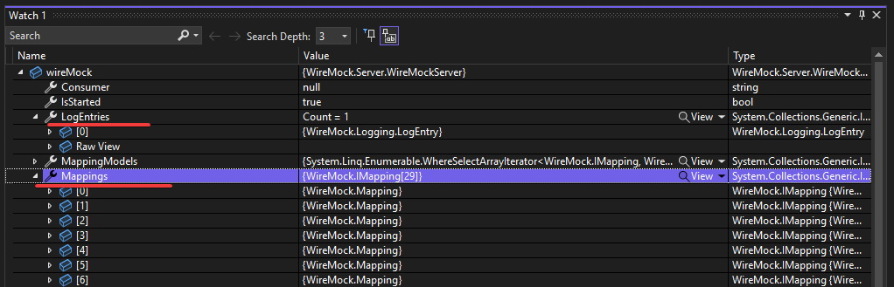

In my previous blog post, I discussed the use of dependency injection (DI) containers for mocking dependencies in tests for ASP.NET Core applications. While this approach is useful in some cases, I personally prefer using mocks/stubs/fakes that don't require any changes in the app internals and work directly with the actual protocol used by the application being tested. 

In this post, I will introduce to you `WireMock.NET`, a powerful tool for mocking HTTP requests. Unlike the DI container approach, WireMock.NET allows for more accurate and complete testing of HTTP communication. Additionally, it eliminates the need for complicated hacks and workarounds when trying to mock HTTP requests. 

**From this article you will learn:**
- How to easily prepare stubs for HTTP endpoints with WireMock.
- How to troubleshoot most common problems. 
- How to improve readability and mailability of your test scenarios.
- How to avoid traps related to HTTP endpoint stubbing.

## What is the WireMock.NET?

[WireMock.NET](https://github.com/WireMock-Net/WireMock.Net) is a .NET version of [WireMock](https://WireMock.org/), a library for stubbing and mocking HTTP services. With WireMock.NET, you can define the expected responses for particular requests, and the library will intercept and manage those requests for you. This allows for easy testing of the code that makes HTTP requests, without having to rely on the actual external service being available and without hacking HttpClient.


## How to setup WireMock.NET?

To get started, you need to install [WireMock.Net](https://www.nuget.org/packages/WireMock.Net) nuget package first: 

```xml
<PackageReference Include="WireMock.Net" Version="1.5.17" />
```

After installing, you can start using `WireMock.NET` by creating an instance of the `WireMockServer` class and configuring it with the desired behavior. This can be easily done by calling `WireMockServer.Start` or `WireMockServer.StartWithAdminInterface` method.

```cs
using var wireMock = WireMockServer.StartWithAdminInterface(port: 1080, ssl: false);
```

You need to also change mocked service address in your application config to point it to WireMock server address.

```cs
await using var appFactory = new WebApplicationFactory<Program>().WithWebHostBuilder(builder =>
{
  builder.ConfigureAppConfiguration(configurationBuilder =>
  {
    //INFO: Override downstream service addresses pointing to WireMock address
    configurationBuilder.AddInMemoryCollection(new Dictionary<string, string>
    {
      ["ExternalServices:WeatherService"] = "http://localhost:1080"
    });
  });
});
```

Now you can start defining mocks for the outgoing requests by using `WithMapping` method.

```cs
wireMock.WithMapping(new MappingModel
{
    Request = new RequestModel
    {
        Methods = new[] { "GET" },
        Path = "/api/v1.0/weather",
        Params = new List<ParamModel>
        {
            new ParamModel()
            {
                Name = "lat", 
                Matchers = new MatcherModel[] {new() {Name = "ExactMatcher", Pattern = "10.99"}}
            },
            new ParamModel()
            {
                Name = "lon", 
                Matchers = new MatcherModel[] {new() {Name = "ExactMatcher", Pattern = "44.34"}}
            }
        }
    },
    Response = new ResponseModel
    {
        StatusCode = 200,
        Headers = new Dictionary<string, object>
        {
            ["Content-Type"] = "application/json; charset=utf-8"
        },
        BodyAsJson = new
        {
            temp = 298.48,
            feels_like = 298.74,
            temp_min = 297.56,
            temp_max = 300.05,
            pressure = 1015,
            humidity = 64
        }
    }
});
```

Alternatively, you can use fluent syntax which seems to be more concise:

```cs
wireMock
    .Given(
        Request.Create()
            .WithPath("/api/v1.0/weather")
            .WithParam("lat", "10.99")
            .WithParam("lon", "44.34")
            .UsingGet()
    )
    .RespondWith(
        Response.Create()
            .WithStatusCode(200)
            .WithHeader("Content-Type", "application/json; charset=utf-8")
            .WithBodyAsJson(new
            {
                temp = 298.48,
                feels_like = 298.74,
                temp_min = 297.56,
                temp_max = 300.05,
                pressure = 1015,
                humidity = 64
            })
    );
```
Once the server is running, you can make your HTTP requests as normal and WireMock.NET will intercept and handle them based on your configuration.

The complete minimal sample setup can look as follows:

```cs
[Test]
public async Task sample_WireMock_usage()
{
  //INFO: Setup WireMock.Net server
  using var wireMock = WireMockServer.StartWithAdminInterface(port: 1080, ssl: false);
  
  //INFO: Setup WebApplicationFactory
  await using var appFactory = new WebApplicationFactory<Program>().WithWebHostBuilder(builder =>
  {
    builder.ConfigureAppConfiguration(configurationBuilder =>
    {
      //INFO: Override downstream service addresses pointing to WireMock address
      configurationBuilder.AddInMemoryCollection(new Dictionary<string, string>
      {
        ["ExternalServices:WeatherService"] = "http://localhost:1080"
      });
    });
  });

  //INFO: Stub outgoing request
  wireMock
    .Given(
        Request.Create()
            .WithPath("/api/v1.0/weather")
            .WithParam("lat", "10.99")
            .WithParam("lon", "44.34")
            .UsingGet()
    )
    .RespondWith(
        Response.Create()
            .WithStatusCode(200)
            .WithHeader("Content-Type", "application/json; charset=utf-8")
            .WithBodyAsJson(new
            {
                temp = 298.48,
                feels_like = 298.74,
                temp_min = 297.56,
                temp_max = 300.05,
                pressure = 1015,
                humidity = 64
            })
    );

    //INFO: Automate tested app
}
```

## Troubleshooting

One of the most common issues when working with WireMock.NET are incorrectly defined mappings. If you are receiving the 404 code instead of the expected response, that indicates your stub doesn't match the request made by the tested app. To troubleshoot this issue, you can use the debugger to investigate requests that reached WireMock server by checking `WireMockServer.LogEntries` and comparing requests parameters with mappings defined in `WireMockServer.Mappings` objects. 



However, checking these objects with a debugger can be cumbersome. An alternative approach is to open the WireMock server's admin interface in a web browser by visiting [http://localhost:1080/__admin/requests](http://localhost:1080/__admin/requests). This will show you all the requests that have been received by WireMock. You should search for the `RequestMatchResult` section of a given request, and all elements from `MatchDetails` with a score below 1 could indicate a problem.

```json
[
  {
    "Guid": "7b7331a3-e142-40dd-86c0-8f12c8acd530",
    "Request": {
      "ClientIP": "::1",
      "DateTime": "2023-03-26T15:10:17.3587479Z",
      "Path": "/api/v1.0/weather",
      "AbsolutePath": "/api/v1.0/weather",
      "Url": "http://localhost:1080/api/v1.0/weather?lat=10.99&lon=44.34",
      "AbsoluteUrl": "http://localhost:1080/api/v1.0/weather?lat=10.99&lon=44.34",
      "Query": {
        "lat": [
          "10.99"
        ],
        "lon": [
          "44.34"
        ]
      },
      "Method": "GET",
      "Headers": {
        "Host": [
          "localhost:1080"
        ],
        "traceparent": [
          "00-c4d2eaf4ac470b56b1a24397286c7a95-5308e95b0a1d839d-00"
        ]
      },
      "Cookies": {}
    },
    "Response": {
      "StatusCode": 404,
      "Headers": {
        "Content-Type": [
          "application/json"
        ]
      },
      "BodyAsJson": {
        "Status": "No matching mapping found"
      },
      "DetectedBodyType": 2
    },
    "PartialMappingGuid": "808559be-cc6d-4197-a686-1238ab5a9da2",
    "PartialRequestMatchResult": {
      "TotalScore": 3,
      "TotalNumber": 4,
      "IsPerfectMatch": false,
      "AverageTotalScore": 0.75,
      "MatchDetails": [
        {
          "Name": "PathMatcher",
          "Score": 0
        },
        {
          "Name": "ParamMatcher",
          "Score": 1
        },
        {
          "Name": "ParamMatcher",
          "Score": 1
        },
        {
          "Name": "MethodMatcher",
          "Score": 1
        }
      ]
    }
  }
]
```

Take the `PartialMappingGuid` and open `http://localhost:1080/__admin/mappings/{PartialMappingGuid}` to get details about the expected request shape. By comparing request data with mapping you should be able to quickly figure out what is wrong with your stub.

```json
{
  "Guid": "808559be-cc6d-4197-a686-1238ab5a9da2",
  "UpdatedAt": "2023-03-26T15:10:16.8250017Z",
  "Request": {
    "Path": {
      "Matchers": [
        {
          "Name": "WildcardMatcher",
          "Pattern": "api/v1.0/weather",
          "IgnoreCase": false
        }
      ]
    },
    "Methods": [
      "GET"
    ],
    "Params": [
      {
        "Name": "lat",
        "Matchers": [
          {
            "Name": "ExactMatcher",
            "Pattern": "10.99",
            "IgnoreCase": false
          }
        ]
      },
      {
        "Name": "lon",
        "Matchers": [
          {
            "Name": "ExactMatcher",
            "Pattern": "44.34",
            "IgnoreCase": false
          }
        ]
      }
    ]
  },
  "Response": {
    "StatusCode": 200,
    "BodyAsJson": {
      "temp": 298.48,
      "feels_like": 298.74,
      "temp_min": 297.56,
      "temp_max": 300.05,
      "pressure": 1015,
      "humidity": 64
    },
    "Headers": {
      "Content-Type": "application/json; charset=utf-8"
    }
  },
  "UseWebhooksFireAndForget": false
}
```

In order the use the WireMock Admin API, the WireMock server must be running. This is quite an obvious fact, but it might be tricky during test session. We need to keep the server alive a little longer thant the test duration. Setting breakpoint in the middle of the test doesn't work because debugger freezes the whole process and we won't get any response from the Admin API. To handle this situation, I use a simple trick by putting `await Task.Delay(TimeSpan.FromMinutes(10));` in the place when I want to inspect WireMock Admin API.


**Most common mistakes while defining request mapping**:
- Incorrect request method.
- Incorrectly serialized expected request body.
- Redundant or missing `/` at the beginning/end of the path.
- Adding query parameters in path instead of params.

## Best practices


### Avoiding endpoint addresses clash

When using WireMock it's important to ensure that there are no endpoint address clashes between multiple mocked servers. This might happen when tested application is using two different external dependencies with the same endpoint addressing. It might seem to be a highly unlikely case, but believe me, it happens. When you hit the name clash, WireMock responses might not be what you expect and it might be very confusing. To avoid this issue, I recommend to suffix the mocked server address with the name of the service being mocked. The same name should be added as a prefix to every endpoint mapping.


```cs
const string WeatherServiceName = "WeatherService";

await using var appFactory = new WebApplicationFactory<Program>().WithWebHostBuilder(builder =>
{
  builder.ConfigureAppConfiguration(configurationBuilder =>
  {
    //INFO: Override downstream service addresses pointing to WireMock address
    configurationBuilder.AddInMemoryCollection(new Dictionary<string, string>
    {
      ["ExternalServices:WeatherService"] = $"http://localhost:1080/{WeatherServiceName}/"
    });
  });
});

wireMock
  .Given(
      Request.Create()
          .WithPath($"/{WeatherServiceName}/api/v1.0/weather?lat=10.99&lon=44.34")
          .UsingGet()
  )
  .RespondWith(/*TODO*/);


```

When you start with one service dependency, this might seems to be redundant but sooner or later you might hit the name clash. Applying this prefix-suffix trick from the very beginning might save you an unnecessary debugging session, as well as the refactoring needed to adjust existing stubs to this pattern.

### Dispose your mappings

WireMock instance can be re-used between tests to improve test execution performance. However, this approach can lead to mapping clashes, as each test may define different mappings for the same endpoints. This is a real trouble-maker as the WireMock's responses might vary based on the test execution order. Test might pass when it's run in isolation, and it might fail when it's run as a part of a test suite because other test might add mapping for the same endpoint with better matching for current parameters. To ensure that mappings defined in one test don't affect other tests, it's good to call the `Reset()` method before every test. This way every test starts with a clean slate.

Another option is to create a disposable object that represents each mapping and deletes it in the `Dispose` method. This approach ensures that all mappings are deleted at the end of the test case, without the need for Setup/Teardown methods. It also allows for greater control over the scope of each mapping, which can be useful when testing different responses from the same endpoint within a single test case. 

Example implementation and usage can look as follows:

```cs
/// <summary>
///  Represents disposable handle for request stub
/// </summary>
public class RequestStub: IDisposable
{
    private readonly IWireMockServer _wireMock;
    private readonly Guid _stubId;

    public RequestStub(IWireMockServer wireMock, Guid stubId)
    {
        _wireMock = wireMock;
        _stubId = stubId;
    }

    public void Dispose() => _wireMock.DeleteMapping(_stubId);
}

public class SampleTests
{
  /// <summary>
  ///  Helper method for defining request stub for specific endpoint
  /// </summary>
  public RequestStub MockSomething(IWireMockServer wireMock)
  {
      var stubId = Guid.NewGuid();
      wireMock.WithMapping(new MappingModel
      {
          Guid = stubId,
          Request = /*TODO: Define request*/,
          Response = /*TODO: Define response*/
      });
      return new RequestStub(wireMock, stubId);
  }

  [Test]
  public async Task sample_test_case()
  {
      //INFO WireMMmock and WebApplicationFactory setup omitted for brevity
      var wireMock = GetSharedWireMockInstance();

      //INFO: Create stub with limited scope
      using(var someRequestStub2 = MockSomething(wireMock))
      {

      }

      //INFO: Create stub that will be dispose at the end of test method
      using var someRequestStub1 = MockSomething(wireMock);
  }
}

```


### StubObjectPattern

Creating an endpoint mapping definition requires a couple lines of code. Even for a simple endpoint it might be over a dozen lines. Most of that code is related to technical aspects of HTTP communication and it's not important from the test case perspective. All that code for preparing stubs can quickly become complex and difficult to manage, degrading readability of our tests cases. 
My solution is to create an object that represents the stubbed service and provides methods for defining stubs for each operation consumed from that service. By wrapping the logic for creating stub definitions into meaningful methods, you can more easily understand the purpose of each stub and improve maintainability, readability, as well as consistency of your test case scenario.

```cs
public class WeatherServiceStub
{
    private const string ServicePrefix = "WeatherService";
    private readonly WireMockServer _wireMock;

    public WeatherServiceStub(WireMockServer wireMock)
    {
        _wireMock = wireMock;
    }

    public RequestStub MockCurrentWeather((double lat, double lon) location, Action<WeatherResponse> adjustResponse)
    {
        var mappingId = Guid.NewGuid();
        var expectedResponse = new WeatherResponse();
        adjustResponse(expectedResponse);

        _wireMock.WithMapping(new MappingModel
        {
            Guid = mappingId,
            Request = new RequestModel
            {
                Methods = new[] { "GET" },
                Path = $"{ServicePrefix}/api/v1.0/weather?lat={location.lat}&lon={location.lon}4"
            },
            Response = new ResponseModel
            {
                StatusCode = 200,
                Headers = new Dictionary<string, object>
                {
                    ["Content-Type"] = "application/json; charset=utf-8"
                },
                BodyAsJson = expectedResponse
            }
        });
        return new RequestStub(_wireMock, mappingId);
    }
}
```

Stub factory methods for specific endpoints accept a simplified form of request input parameters, as well as a lambda function for overriding response default data. This approach allows for specifying in the test scenario only those attributes that are important from the test case perspective:

```cs
using var wireMock = WireMockServer.StartWithAdminInterface(port: 1080, ssl: false);
var weatherServiceStub = new WeatherServiceStub(wireMock);

using var currentWeatherMock = weatherServiceStub.MockCurrentWeather
(
  location: (10.99, 44.34), 
  response =>
  {
      response.temp = 298.48;
      response.feels_like = 298.74;
  }
);
```

**Benefits of using this approach:**

- It simplifies the process of defining and managing endpoint stubs. 
- It helps to avoid code duplication because those stub objects allow for reusing stub creation logic.
- It allows for writing more expressive and readable test scenarios. 


## Other features

WireMock.NET offers a variety of features beyond basic stubbing and mocking of HTTP requests. One such feature is the ability to [proxy requests](https://github.com/WireMock-Net/WireMock.Net/wiki/Proxying) to a real service and capture the responses in the form of mappings. You can use them as a basis for your stubs, eliminating the need for manual response definition.

WireMock.NET also enables you to read mappings and stub definitions from [static files](https://github.com/WireMock-Net/WireMock.Net/wiki/Mapping#static-mappings), rather than having to define them programmatically. This can be useful for sharing stubs across different tests or projects.

In addition to this, WireMock.NET also allows for the creation of dynamic [response templates](https://github.com/WireMock-Net/WireMock.Net/wiki/Response-Templating) that include data from the request. This allows you to create responses that vary based on the details of the request, which can be useful for testing edge cases or simulating the behavior of a real service.

Another powerful feature of WireMock.NET is the ability to simulate service behavior with [Scenarios and States](https://github.com/WireMock-Net/WireMock.Net/wiki/Scenarios-and-States). You can easily simulate different states of a service and switch between them. This can be useful for testing how your code handles different types of failures or responses from a service.


> To learn more about the possibilities of WireMock.NET, I highly recommend a diving into the [WireMock Wiki page](https://github.com/WireMock-Net/WireMock.Net/wiki)