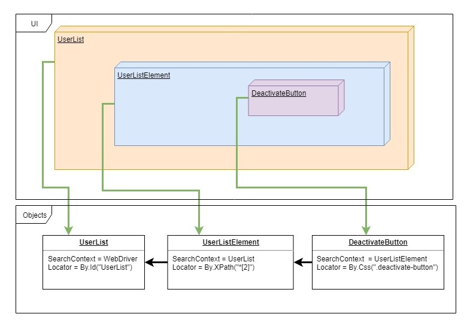

`StaleElementReferenceException` can be definitely classified as the nightmare no 1 of people who write automated test with Selenium framework. This exception occurs when given web element with which we are trying to interact is no longer present in DOM tree. This can be caused by multiple factors, the most often meet are:

- an element was removed in the meantime
- an element was replaced with newer content (for example by `Ajax`)
- an element was re-rendered by JavaScript view/template framework

In the first case, `StaleElementReferenceException` indicate the real issue - the app is broken or our automated test case is invalid - whereas the last two cases are mostly caused by our UI framework and shouldn't affect our UI test. All of the solutions that I've found in the network are based on applying try-catch-retry pattern around the places where the problem occurs. However, this could degrade readability and maintainability. So how to get rid of `StaleElementReferenceException` without introducing technical debt and changing the way we interact with web elements?


## StableWebElement to the rescue!

I got the idea of `StableWebElement` – a wrapper for `IWebElement` which could detect the situation of stale reference and try to find a new reference to the original element. (all this happened behind the scene) The key element of this wrapper is memoization of searching context (parent element) and locator.  Let's see how it works on example. We have a users list, which is a collection of list elements and each list element contains a button to deactivate the user. In order to perform user deactivation we have to find users list, next we have to find list element that represents given user and at the end, we need to locate deactivation button inside the list element. The code for automating it with Selenium can looks as follows:

```csharp
[Test]
publicv void should_be_able_to_deactivate_user(RemoteWebDriver webDriver)
{
    var userList = webDriver.FindElement(By.Id("UserList"));
    var userListElement = userList.FindElement(By.XPath("*[2]"));
    var deactivationButton = userListElement.FindElement(By.CssSelector(".deactivate-button"));
    deactivationButton.Click();
}
```

The mapping between UI elements and object that represents them is showed in the diagram below:




The problem of stale reference can occur on any level of our object hierarchy: our deactivate button could be re-rendered, it's containing list element or the whole user list was replaced with the newer version of HTML.

### Implementing StableWebElement 


```csharp
public interface IStableWebElement : IWebElement, ILocatable, ITakesScreenshot, IWrapsElement, IWrapsDriver
{
    void RegenerateElement();
    bool IsStale();
    string GetDescription();
}
```

At first, I thought that extending `IWebElement` will be enough, but after running my test suit I encounter a few methods from Selenium that accepts `IWebElement` and perform casting to different interfaces that are not in the IWebElement inheritance hierarchy.

Now we create an implementation of our `IStableWebElement` interface:

```csharp
public class StableWebElement: IStableWebElement
{
    private readonly ISearchContext parent;
    private IWebElement element;
    private readonly By locator;

    public StableWebElement(IWebElement elemen, ISearchContext parent, By locator)
    {
        this.parent = parent;
        this.element = element;
        this.locator = locator;
    }
}
```

All of the methods from the interface should be implemented as a proxy for original methods on the `element` object in the following manner:

```csharp
public void SendKeys(string text)
{
    Execute(() => element.SendKeys(text));
}

public void Click()
{
    Execute(() => element.Click());
}

public bool Displayed 
{ 
    get 
    { 
        return Execute(() => element.Displayed); 
    } 
}
```

All original methods were wrapped in the `Execute` method which is responsible for detecting of `StaleElementReferenceException` during original method invocation. When the exception occurs we try to restore element reference by invoking `RegenerateElement` and retry the operation. There are two `Execute` methods because we have to wrap with them methods and functions (notice that one return generic element and the second one return void):

```cs
private T Execute<T>(Func<T> function)
{
    T result = default (T);
    Execute(() => { result = function(); });
    return result;
}

private void Execute(Action action)
{
    var success = RetryHelper.Retry(3, () =>
    {
        try
        {
            action();
            return true;
        }
        catch (StaleElementReferenceException)
        {
            RegenerateElement();
            return false;
        }
    });
    if (success == false)
    {
        throw new WebElementNotFoundException("Element is no longer accessible");
    }
}
```

And the most interesting part is the `RegenerateElement` method:

```csharp
public void RegenerateElement()
{
    var stableParent = parent as IStableWebElement;
    if (stableParent != null && stableParent.IsStale())
    {
        stableParent.RegenerateElement();
    }
    try
    {
        this.element = this.parent.FindElement(locator);
    }
    catch(Exception ex)
    {
        throw new CannotFindElementByException(locator, parent, ex);  
    }
}
```

At first, we check if our parent (which is our search context) is also affected by stale reference. If so we perform `RegenerateElement` method on the parent. This creates recursion call and we are able to restore references to the root element (no matter how many parents are in the relation chain). After we retrieve the reference to the parent we also need to find a fresh version of the current element using new parent and memorized locator. If any exception occurs during searching for the current element that means the element truly disappear and the StaleReferenceException was an indicator of the true problem. The last missing part is the method that detects if the element has a stale reference.


```cs
public bool IsStale()
{
    try
    {
        //INFO: If element is stale accessing any property should throw exception        
        var tagName = this.element.TagName;
        return false;
    }
    catch (StaleElementReferenceException )
    {
        return true;
    }
}
```

### Applying StableWebElement 

In order to use StableWebElement we need to add extension method for `ISearchContex` that search for given element and wrap it into our StableWebElement proxy:


```csharp
static class StableElementExtensions
{
    public static IStableWebElement FindStableElement(this ISearchContext context, By locator)
    {
        var element = context.FindElement(locator);
        return new StableWebElement(context, element, locator);
    }    

    public static ReadOnlyCollection<IStableWebElement> FindStableElements(this ISearchContext context, By locator)
    {        
        return  context.FindElements(locator
                .Select(x=> new StableWebElement(context, x, locator))
                .ToList()
                .AsReadOnly();
    }    
}
```

Now we have to replace all invocation of `FindElement` with our new extension method. If we don't need to be explicitly about using this new approach we can tweak `FindElement` and `FindElements` methods from our `StableWebElement` wrapper to intercept the real result and wrap it into StableWebElement:

```cs
public IWebElement FindElement(By locator)
{
    var foundElement = Execute(() => element.FindElement(locator));
    return new StableWebElement(this.parent, foundElement, locator);
}

public ReadOnlyCollection<IWebElement> FindElements(By locator)
{
    return Execute(() => element.FindElements(locator))
        .Select(x=> new StableWebElement(this.parent, x, locator))
        .ToList()
        .AsReadOnly();
}
```

This little trick allows us to introduce `StableWebElement` almost transparently into existing codebase with minimal effort. I said "almost" because we need to still use `FindStableElement` extension method on search context which is `WebDriver` (or we can create a wrapper for `WebDriver` that use the same trick as StableWebElement).


## Summary
All methods for locating WebElement in my test always return StableWebElement wrapper and the problem with StaleObjectReferenceException disappeared.

The full implementation of `StableWebElement` can be found in `Tellurium` project [here](https://github.com/cezarypiatek/Tellurium/blob/6f3754060f4386e115b40e13ffed5303bd98fc39/Src/MvcPages/SeleniumUtils/StableWebElement.cs)

