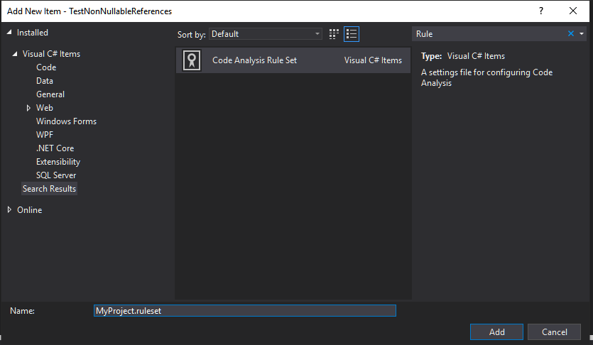
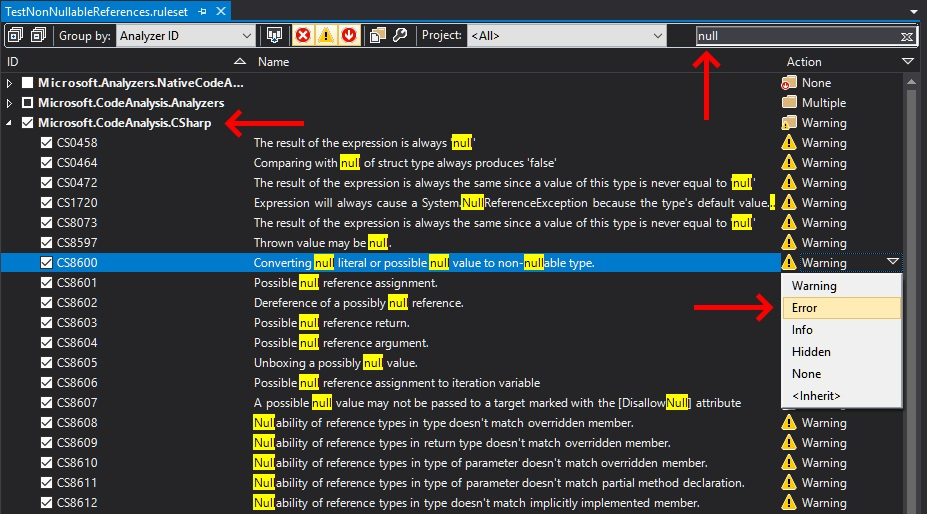
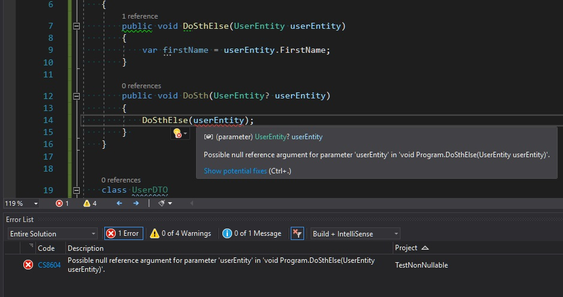
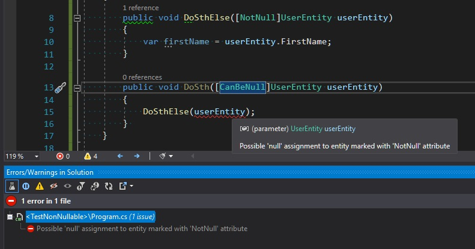
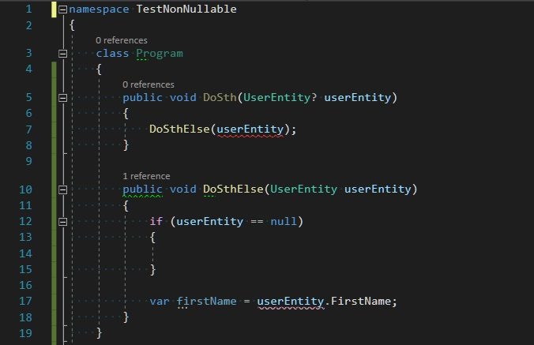
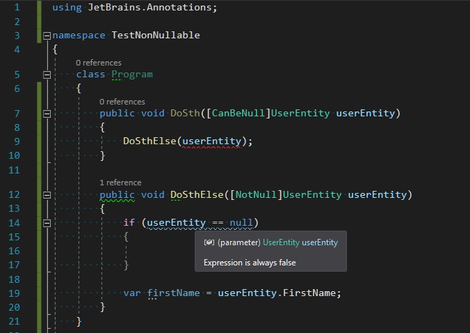

Two weeks ago .NET Core 3.0 was officially published. Together with the new framework's version, Visual Studio 2019 got a support for a long awaited C# 8.0. The complete list of the new language feature is available [here](https://docs.microsoft.com/en-US/dotnet/csharp/whats-new/csharp-8) on the MSDN but the one that deserves a special attention is [Nullable reference types](https://docs.microsoft.com/en-US/dotnet/csharp/whats-new/csharp-8#nullable-reference-types). This is very important change in the language semantic because from now we will be able to eliminated a certain class of errors related reference `nullability` on the compilation stage. In this blog post I will show you how to use this new language feature and how to achieve similar benefits if you still cannot use .NET Core 3.0 in your projects.


## How to use Non-nullable references

If our project is targeting .NET Core 3.0 or higher we can start using non-nullable references. However, when we add `?` annotation to the reference type we get the following warning: 

> `CS8632: The annotation for nullable reference types should only be used in code within a '#nullable' annotations context.`

Our code will compile but all the rules related to the non-nullable references will be ignored (our code will be interpreted as it was before C# 8). Because this feature is a breaking change in the language it should be explicitly enabled. To test it in a single file add `#nullable enable` directive. In order to enable it for the whole project add `<Nullable>enable</Nullable>` to your csproj definition.  If you are serious about using non-nullable references I would recommended enabling it for the whole solution by adding `Directory.Build.props` file in the root directory of your source code with the content as follows:

```xml
<Project>
 <PropertyGroup>
    <Nullable>enable</Nullable>
    <RunAnalyzersDuringBuild>true</RunAnalyzersDuringBuild>
    <RunAnalyzersDuringLiveAnalysis>true</RunAnalyzersDuringLiveAnalysis>
 </PropertyGroup>
</Project>
```

Since now all the references to the reference types are treated as `non-nullable` unless they are explicitly marked as nullable with `?` annotation. These new rules are verified by the Roslyn analyzers from `Microsoft.CodeAnalysis.CSharp` package (which is added implicitly to all C# projects). There is over a 40 rules related to the `nullability` and the complete list is presented below:

|Code|Title|
|---|----|
|CS8073|The result of the expression is always the same since a value of this type is never equal to 'null'|
|CS8597|Thrown value may be null.|
|CS8600|Converting null literal or possible null value to non-nullable type.|
|CS8601|Possible null reference assignment.|
|CS8602|Dereference of a possibly null reference.|
|CS8603|Possible null reference return.|
|CS8604|Possible null reference argument.|
|CS8605|Unboxing a possibly null value.|
|CS8606|Possible null reference assignment to iteration variable|
|CS8607|A possible null value may not be passed to a target marked with the [DisallowNull] attribute|
|CS8608|Nullability of reference types in type doesn't match overridden member.|
|CS8609|Nullability of reference types in return type doesn't match overridden member.|
|CS8610|Nullability of reference types in type of parameter doesn't match overridden member.|
|CS8611|Nullability of reference types in type of parameter doesn't match partial method declaration.|
|CS8612|Nullability of reference types in type doesn't match implicitly implemented member.|
|CS8613|Nullability of reference types in return type doesn't match implicitly implemented member.|
|CS8614|Nullability of reference types in type of parameter doesn't match implicitly implemented member.|
|CS8615|Nullability of reference types in type doesn't match implemented member.|
|CS8616|Nullability of reference types in return type doesn't match implemented member.|
|CS8617|Nullability of reference types in type of parameter doesn't match implemented member.|
|CS8618|Non-nullable field is uninitialized. Consider declaring as nullable.|
|CS8619|Nullability of reference types in value doesn't match target type.|
|CS8620|Argument cannot be used for parameter due to differences in the nullability of reference types.|
|CS8621|Nullability of reference types in return type doesn't match the target delegate.|
|CS8622|Nullability of reference types in type of parameter doesn't match the target delegate.|
|CS8624|Argument cannot be used as an output for parameter due to differences in the nullability of reference types.|
|CS8625|Cannot convert null literal to non-nullable reference type.|
|CS8626|The 'as' operator may produce a null value for a type parameter.|
|CS8629|Nullable value type may be null.|
|CS8631|The type cannot be used as type parameter in the generic type or method. Nullability of type argument doesn't match constraint type.|
|CS8632|The annotation for nullable reference types should only be used in code within a '#nullable' annotations context.|
|CS8633|Nullability in constraints for type parameter doesn't match the constraints for type parameter in implicitly implemented interface method'.|
|CS8634|The type cannot be used as type parameter in the generic type or method. Nullability of type argument doesn't match 'class' constraint.|
|CS8638|Conditional access may produce a null value for a type parameter.|
|CS8643|Nullability of reference types in explicit interface specifier doesn't match interface implemented by the type.|
|CS8644|Type does not implement interface member. Nullability of reference types in interface implemented by the base type doesn't match.|
|CS8645|Interface is already listed in the interface list with different nullability of reference types.|
|CS8653|A default expression introduces a null value for a type parameter.|
|CS8654|A null literal introduces a null value for a type parameter.|
|CS8655|The switch expression does not handle some null inputs.|
|CS8667|Partial method declarations have inconsistent nullability in constraints for type parameter|
|CS8714|The type cannot be used as type parameter in the generic type or method. Nullability of type argument doesn't match 'notnull' constraint.|


By default all these rules are reported as `WARNING`, which means even if they are violated the code will compiled and worked. My advice is to go through this list carefully and increase the severity to `ERROR` level for the most of them. In order to change the way these rules are treated you have to at first add `*.ruleset` file to your project/solution by clicking in the project's (or solution's) context menu `Add -> New Item` and creating a file from `Code Analysis Rule Set` template:



In the next step you have to reference this ruleset file in your `*.csproj` or `Directory.Build.props` file with the following entry:

```xml
 <CodeAnalysisRuleSet>MyRules.ruleset</CodeAnalysisRuleSet>
```

Do not forget to add this file to your source control system in order to enforce all those rules across your teammates and CI.

Now you can start configuring severity level for individual rules.  After double click on you ruleset file Visual Studio should open it in `Ruleset editor`. As I've mentioned before, entries related to `Nullable reference types` should be available under `Microsoft.CodeAnalysis.CSharp` branch. You can find them all by writing `null` keyword in the search field.




If you are using `JetBrains Rider` you have configure ruleset by manually editing xml inside `*.ruleset` file - there is no graphical editor for this. The file's format looks as follows:

```xml
<?xml version="1.0" encoding="utf-8"?>
<RuleSet Name="New Rule Set" Description=" " ToolsVersion="16.0">
  <Rules AnalyzerId="Microsoft.CodeAnalysis.CSharp" RuleNamespace="Microsoft.CodeAnalysis.CSharp">
    <Rule Id="CS8618" Action="Error" />
  </Rules>
</RuleSet>
```

After increasing the severity level to `ERROR`, all the violations of given rule will be reported in more noticeable way and will block the compilation.




## The era before C# 8 

Although the `Nullable reference types` are a very new language feature I've been working with this concept for quite long.  To simulate similar behavior in the previous language versions I been using the following attributes from [JetBrains.Annotations](https://www.nuget.org/packages/JetBrains.Annotations/) package:

- `[NotNull]`
- `[CanBeNull]`
- `[ItemNotNull]`
- `[ItemCanBeNull]`


In order to start using these attributes you need to perform the following steps:

1. Install aforementioned [JetBrains.Annotations](https://www.nuget.org/packages/JetBrains.Annotations/) nuget package
2. Increase severity level for rules related to these attributes in Resharper configuration. Go to `Resharper -> Options -> Code Inspection -> Inspection Severity` and review rules associated with nullability.
3. Enable [Solution Wide Analysis](https://www.jetbrains.com/help/resharper/Code_Analysis__Solution-Wide_Analysis.html)

Since now you can start annotating your code with `[*Null]` attributes:



These inspections works only in Visual Studio and rules' violations don't affect the compilation process. However, you can enforce all the checks in your `CI` pipelines using Resharper's [InspectCode Command-Line Tool](https://www.jetbrains.com/help/resharper/InspectCode.html)

All the attributes from `JetBrains.Annotations` package are conditional, which means they are not compiled into output assemblies unless you defined `JETBRAINS_ANNOTATIONS` build constant. You can read more about usage of these attributes in my blog post [Hunt your bugs in design time](/post/hunt-your-bugs-design-time/#notnull-and-canbenull-and-implicitnotnull) or on the [official documentation](https://www.jetbrains.com/help/resharper/Code_Analysis__Value_Analysis.html)

## There is a still are for improvement

I've played a little with `Nullable reference types` from C# 8.0 to compare it with `JetBrains.Annotations` and I've spotted a few missing bits. Let's take the following code with C# 8.0 annotations



My expectations:

- Line 7: Reported as ERROR - OK
- Line 12: This condition is always evaluated to `false` so should be somehow reported
- Line 17: This code is OK but the previous condition mislead analyses and now is reported as ERROR.


The same code with `JetBrains.Annotations` is reported according to expectations:

