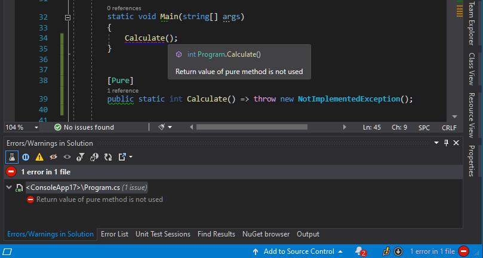

A while ago I came across ["Quick notes on a rant"](https://gist.github.com/dsyme/32de0d1bb0799ca438477c34205c3531) authored by Don Syme. This rant criticizes the C# language for the lack of a few important features. The first point is `"Implicitly discarding information is so 20th Century"` which brings our attention to one of the sources of bugs in C# programs. Lucky me, I got the pleasure to make this kind of bug and find it later in production code, so this blog post is to save you the trouble. 


## Other .NET languages

There are programming languages where returned values need to be explicitly handled. For example in `F#` we have to use the returned value or discard it with the `ignore` function. The following example code will result in a compilation warning:


```fsharp
open System

[<EntryPoint>]
let main argv =
    DateTime.Today.ToShortDateString()
    printfn "Hello World from F#!"
    0
```

> warning FS0020: The result of this expression has type 'string' and is implicitly ignored. Consider using 'ignore' to discard this value explicitly, e.g. 'expr |> ignore', or 'let' to bind the result to a name, e.g. 'let result = expr'.

However, in `PowerShell` unconsumed values are treated as function results. For example, the function presented below returns two values: a `System.IO.FileSystemInfo` object representing a newly created directory and an integer with a value 0.

```powershell
function Do-Something
{
  New-Item -ItemType Directory -Path $([System.Guid]::NewGuid())
  return 0;
}
```

At first, it might be surprising for people who come from different programming languages, but the purpose of the `return` keyword is not to return the value but rather to mark the exit point. The `return value` syntax is a shorthand for:

```powershell
value
return
```

If your function has only one exit point, you probably don't need to use the `return` keyword at all. Very often our custom `PowerShell` functions return more than we expected. To fix that, we need to find a line that produces an unbound value and discard it by piping it to `Out-Null`

```powershell
function Do-Something
{
  New-Item -ItemType Directory -Path $([System.Guid]::NewGuid()) | Out-Null
  return 0;
}
```


## How to protect C# code
Those were examples from other `dotnet` languages, but in `C#` the unused return values are simply ignored which might result in accidental bugs like this:

```cs
public int Calculate()
{
  if(ShouldCalculateA())
  {
    //ERROR: MISSING return keyword
    CalculateA()
  }
  return CalculateB()
}
```

We are also susceptible to this kind of mistakes, especially while working with types from `System.Collections.Immutable` namespace:

```cs
public ImmutableArray<int> GetCoefficient()
{
    var result = new ImmutableArray<int>();
    result.Add(1);
    result.Add(2);
    //ERROR: returned array is empty
    return result;
}
```


So what can we do with the lack of support on the language level and how to protect our `C#` codebase from this kind of bug? As Don Syme mentioned in his notes, we can use some sort of static code analyzers. This market need was spotted years ago by `JetBrains` company that released [JetBrains.Annotations](https://www.nuget.org/packages/JetBrains.Annotations/2021.1.0-eap01) NuGet package containing various attributes that extend static code analysis performed by their products (originally only by the `ReSharper`, and later also by the `Rider`). This package contains [[PureAttribute]](https://www.jetbrains.com/help/resharper/Reference__Code_Annotation_Attributes.html#PureAttribute) which is intended to mark the functions that can be classified as [Pure Function](https://en.wikipedia.org/wiki/Pure_function). Based on the configuration, all unbound calls to those methods are appropriately reported by the [Solution Wide Analysis](https://www.jetbrains.com/help/resharper/Code_Analysis__Solution-Wide_Analysis.html) module. 



`BCL` also contains [PureAttribute](https://docs.microsoft.com/en-us/dotnet/api/system.diagnostics.contracts.pureattribute?view=netframework-4.7.2) which is part of CodeContracts framework. Unused calls to methods with that attribute can be reported as [CA1806: Do not ignore method results](https://docs.microsoft.com/en-us/dotnet/fundamentals/code-analysis/quality-rules/ca1806) with [Microsoft.CodeAnalysis.NetAnalyzers](https://www.nuget.org/packages/Microsoft.CodeAnalysis.NetAnalyzers) package. Unfortunately, `CodeContracts` is dead, and `[System.Diagnostics.Contracts.Pure]` annotations are gradually abandoned - you can read more about this attribute here [The Pure Attribute in .NET Core](https://www.infoq.com/news/2019/01/pure-attribute-net-core/).


However, not every return-value-purpose function can be classified as `Pure Function` because of the side effects caused by the fact of using `IO` - for example, methods that read data from external storage like file or database. `JetBrains.Annotations` package contains another attribute for that purpose called [[MustUseReturnValueAttribute]](https://www.jetbrains.com/help/resharper/Reference__Code_Annotation_Attributes.html#MustUseReturnValueAttribute)


## Bring C# to the next level

This attribute base approach requires additional attention during the function authoring and the lack of those attributes in existing libraries still might be a source of troubles. `JetBrains` offers something called [External Annotations](https://www.jetbrains.com/help/resharper/Code_Analysis__External_Annotations.html#creating) that should solve the problem with the lack of annotations in third-party libraries, but this is still extra work to do. How about reversing that approach and shifting the burden of deciding if a returned value is needed from method author to method consumer - just like it is in a language like `F#`. To do that I extended my analyzers page [CSharpExtensions](https://github.com/cezarypiatek/CSharpExtensions) with a dedicated diagnostic `CSE005: Return value unused` that can find and report every unused result from a method call, await expression, or object creation. By default, all violations are reported as a warning, but this can be easily changed with an appropriate entry in the `ruleset` file or `.editorconfig`:

```ini
[*.cs]
dotnet_diagnostic.CSE005.severity = error
```

Since now every unnecessary return value must be explicitly ignored with a [discard operator](https://docs.microsoft.com/en-us/dotnet/csharp/discards):

```cs
_ = MethodWithRedundantResult();
```

## Sloppy Fluent API

After running the first version of my analyzer on one of my ASP.Core projects, I got a lot of warnings. Almost all of them were caused by different fluent APIs, which are quite popular in objects that implement builder pattern. Lots of warnings in classes responsible for configuring different aspects of ASP.Core like web host configuration, `dependency injection`, or the HTTP pipelines. Another hive was located in components using `FluentValidator`. 

This is how the template `Startup` class looks like after scanning it with `CSE005`:

```cs
namespace WebApplication3
{
    public class Startup
    {
        public Startup(IConfiguration configuration)
        {
            Configuration = configuration;
        }

        public IConfiguration Configuration { get; }

        public void ConfigureServices(IServiceCollection services)
        {
            // warning CSE005: Use the return value or discard it explicitly
            services.AddControllers();
        }

        public void Configure(IApplicationBuilder app, IWebHostEnvironment env)
        {
            if (env.IsDevelopment())
            {
                // warning CSE005: Use the return value or discard it explicitly
                app.UseDeveloperExceptionPage();
            }

            // warning CSE005: Use the return value or discard it explicitly
            app.UseHttpsRedirection();

            // warning CSE005: Use the return value or discard it explicitly
            app.UseRouting();

            // warning CSE005: Use the return value or discard it explicitly
            app.UseAuthorization();

            // warning CSE005: Use the return value or discard it explicitly
            app.UseEndpoints(endpoints =>
            {
                endpoints.MapControllers();
            });
        }
    }
}
```

To clean that up, we need to discard almost every line or compact the code with call chaining (I guess that was the original intention) and discard only the final values:


```cs
public void Configure(IApplicationBuilder app, IWebHostEnvironment env)
{
    if (env.IsDevelopment())
    {
        _ = app.UseDeveloperExceptionPage();
    }

    _ = app.UseHttpsRedirection()
        .UseRouting()
        .UseAuthorization()
        .UseEndpoints(endpoints =>
        {
            _ = endpoints.MapControllers();
        });
}
```


Honestly, I'm not a fan of those fluent builders because they are very confusing. I always need to check if a given function returns a new instance or the same one on which I operate. This approach only makes sense for immutable types, adding it in other situation only for the sake of methods call chaining seems to be real abuse. 

To allow easier introduction of `CSE005` analyzer to existing projects, without the need to rewrite all those config classes, I added an option to exclude given return types from the analysis:

```json
{
  "CSE005": {
    "IgnoredReturnTypes": [ 
        "Microsoft.Extensions.DependencyInjection.IServiceCollection",
        "Microsoft.Extensions.Configuration.IConfigurationBuilder",
        "Microsoft.Extensions.Logging.ILoggingBuilder"
        ] 
  } 
}
```

To make it work you need to save this config as `CSharpExtensions.json` add include it in your project file as follows:

```xml
<ItemGroup>
    <AdditionalFiles Include="CSharpExtensions.json" />
</ItemGroup>
```

## Call to action

I'm really interested what do you think about adding this new feature to C#? Do you like it? Are you going to use it in your project? Have you found any real issues after scanning your current codebase? Any ideas for improving `CSE005` rule? Please let me know in the comment section below.

> **UPDATE 2021-02-17:** As [Prod_Is_For_Testing](https://www.reddit.com/user/Prod_Is_For_Testing/) from Reddit pointed out, there's an existing rule [IDE0058: Remove unnecessary expression value](https://docs.microsoft.com/en-us/dotnet/fundamentals/code-analysis/style-rules/ide0058) which works exactly like `CSE005`. Formerly, all `IDE*` rules were available only in Visual Studio but now they can be used also outside the editor (with `dotnet build` or `msbuild`) after adding [Microsoft.CodeAnalysis.CSharp.CodeStyle](https://www.nuget.org/packages/Microsoft.CodeAnalysis.CSharp.CodeStyle) package. This package also offers an automatic code fix for that issue. Sample `.editorconfig` configuration for this diagnostic:

```ini
[*.cs]
dotnet_diagnostic.IDE0058.severity = error
csharp_style_unused_value_expression_statement_preference = discard_variable
```