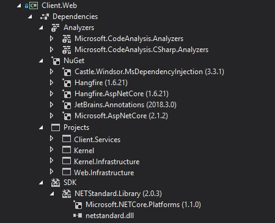

In the early days of dotnet core, there was an attempt of changing the C# project file format. The old "csproj" based on `XML` format was replaced with  `.xproj/project.json`. However, after releasing `dotnet core 1.0` the authors decided to get back to `XML` file.  The format stayed the same but the specification went through a major change. With the new schema, a lot of improvements come into .net development and they are not restricted only to dotnet core projects.

## Changes

### Files information diet
In `VS2007` format the `csproj` is not a ledger of all project files anymore. This decision has a few benefits. The first one is that we have much fewer conflict situations during committing changes into VCS. Two people can simultaneously add files into the same project and not to worry about the need for merging conflicts. The second one is related to the order in the codebase. I used to work with people who have a bad habit of excluding files from the project instead of deleting them completely. This results in polluting codebase with unnecessary files and causes a lot of confusion (a lot of questions, such as: "Is it still necessary?", "Why this is not included into the project?"). With the new csproj format this problem disappeared almost completely. Of course, there is still an option of excluding files from the project but the result is an additional entry in csproj and - thanks to that - it is much easier to spot it during code review.


### Nuget

With the new `csproj` format a few changes also come to the nuget. At first, the `packages.config` has been abandoned and the information about referenced NuGet packages was moved into `csproj` file - all NuGet dependencies are now listed as `PackageReference` nodes. The next change is related to creating your own NuGet packages. You don't need `nuspec` file anymore to generate a NuGet package from your project - all the package metadata is inside the project file. And the most important information: working with NuGet is much nicer because it's finally fast. There is a tremendous difference in NuGet performance between projects in the old and new format. In the old format, even the simplest actions such as install or update a single package were painfully slow. The issue is described here: [Why is everything related to NuGet package restore/upgrade so slow](https://github.com/NuGet/Home/issues/5805) and the only working solution is a migration to new csproj format. 


### Project references

The new project format also changed the way how the information about dependencies is stored. First of all, the `ProjectReference` node has been simplified and we only need a `csproj` path to reference other project. 


__Old project reference style:__
```xml
<ProjectReference Include="..\..\Domain.Invoice\Domain.Invoice.csproj">
    <Project>{f7cc9baa-c366-4652-b1e6-a96a82bceb1f}</Project>
    <Name>Domain.Invoice</Name>
</ProjectReference>
```

__New project reference style:__

```xml
<ProjectReference Include="..\..\Domain.Invoice\Domain.Invoice.csproj" />
```
The way of referencing NuGet packages has also been changed. As I've mentioned before there is no `package.config` anymore and the information about NuGet references from the `package.config` and project file was merged and simplified. Currently, in order to add NuGet package, we only need a `PackageReference` entry in `csproj` with appropriate attributes pointing to the right package id and version. The information about location of downloaded libraries was removed. Those changes solved the problem of potential inconsistency between the information about the package in `package.config` and csproj file - in the past, I came across the situation when somebody upgraded the package and forgot to commit one of those two files. With new csproj format this is not possible anymore.

__Old NuGet reference style:__

```xml
<Reference Include="Castle.Core, Version=4.3.1, Culture=neutral, processorArchitecture=MSIL">
    <HintPath>..\packages\Castle.Core.4.3.1\lib\net45\Castle.Core.dll</HintPath>
</Reference>
```

__New NuGet reference style:__
```xml
 <PackageReference Include="Castle.Core" Version="4.3.1" />
```

All project references are very clearly presented now in the `Solution Explorer` in the form of a tree, divided into categories based on the dependency source:



## Benefits for everyone
I've encountered an opinion that the new c# project format is uniquely associated with dotnet core on numerous occasions. This is probably caused by the fact that the Visual Studio template `Class Library (.NET Framework)` is still based on the old csproj format. The truth is that the new format can be used not only for dotnet core and dotnet standard but for the .NET Framework projects, too. If you are using Visual Studio 2017, you can even migrate existing projects into the new format. In order to create a C# project with .NET Framework that utilizes the new format, you have to select `Class Library (.NET standard)` template and after that change manually the value of `<TargetFramework>` node inside the csproj file to the appropriate [Target Framework Moniker (TFM)](https://docs.microsoft.com/en-us/dotnet/standard/frameworks). For example, for `.NET Framework 4.7.2` you have to use `<TargetFramework>net472</TargetFramework>`. The video below shows how to do that correctly:


<div class="video-container">
<iframe width="853" height="480" src="https://www.youtube.com/embed/QlIZ056vYjw?rel=0" frameborder="0" allow="autoplay; encrypted-media" allowfullscreen></iframe>
</div>

## Migration

As I've mentioned before, you can migrate existing .NET solution into the new csproj format and take advantage of all the new features. The migration is very easy thanks to the [CsprojToVs2017](https://github.com/hvanbakel/CsprojToVs2017) command line tool. You just need to download and run the tool with the path to the `sln` file as the parameter. However, if your codebase is polluted with unnecessary `cs` files that have been detached from the project, you have to perform cleanup before you make a migration. For that occasion, I've prepared a couple of `PowerShell` cmdlets that help to spot all unused files within the source code. This code should be run directly from the `Package Manager Console` in the Visual Studio.


```powershell
function Search-ItemsRecursive{
  [CmdletBinding()]
  param($ProjectItems, $Filter, [switch]$Recurse=$false)
  foreach ($item in $ProjectItems) {
    if($(. $Filter $item))
    {
        $item
    }else{
        if(($item.ProjectItems -ne $null) -and $Recurse){
            Search-ItemsRecursive -ProjectItems $item.ProjectItems -Filter $Filter -Recurse:$Recurse
        }
    }
  }
}

function Find-OrphanFilesInSolution([switch]$IgnoreObj=$true){
    Get-Project -All | Find-OrphanFilesInProject -IgnoreObj:$IgnoreObj
}    

function Find-OrphanFilesInProject{    
    [CmdletBinding()]
    param([Parameter(ValueFromPipeline=$true)]$Projects, [switch]$IgnoreObj=$true)
    process{
        $toProcess = if($Projects){$Projects}else{Get-Project}    
        foreach($p in $toProcess){
            $projectPath = Split-Path $p.FullName -Parent
            $csFilesInProject = Search-ItemsRecursive -ProjectItems $p.ProjectItems -Filter {param($item)$item.Name -like "*.cs"} -Recurse |% {$_.Properties.Item("FullPath").Value}
            dir $projectPath -Filter "*.cs" -Recurse |? { $csFilesInProject -notcontains $_.FullName } |? {(-not $IgnoreObj) -or ($_.Directory -notlike "*\obj*")} |select FullName 
        }
    }    
}
```

In order to perform cleanup, you have to execute the following steps:

1. Paste the code of cmdlets into `Package Manager Console`
2. Invoke `Find-OrphanFilesInSolution` to get the complete list of unused C# files
3. Invoke `Find-OrphanFilesInSolution | Remove-Item` in order to delete unused C# files

The only thing that caused an issue for me during the migration was the resource files because they still need to be explicitly referenced inside the csproj file. At the time when I was performing the migration on my solution (over a year ago), this scenario was not supported by the `CsprojToVs2017` tool, so if you have `resx` files in your project you have to pay attention to them and fix them manually in case this is still an issue.


## Reusing project configuration
After migrating projects into the new format it's good to extract common projects configuration into `Directory.Build.props` file and put into the solution root directory. This will save you a lot of time in the future when there is a need to change common properties for all projects such as a framework or C# language version. This mechanism is very well described by [Thomas Levesque](https://www.thomaslevesque.com/) in his article  [COMMON MSBUILD PROPERTIES AND ITEMS WITH DIRECTORY.BUILD.PROPS](https://www.thomaslevesque.com/2017/09/18/common-msbuild-properties-and-items-with-directory-build-props/).  My ``Directory.Build.props` file looks as follows:

```xml
<Project>
    <PropertyGroup>
        <TargetFramework>netstandard2.0</TargetFramework>
         <Platforms>x64</Platforms>
         <RunCodeAnalysis>false</RunCodeAnalysis>
         <LangVersion>7.2</LangVersion>
    </PropertyGroup>
</Project>
```


## Summary
The new csproj format comes with a lot of benefits. The project file is much cleaner than before and many well known issues related to dotnet development were solved with the new schema. And the most important information: this new format is not reserved only for dotnet core - you can utilize it no matter what kind of .net framework you are using - it works event with Full .NET Framework. You should definitely start using it if it hasn't happen so far.
