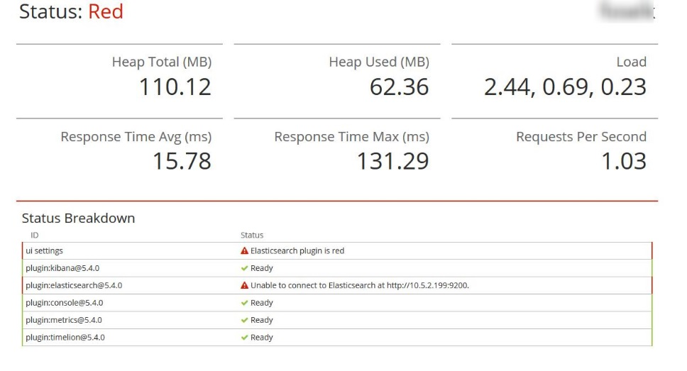

Add one of the following — noting the correct path, debian or debian9 — in your `/etc/apt/sources.list.d/` directory in a file with a .list suffix, for example curator.list

```plaintext
deb [arch=amd64] https://packages.elastic.co/curator/5/debian stable main
```

```plaintext
deb [arch=amd64] https://packages.elastic.co/curator/5/debian9 stable main
```

Switch to admininstrator with `sudo su` command.

Update package indices

```shell
apt-get update
```

Install `curator`

```shell
apt-get install elasticsearch-curator
```

Check `curator` version

```shell
curator --version
```
If you have older version that 5.4 that means you incorectly edited `sources.list.d`.


Prepare `curator` configuration

```yaml
---
client:
  hosts:
    - 127.0.0.1
  port: 9200
  url_prefix:
  use_ssl: False
  certificate:
  client_cert:
  client_key:
  ssl_no_validate: False
  http_auth:
  timeout: 30
  master_only: False

logging:
  loglevel: INFO
  logfile:  /var/log/curator/curator.log
  logformat: default
  blacklist: ['elasticsearch', 'urllib3']
```

Save this content to `config.yml`. Remember to create `/var/log/curator` directory.  More info about curator configuration [here](https://www.elastic.co/guide/en/elasticsearch/client/curator/5.x/configfile.html)


Prepare cleanup configuration

```yaml
---
actions:
  1:
    action: delete_indices
    description: >-
      Delete indices older than 14 days (based on index creation date)
    options:
      ignore_empty_list: True
    filters:
    - filtertype: pattern
      kind: prefix
      value: test_
    - filtertype: age
      source: creation_date
      direction: older
      unit: days
      unit_count: 14

```

Save to `action.yml`. Copy both files to `/opt/curator-config/` directory. More info about action configuration [here](https://www.elastic.co/guide/en/elasticsearch/client/curator/5.x/actions.html) I've defined two filters: `patter` that select all indices which names starts with `text_` prefix and the `age` to select indices that creation date is older than 14 days. All filters are combined with `AND` operator. All available filters are described [here](https://www.elastic.co/guide/en/elasticsearch/client/curator/5.x/filters.html)


In order to perform cleanup run curator with parameters as follows:

```shell
curator --config /opt/curator-config/config.yml /opt/curator-config/action.yml
```

The output should be logged to `/var/log/curator/curator.log` file.

Now we have to schedule the clean-up with crontab

```shell
crontab -e
```

You should get the following info:

```shell
Select an editor.  To change later, run 'select-editor'.
  1. /bin/ed
  2. /bin/nano        <---- easiest
  3. /usr/bin/vim.basic
  4. /usr/bin/vim.tiny

Choose 1-4 [2]:
```

Select your favorite text editor and add the following entry in the opened file

```shell
0 0 * * * /usr/bin/curator --config /opt/curator-config/config.yml /opt/curator-config/action.yml >/dev/null 2>&1
```

Each line in the crontab configuration has the following format

```
<time-expression> <command-to-execute>
```

In my example, I used `0 0 * * *` as a time-expression which means that my command will be run every day at midning. If you don't know crontab time syntax you can easily generate desired expression using https://crontab-generator.org/ After saving crontab config file if everything was configured correctly you should get `crontab: installing new crontab` message. That's all. You can verify if everything is working correctly by examining `/var/log/curator/curator.log`  log file.