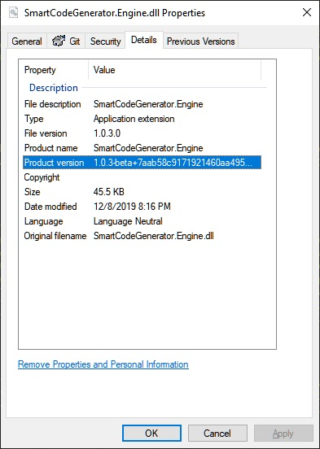
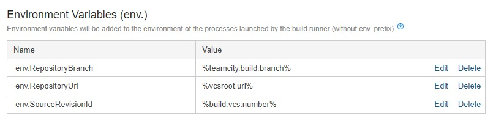

The new `csproj` format introduces two major changes that are important from the artifact metadata management perspective. First of all, a NuGet package definition was moved into the project file which allows sharing common attributes between NuGet package manifest and assembly info. Secondly, a new mechanism for generating source code of assembly metadata attributes was added, which shares some benefits from the first feature as well as simplify how these values can be overridden during the build process. However, it's still a common thing that tools like `regex` and `string replace` are used for this purpose, which is definitely against the original intentions. In this blog post, I will show you what project metadata should we set, how they related to each other and how they affect the build's artifacts - and the most important thing how to set them correctly during the CI build.

## Version, VersionPrefix and VersionSuffix
The 
[Microsoft.NET.DefaultAssemblyInfo.targets](https://github.com/dotnet/sdk/blob/master/src/Tasks/Microsoft.NET.Build.Tasks/targets/Microsoft.NET.DefaultAssemblyInfo.targets), which is by default included in the `SDK` projects, provides a mechanism for setting assembly related metadata. Thanks to that we can set the assembly version without using string manipulation over `AssemblyInfo.cs` file. For this purpose, we have `Version`, `VersionPrefix` and `VersionSuffix` properties on our disposal and the relation between them is defined by the following excerpt from the aforementioned targets file:

```xml
<PropertyGroup Condition=" '$(Version)' == '' ">
    <VersionPrefix Condition=" '$(VersionPrefix)' == '' ">1.0.0</VersionPrefix>
    <Version Condition=" '$(VersionSuffix)' != '' ">$(VersionPrefix)-$(VersionSuffix)</Version>
    <Version Condition=" '$(Version)' == '' ">$(VersionPrefix)</Version>
  </PropertyGroup>
```

which can be expressed in pseudo-code as follows:

```plaintext
if(Version == '')
{
    if(VersionPrefix == '')
    {
        VersionPrefix = '1.0.0'
    }
    
    if(VersionSuffix != '')
    {
        Version = VersionPrefix + '-' + VersionSuffix
    }
    else
    {
        Version = VersionPrefix
    }
}
```

If the `Version` property is hardcoded in the project's file, then passing `VersionPrefix` and `VersionSuffix` from the outside has no effect.

The `Version` attribute is used for the NuGet package too. If the version contains `VersionSuffix` then the package is treated as `pre-release` package. `Version` property is also use in [Microsoft.NET.GenerateAssemblyInfo.targets](https://github.com/dotnet/sdk/blob/master/src/Tasks/Microsoft.NET.Build.Tasks/targets/Microsoft.NET.GenerateAssemblyInfo.targets) to generate `AssemblyVersion` attribute if it's not defined before (take a look at [GetAssemblyVersion](https://github.com/dotnet/sdk/blob/dfbc78147ef297ec8e5fd1f4ab5e085f27b6a94c/src/Tasks/Microsoft.NET.Build.Tasks/targets/Microsoft.NET.GenerateAssemblyInfo.targets#L159) target).

Later on, in [CreateGeneratedAssemblyInfoInputsCacheFile](https://github.com/dotnet/sdk/blob/dfbc78147ef297ec8e5fd1f4ab5e085f27b6a94c/src/Tasks/Microsoft.NET.Build.Tasks/targets/Microsoft.NET.GenerateAssemblyInfo.targets#L105) target, `AssemblyVersion` and couple of other properties are used to generate `cs` file that contains assembly related attributes (this file can be find under `$(IntermediateOutputPath)$(MSBuildProjectName).AssemblyInfoInputs.cache` path - by default in `obj` directory). The definitions of generated attributes are defined in [GetAssemblyAttributes](https://github.com/dotnet/sdk/blob/dfbc78147ef297ec8e5fd1f4ab5e085f27b6a94c/src/Tasks/Microsoft.NET.Build.Tasks/targets/Microsoft.NET.GenerateAssemblyInfo.targets#L64) target. Here's a complete list of `Msbuild` properties and affected assembly attributes:

|MsBuild property | Assembly attribute|
|------------------|-------------------|
| Company | System.Reflection.AssemblyCompanyAttribute|
| Configuration | System.Reflection.AssemblyConfigurationAttribute|
| Copyright | System.Reflection.AssemblyCopyrightAttribute|
| Description| System.Reflection.AssemblyDescriptionAttribute|
| FileVersion | System.Reflection.AssemblyFileVersionAttribute|
| InformationalVersion | System.Reflection.AssemblyInformationalVersionAttribute |
| Product | System.Reflection.AssemblyProductAttribute|
| AssemblyTitle | System.Reflection.AssemblyTitleAttribute |
| AssemblyVersion | System.Reflection.AssemblyVersionAttribute |
| NeutralLanguage | System.Resources.NeutralResourcesLanguageAttribute |

`VersionPrefix`, `VersionSuffix` and `SourceRevisionId` are combined into a single string with the following format `"{VersionPrefix}-{VersionSuffix}+{SourceRevisionId}"` and set as `InformationalVersion` property. This value is presented as `Product version` in the file properties window:



You can disable generating code of specific assembly attribute by defining corresponding  `GenerateAssembly*Attribute` MSBuild property. For example, if you want to use explicitly `GenerateAssemblyVersionAttribute` in your codebase, you have to add the following entry in the project file:

```xml
<PropertyGroup>
    <GenerateAssemblyVersionAttribute>false</GenerateAssemblyVersionAttribute>
</PropertyGroup>
```

## Repository info
A very often appears the question - how can we correlate dotnet assembly with the specific commit, that was used to produce a given assembly. When I was working with the `SVN` repositories, I met with the practice of embedding commit sequence number into the `Version` attribute. This works very well, however with `git` repositories it's not possible anymore - commits are identified by unique hash rather than by sequence number. I also saw a couple of desperate attempts of calculating some sort of `pseudo-sequence-number` for git revision base on the commit timestamp and some other factors with very fancy algorithms. Happily, there is no need for something like that because `MSBuild` contains properties that are intended for marking a Nuget package and assembly with repository information. `AddSourceRevisionToInformationalVersion` target from[Microsoft.NET.GenerateAssemblyInfo.targets]() allows us add commit number (whenever format it has) into `System.Reflection.AssemblyInformationalVersionAttribute` by defining `SourceRevisionId` property. As I've mentioned before in this blog post, this information can be found in the file's properties as a segment of `Product version` (after `+` sign):


`SourceRevisionId` is also used in [NuGet.Build.Tasks.Pack.targets]() to set `RepositoryCommit` property if not defined before. Besides the revision number, we have also an option to set properties like: `RepositoryUrl`, `RepositoryType` and `RepositoryBranch` which are self-described. These properties are used to prepare the `nuspec` file. After building the Nuget package, all those information should be available under `/package/metadata/repository` node of the package manifest: 


```xml
<?xml version="1.0" encoding="utf-8"?>
<package xmlns="http://schemas.microsoft.com/packaging/2012/06/nuspec.xsd">
  <metadata>
    <id>SmartCodeGenerator.Engine</id>
    <version>1.0.0</version>
    <authors>Cezary Piątek</authors>
    <owners>Cezary Piątek</owners>
    <requireLicenseAcceptance>false</requireLicenseAcceptance>
    <projectUrl>https://github.com/cezarypiatek/SmartCodeGenerator</projectUrl>
    <description>On build code generation engine</description>
    <repository type="git" url="https://github.com/cezarypiatek/SmartCodeGenerator" branch="master" commit="7aab58c9171921460aa495a335e1474f4861649c" />
    <dependencies>
      <group targetFramework=".NETCoreApp3.0" />
    </dependencies>
  </metadata>
</package>
```

Besides setting all those repository related metadata for assemblies and NuGet packages, it's also a good practice to always push a tag with version number after every successful release build.

## How to set it up properly
Before .NET Core SDK-projects era, the only way of setting assembly attributes dynamically during the CI build was to do some string-base manipulations on `AssemblyInfo.cs` file which contains assembly related attributes. Now the things are simpler because the source code responsible for adding assembly attributes is automatically generated during the build by `CreateGeneratedAssemblyInfoInputsCacheFile` target using MSBuild properties. Dotnet CLI has dedicated parameter only for setting `VersionSuffix` property via `--version-suffix` parameter but there is an option for setting any MSBuild attribute with `-p` option. For example, we can set up `VersionPrefix` and `VersionSuffix` separately, as well as repository info in the following way:

```shell
dotnet build SmartCodeGenerator.sln -p:VersionPrefix=1.0.3 -p:VersionSuffix=beta -p:SourceRevisionId=7aab58c9171921460aa495a335e1474f4861649c -p:RepositoryUrl=https://github.com/cezarypiatek/SmartCodeGenerator -p:RepositoryType=git -p:RepositoryBranch=develop
```

There's also an option to set MSBuild properties by defining environment variables with the same name as corresponding properties. This works really well with `TeamCity` and hierarchical projects. By defining environment variables on the root project with the following values you can make sure that all project in the hierarchy will have always embedded repository metadata in the build artifacts:



You can also set up here `Copyright`, `Authors`, `Company`, `IconUrl` - all the values that you need to repeat for every project in your organization.
**One more important thing:** if any of the MSBuild properties are hardcoded inside the project file (or `Directory.Build.props` or `Directory.Build.targets`) it can't be overridden by passing it as a command-line parameter or environment variable unless it's defined conditionally. If you want to provide a default value of a given parameter inside the project file, and still have an ability to override it from the outside, you have to define the property in the following way:

```xml
<PropertyGroup>
    <SampleProperty Condition="'$(SampleProperty)' == ''">DefaultValue</SampleProperty>
</PropertyGroup>
```