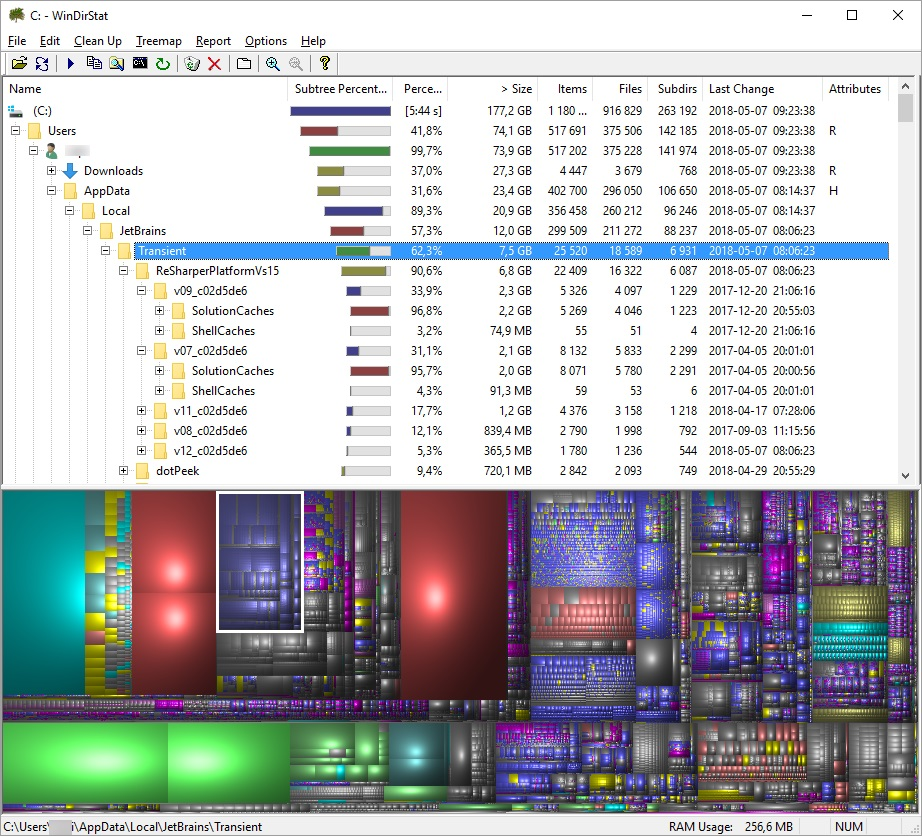
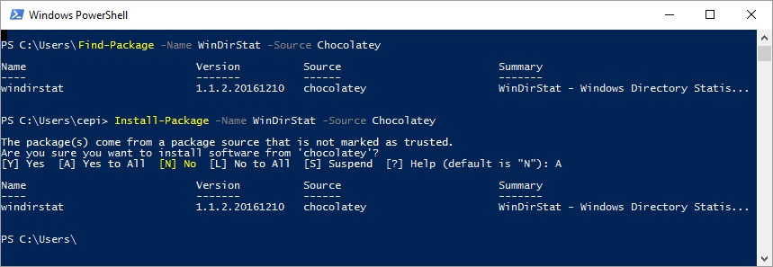

My laptop stores everything on 250 GB SSD hard drive (actually Windows sees it as 223 GB), so from time to time I'm running out of free space. When there is a need I'm starting clearing-up by emptying `c:\Users\user_name\AppData\Local\Temp\` and `c:\Users\user_name\Downloads\` directories (the second one against all appearances is often full of unnecessary files). When this is not enough I use [WinDirStart](https://windirstat.net/) to analyze my hard disk usage. This simple but extremely useful tool presents directory tree with attributes related to disk utilization such as: size, usage percentage, number of items (files and subdirectories), etc.; so you can easily drill down the tree looking for elements eating up your free space. There is also a colorful tree map that allows you to immediately spot large files.

One of my interesting discoveries were Resharper cache files which can weigh even over few GB. Those files can be found inside the appropriate directory under `C:\Users\user_name\AppData\Local\JetBrains\Transient\` path (there are also cache files for other JetBrains products). From my observation those files tend to survive the Resharper updates, so there is a very high possibility that you have cache files for old version which are totally useless now. Besides old versions there are cache files for **all solutions that have been opened** by Visual Studio with enabled Resharper - and again - some of them are probably not necessary anymore. After deleting those files Resharper can slow down for a moment until it rebuilds cache for currently opened solution but we will have cached data for only what is truly necessary and we should regain some free space on the hard drive.



If you are interested in using `WinDirStat` you can download it using links from the official website [https://windirstat.net/download.html](https://windirstat.net/download.html) or install it using Powershell package manger ([Chocolatey](https://chocolatey.org/) provider is required) with command:

```powershell
Install-Package -Name WinDirStat -Source Chocolatey
```




If you find `WindDirStat` useful you can support this project financialy using the `Support this project` button on the project's website footer [https://windirstat.net/](https://windirstat.net/)

