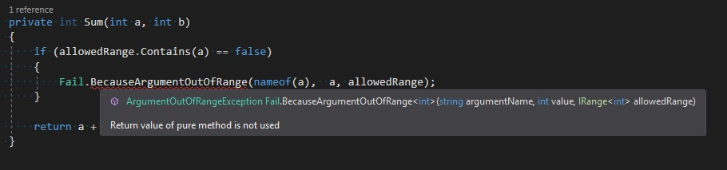

Have you ever been in the situation when discovered in the logs an exception that force you to spend the next couple of minutes or even hours figuring out what exactly went wrong? The message was very cryptic and the only useful information that guides you to the crime scene was a stack trace. But after arriving there you still have no idea what really happened and what was the culprit. And the most frustrating part is that in many cases the reason is very trivial and could be diagnosed immediately if the error message contains sufficient information. Sounds familiar? I was in this situation many times before, especially when I was working with 3rd party libraries. In this blog post, I would like to share with you my thoughts and experience related to designing exception.


## Official guideline

First of all, there is a chapter in [Framework Design Guideline](https://docs.microsoft.com/en-us/dotnet/standard/design-guidelines/index) devoted to [Design Guidelines for Exceptions](https://docs.microsoft.com/en-us/dotnet/standard/design-guidelines/exceptions) which every .net developer should get familiar with. There are three main sections which cover the subject of:

- [Exception Throwing](https://docs.microsoft.com/en-us/dotnet/standard/design-guidelines/exception-throwing) 

- [Using Standard Exception Types](https://docs.microsoft.com/en-us/dotnet/standard/design-guidelines/using-standard-exception-types)

- [Exceptions and Performance](https://docs.microsoft.com/en-us/dotnet/standard/design-guidelines/exceptions-and-performance) 

Obeying this guideline should at some point make our life easier but there are also areas for more improvement, especially in terms of information which should be included in the exception.


## ArgumentException
Let's take a look at `ArgumentException` which comes from the standard library and is used for notifying about invalid parameters.  We have the following constructors at our disposal:

```csharp
public ArgumentException()
public ArgumentException(string message, Exception innerException)
public ArgumentException(string message, string paramName)
public ArgumentException(string message, string paramName, Exception innerException)
```

and the most useful overloads are those which accepts `parameterName`. When we try to throw this exception we've got the following message:

```plaintext
<message>
Parameter name: <parameterName>
```
Despite the `message` parameter value (the first line of the exception message), the first question that comes to our mind is **What was the value of invalid argument?**. Now it's our responsibility to provide a comprehensive explanation that contains current value every time when we throw an exception using the aforementioned constructor. A better approach would be own in our codebase a helper function that enforces providing also the argument value and produces the exception with a message that explains current situation:

```csharp
public class Fail
{
    [Pure]
    public static ArgumentException BecauseArgumentXXX<T>(string argumentName, T argumentValue)
    {        
        return new ArgumentException($"Here comes the explanation why the '{argumentName}' argument with value '{argumentValue}' is invalid");
    }
}
```

Where the `XXX` part in the helper name is the reason why the argument was invalid. This solution takes off the burden of making up the exception message every time and enforces the need for providing argument current value. If there is a requirement for internationalization you can easily move the exception message to the resource file (remember about converting string interpolation into `string.Format`);

### ArgumentOutOfRangeException - numeric values

One of the `BCL` exceptions that specify the reason for the invalid parameter is `ArgumentOutOfRangeException`. The situation is a little bit better than in `ArgumentException` case because as we see below there is a constructor overload that accepts `parameterName` as well as `actualValue`:

```csharp
public ArgumentOutOfRangeException()
public ArgumentOutOfRangeException(string paramName)
public ArgumentOutOfRangeException(string paramName, string message)
public ArgumentOutOfRangeException(string message, Exception innerException)
public ArgumentOutOfRangeException(string paramName, object actualValue, string message)
```

The message produced by this overload looks as follows:

```plaintext
<message>
Parameter name: <parameterName>
Actual value was <actualValue>.
```
Seeing this message we immediately start asking the question: **"What are the limitation for this value"?** Of course, this information could be included in `message` parameter but constructing the message using the same pattern everytime would be very tedious. Let's take a look at one of the [DateTime constructor](https://github.com/dotnet/coreclr/blob/57f8358221a3c4ad7f1608f625bc3c5936618505/src/System.Private.CoreLib/shared/System/DateTime.cs#L228):

```csharp
public DateTime(int year, int month, int day, int hour, int minute, int second, int millisecond)
{
    if (millisecond < 0 || millisecond >= MillisPerSecond)
    {
        throw new ArgumentOutOfRangeException(nameof(millisecond), SR.Format(SR.ArgumentOutOfRange_Range, 0, MillisPerSecond - 1));
    }
    long ticks = DateToTicks(year, month, day) + TimeToTicks(hour, minute, second);
    ticks += millisecond * TicksPerMillisecond;
    if (ticks < MinTicks || ticks > MaxTicks)
        throw new ArgumentException(SR.Arg_DateTimeRange);
    _dateData = (ulong)ticks;
}
```
As we see there is a validation for `millisecond` parameter. If the value doesn't belong to `[0, MillisPerSecond)` range then the `ArgumentOutOfRangeException` exception is thrown. The exception message is composed using `SR.Format(SR.ArgumentOutOfRange_Range, 0, MillisPerSecond - 1)` statement. In order to compose the message, somebody had to know that he must use a special `SR.Format()` finction with a dedicated constant `SR.ArgumentOutOfRange_Range` and he had to duplicate the values of range endpoints from the if statement (This validation logic is duplicated four times in `DateTime` struct). I've found the statement `SR.Format(SR.ArgumentOutOfRange_Range, MIN, MAX)` in 28 files in CoreCLR source code!!! (There was also a `string.Format(CultureInfo.CurrentCulture, SR.ArgumentOutOfRange_Range,  MIN, MAX)` variation too!!!). For me there are two issues: range info duplication and error message compose logic duplication. These problems can be solved by introducing an interface that represents the range. An object that implement this interface can be used to verify given value correctness and also can be pass to exception factory in a case when we want to inform about exceeding the allowed range:

```csharp

public interface IRange<in T>
{
    bool Contains(T value);
    string GetDescription();
}

public class Fail
{
    [Pure]
    public static ArgumentOutOfRangeException BecauseArgumentOutOfRange<T>(
        T value,
        string argumentName, 
        IRange<T> allowedRange
    )
    {
        var rangeDescription = allowedRange.GetDescription();
        return new ArgumentOutOfRangeException($"Parameter '{argumentName}' with value '{value}' was outside the allowed range '{rangeDescription}'");
    }
}
```

A sample implementation of `IRange<>` can looks as follows:

```csharp
public class OpenRange<T>:IRange<T> where T:IComparable<T>
{
    private readonly T min;
    private readonly T max;

    public OpenRange(T min, T max)
    {
        this.min = min;
        this.max = max;
    }

    public bool Contains(T value) => value.CompareTo(min) > 0 && value.CompareTo(max) < 0;

    public string GetDescription() => $"({min}) - {max})"
}
```

Using our new range facility we can rewrite `DateTime` constructor in the following way:

```csharp
private static IRange<int> allowedMilisecondRange = new LeftClosedRightOpenRange<int>(0, MillisPerSecond);
private static IRange<long> allowedTicksRange = new ClosedRange<long>(MinTicks, MaxTicks);

public DateTime(int year, int month, int day, int hour, int minute, int second, int millisecond)
{
    if (allowedMilisecondRange.Contains(millisecond) == false)
    {
        throw Fail.BecauseArgumentOutOfRange(millisecond, nameof(millisecond), allowedMilisecondRange);
    }
    long ticks = DateToTicks(year, month, day) + TimeToTicks(hour, minute, second);
    ticks += millisecond * TicksPerMillisecond;
    if (allowedTicksRange.Contains(ticks) == false)
    {
        throw Fail.BecauseArgumentOutOfRange(ticks, nameof(ticks), allowedTicksRange);
    }   
    _dateData = (ulong)ticks;
}
```

As we see `IRange<>` help us improve code readability, reduce the duplication of information about the allowed range and facilitate throwing the exception. It also enforces consistency in our codebase - a ready recipe for testing and informing about values outside the range.
Actually, this solution is not limited to the classical numeric ranges. You can have a class that implements `IRange<string>` and verify if given value belongs to a predefined set of strings. Just remember to compose appropriate description in `GetDescription()` method.


## ArgumentOutOfRange - enum values

The special situation when we what to use `ArgumentOutOfRange` is `default` case in the `switch` statement for enum values. Here is the default code generated by Resharper for `switch` over an enum variable:

```csharp
private void DoSomething(SampleEnum option)
{
    switch (option)
    {
        case SampleEnum.Option1:
            break;
        case SampleEnum.Option2:
            break;
        default:
            throw new ArgumentOutOfRangeException(nameof(option), option, null);
    }
}
```

When we run this function with enum value that is not covered in `case` section we got the exception with following message:

```plaintext
Exception of type 'System.ArgumentOutOfRangeException' was thrown.
Parameter name: option
Actual value was Option3.
```

At first glance, it is not so obvious what went wrong. It could be even more cryptic when the value was a nullable type:

```plaintext
Exception of type 'System.ArgumentOutOfRangeException' was thrown.
Parameter name: option
Actual value was null.
```

In order to make it much easier to diagnose we can add a dedicated helper that construct exception explaining what really happened:


```csharp
public class Fail
{
    [Pure]
    public static ArgumentOutOfRangeException BecauseEnumOutOfRange<T>(string argumentName, T value)
    {
        var enumType = typeof(T);
        var message = $"Unsupported '{argumentName}' enum value: {value} ({enumType.Name})";
        return new ArgumentOutOfRangeException(argumentName, value, message);
    }
}
```


```csharp
private void DoSomething(SampleEnum option)
{
    switch (option)
    {
        case SampleEnum.Option1:
            break;
        case SampleEnum.Option2:
            break;
        default:
            throw Fail.BecauseEnumOutOfRange(nameof(option), option);
    }
}
```

### FileNotFoundException


```csharp
public FileNotFoundException()
public FileNotFoundException(string message)
public FileNotFoundException(string message, Exception innerException)
public FileNotFoundException(string message, string fileName)
public FileNotFoundException(string message, string fileName, Exception innerException)
```

Those are the public constructor for `FileNotFoundException`. The three first should be forbidden. The only useful versions are these ones which accept `fileName` parameter but there is still missing crucial information - **Where the file was looking for?**. In order to make diagnostic less painful we can introduce a helper which accepts `fileName` as well as the list of potential locations and produce exception with comprehensive message:


```csharp
public static class Fail
{
    [Pure]
    public static FileNotFoundException BecauseMissingFile(string fileName, params string[] locations)
    {
        var combinedLocations = string.Join(",", locations);
        return new FileNotFoundException($"Cannot find file '{fileName}' at locations: {combinedLocations}")
    }
}
```

## Missing context information

Sometimes we don't have in given context enough information to create a comprehensive error message. We can pass the missing information from the outside but this has a few disadvantages: this additional parameters pollute our API and bound our method to given invocation context making it less reusable. Let's take an example: we want to load in our application data stored in multiple `XML` files. The method that is responsible for loading data loops through the list of files, read the content and pass it to the component responsible for parsing `XML`:

```csharp

public IReadonlyList<SampleData> LoadData(IReadonlyList<string> files)
{
    var result = new List<SampleData>();
    foreach(var file in files)
    {
        var rawConent = File.ReadAllText(file);
        var data = xmlDataParser.Parse(rawContent);
        result.AddRange(data);
    }
    return result;
}
```

If there are any parsing errors we would like to inform why the structure is invalid and also which file contains this corrupted content. Content verification logic is a part of the parser but it's totally unaware of the content physical source. We have two solutions: we can design the parser to return a structure that contains besides the data also an detailed information about errors if any occurs: 

```csharp
public IReadonlyList<SampleData> LoadData(IReadonlyList<string> files)
{
    var result = new List<SampleData>();
    foreach(var file in files)
    {   
        var rawConent = File.ReadAllText(file);
        var parsingResult = xmlDataParser.Parse(rawContent);
        if(parsingResult.IsSuccess == false)
        {
            throw new DataLoadException($"Cannot load data from file '{file}'. Reason: {parsingResult.ErrorMessage}")
        }
        result.AddRange(parsingResult.Data);
    }
    return result;
}
```


or we can catch the exception throwed by the parser and wrap it in new exception that provide the context information.

```csharp
public IReadonlyList<SampleData> LoadData(IReadonlyList<string> files)
{
    var result = new List<SampleData>();
    foreach(var file in files)
    {   
        try
        {
            var rawConent = File.ReadAllText(file);
            var data = xmlDataParser.Parse(rawContent);
            result.AddRange(data);
        }catch(Exception exception)
        {
            throw new DataLoadException($"Cannot load data from file '{file}'", exception)
        }
    }
    return result;
}
```
Of course, from the performance point of view, the first approach is way much better. It also gives us more flexibility - we can collect error information from all files and forward somehow a complete summary. Unfortunately, sometimes the contract is enforced by the third party library and the `try-catch-throw` is the only possible option to handle this scenario.

## [Pure] attribute

All of my exception factory methods are decorated with `[Pure]` attribute. This attribute comes from [JetBrains.Annotations](https://www.nuget.org/packages/JetBrains.Annotations/) NuGet package and it is intended to mark [pure functions](https://en.wikipedia.org/wiki/Pure_function) - the functions which have no side effects. If you are using `Resharper` and have enabled `Solution-wide analysis` this attribute can save you a lot of troubles when you forget to add `throw` keyword before exception factory method invocation:



You can read more about `Resharper code annotations` in my "[Hunt your bugs in design time](post/hunt-your-bugs-design-time/)" article.


## Summary
Every time when you are writing `throw` statement think about people who could find this exception in logs and what question they could ask. The good exception message is the one that explains in a comprehensive way what exactly conditions took place which caused this exceptional situation. There is no need to ask any question to figure out what happened. An appropriate exception design allows saving a lot of time consumers of your libraries, people who take over the support or even you too. 


### Call for action
I am curious **what was the most mysterious exception that you have ever encounter** and how much time did it take to solve the riddle? Please share your experience in the comment section down below.