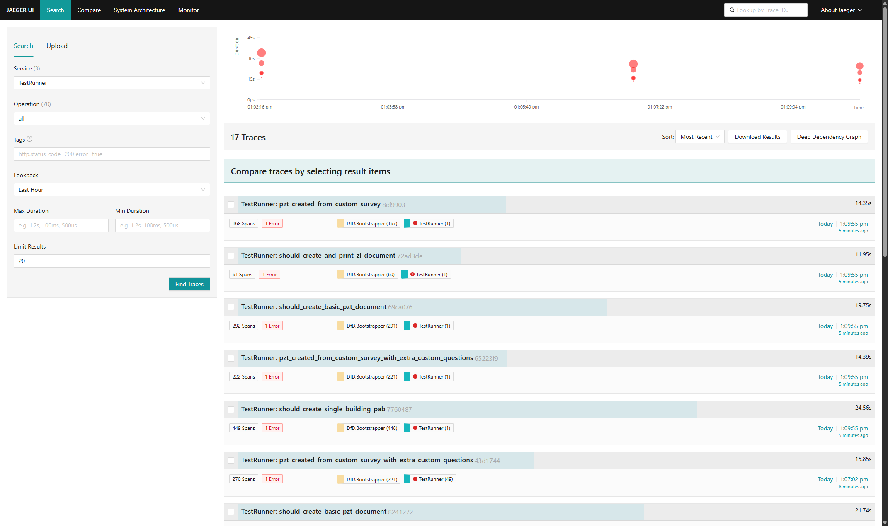
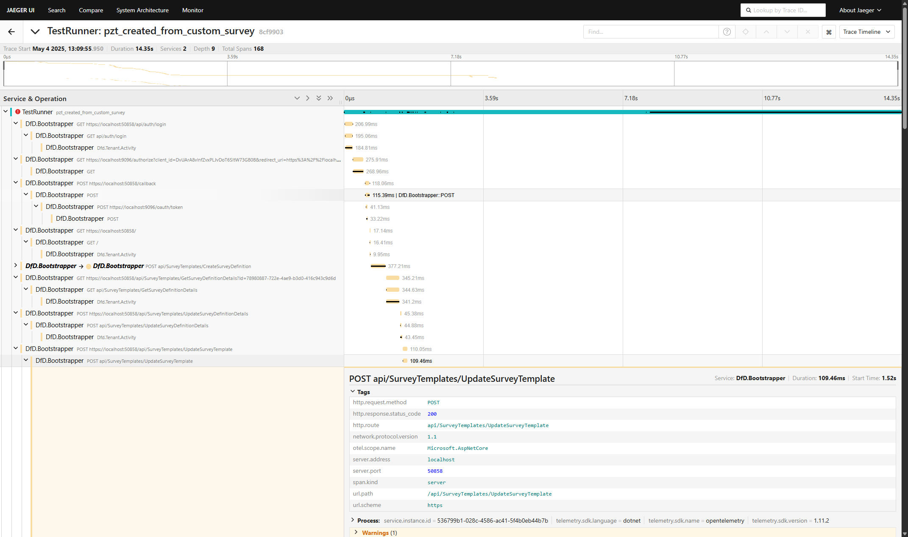
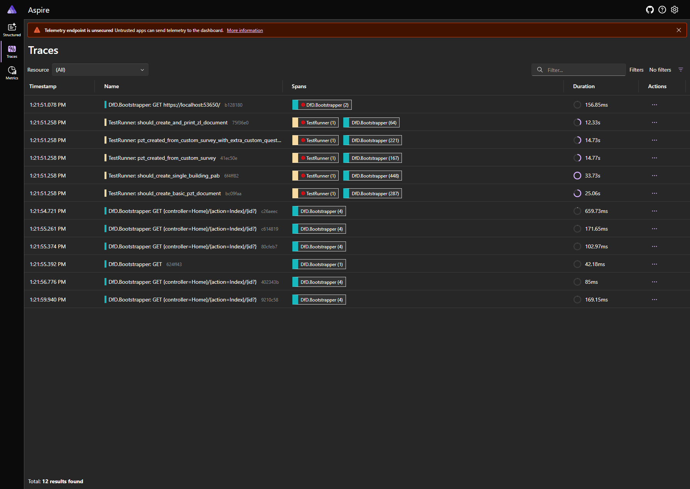
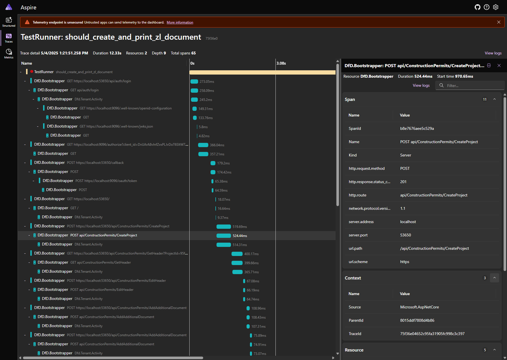
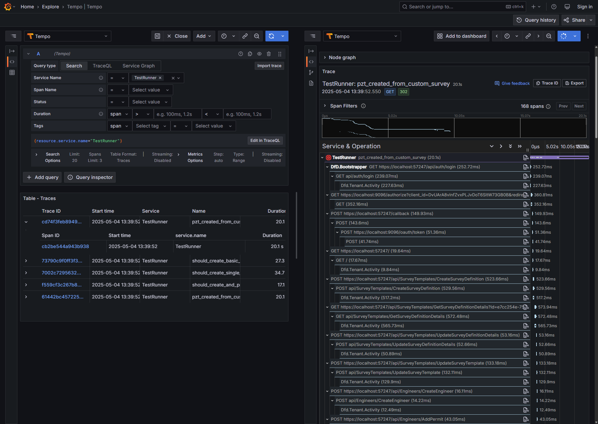

Writing automated tests is only half the battle. Debugging them when something goes wrong is often the bigger challenge — especially when the test runner hijacks the console output or tests run in parallel. The fastest way to identify the source of a problem is to visualize the flow. Imagine being able to see exactly what's happening in your tests and in the application under test. With OpenTelemetry, that’s entirely possible.
<!--more--> 
In the article [Sharing WireMock.NET in sequential and parallel tests](/post/wiremock-in-parallel-tests/), I described how OpenTelemetry can help correlate WireMock stubs with HTTP requests to address the challenges of parallel test execution. But OpenTelemetry has even broader applications in testing - you can use it to quickly pinpoint a failing elements or identify slow parts of your system. In this article, I'll show you how to set up OpenTelemetry tracing for NUnit tests, collect useful telemetry data, and visualize the results using open-source tools.


## Everything starts with Activity

When working with distributed tracing or structured diagnostics in .NET, `System.Diagnostics.Activity` is a fundamental building block. It represents a single unit of work — like a web request, background job, or in our case, a test case. Activities can be nested and carry contextual information like operation name, tags, timing, and exceptions. This makes them incredibly useful for capturing the full picture of what happened during execution.

Wrapping each test case in its own Activity allows you to:

- Clearly isolate logs and telemetry for each test.
- Correlate logs, metrics, and spans across systems using trace IDs.
- Easily spot failed tests and related errors in observability platforms like Grafana, Jaeger, or Application Insights.

Without isolation, it's hard to trace the origin of logs or understand the full scope of what a test executed.

## Wrapping tests in Activities
As I explained in the previous paragraph, we need to wrap each test with its own Activity. However, bloating a test case code with Activity related logic is not an option. A better alternative is to use NUnit's [ITestAction](https://docs.nunit.org/api/NUnit.Framework.ITestAction.html) interface which allows us to automatically inject logic before and after each test execution. We can wrap all the code responsible for creating and disposing of the Activity into a custom attribute that inherits from `ITestAction` and apply it at the assembly level to ensure that every test is wrapped in an Activity.

```cs
using System.Diagnostics;
using ComponentTests.TestFixtures;
using NUnit.Framework.Interfaces;

// INFO: Apply attribute to all tests inside the assembly - should be outside the namespace
[assembly: TestCaseWithActivity]

namespace ComponentTests.TestFixtures;

[AttributeUsage(AttributeTargets.Assembly)]
public class TestCaseWithActivityAttribute : Attribute, ITestAction
{
    public static readonly ActivitySource TestCaseActivitySource = new("TestCaseActivitySource");

    public void BeforeTest(ITest test)
    {
        if(test.IsSuite == false)
        {
            _ = TestCaseActivitySource.StartActivity(test.Name);
        }
    }

    public void AfterTest(ITest test)
    {
        if(Activity.Current is {} activity)
        {
            var result = TestContext.CurrentContext.Result;
            if(result.Outcome.Status == TestStatus.Failed)
            {
                activity.SetStatus(ActivityStatusCode.Error);
                if(string.IsNullOrWhiteSpace(result.Message) == false)
                {
                    activity.AddEvent(new ("Exception", tags: new ()
                    {
                        ["exception.escaped"] = true,
                        ["exception.message"] = result.Message,
                        ["exception.stacktrace"] = result.StackTrace ?? string.Empty,
                        ["exception.type"] = "TestFailed"
                    }));
                }
            }
            
            activity.Dispose();
        }
    }

    public ActionTargets Targets => ActionTargets.Test;
}
```

This way, each test execution will be properly captured in its own activity context, which is essential for correlating events and telemetry data.

## Setting Up OpenTelemetry in Tests
Once we have activity creation in place, the next step is to configure OpenTelemetry to collect trace data. This involves creating a TracerProvider, registering all activity sources relevant to your test infrastructure (HTTP clients, messaging systems, databases, etc), and ensuring proper shutdown to flush the telemetry at the end.

Here's how to set up the tracing for whole test session using global [SetUpFixture](https://docs.nunit.org/articles/nunit/writing-tests/attributes/setupfixture.html):

```cs
using ComponentTests.TestFixtures;
using OpenTelemetry;
using OpenTelemetry.Resources;
using OpenTelemetry.Trace;

namespace ComponentTests.TestSuits;

//INFO: This class should be located in the namespace superior to all classes containing tests
[SetUpFixture]
public class AllTestsSetUpFixture
{
    private TracerProvider? _tracerProvider;

    [OneTimeSetUp]
    public Task GlobalSetup()
    {
        this._tracerProvider = Sdk.CreateTracerProviderBuilder()
            .ConfigureResource(builder =>
            {
                builder.AddService
                (
                    serviceName: "TestRunner",
                    serviceInstanceId: DateTime.Now.ToString("yyyyMMddHHmmss")
                );
            })
            // INFO: Add Activities created for each test case
            .AddSource(TestCaseWithActivityAttribute.TestCaseActivitySource.Name)
            // INFO: Collect activities from HttpClient used in tests
             .AddHttpClientInstrumentation(options =>
             {
                options.EnrichWithHttpRequestMessage = (activity, message) =>
                {
                    // INFO: To make spans more readable
                    activity.DisplayName = $"{message.Method} {message.RequestUri?.ToString()}";
                };
            })
            .AddOtlpExporter(options =>
            {
                //INFO: The sink of your choice
                options.Endpoint = new Uri("http://localhost:4317"); 
            })
            .Build();
        return Task.CompletedTask;
    }
    
    [OneTimeTearDown]
    public Task TeardownSetup()
    {
        if(this._tracerProvider != null)
        {
            this._tracerProvider.ForceFlush();
            this._tracerProvider.Shutdown();
            this._tracerProvider.Dispose();
        }
        return Task.CompletedTask;
    }
}
```

The code above requires some nuget packages with OpenTelemetry facility:

```xml
<ItemGroup>
  <PackageReference Include="OpenTelemetry.Api" Version="1.12.0" />
  <PackageReference Include="OpenTelemetry.Exporter.OpenTelemetryProtocol" Version="1.12.0" />
  <PackageReference Include="OpenTelemetry.Instrumentation.Http" Version="1.11.1" />
</ItemGroup>
```

You need also ensure that app under test has also configured support for OpenTelemetry and export data to the same sink as tests.

## Visualizing Collected Telemetry

Just collecting OpenTelemetry data isn’t enough — it’s like logging everything to a file and never opening it. To actually make use of the telemetry, we need a way to visualize the data in a convenient and readable form.

There are many tools that support OpenTelemetry, but setting them up manually can be tedious. A full telemetry stack typically requires at least three components:

- A data collector (like the OpenTelemetry Collector)
- Some form of storage (for traces, metrics, and logs)
- A UI to browse and explore the data.

Fortunately, there are several pre-packaged Docker images that bundle all these components together. These are perfect for local development setups where ease-of-use is more important than production-grade durability or scalability. Most of these solutions keep data in memory, so they're not suited for long-term usage or deployment, but they’re excellent for exploring what’s going on during test execution.


### Jaeger All-In-One


[Jaeger](https://www.jaegertracing.io/) is an open-source tool focused on distributed tracing. The [All-In-One Docker](](https://hub.docker.com/r/jaegertracing/all-in-one)) image packages everything needed — collector, storage, and UI — into a single container, making local setup quick and effortless. It's limited to tracing only, with no support for logs or metrics. The built-in UI is clean and intuitive, offering a clear view into trace data across your system or test suite.

```shell
docker run -it --rm -p 16686:16686 -p 4317:4317 jaegertracing/all-in-one
```

Once running, you can open [http://localhost:16686](http://localhost:16686) to inspect traces.





### .NET Aspire Dashboard

The [.NET Aspire Dashboard](https://hub.docker.com/r/microsoft/dotnet-aspire-dashboard/) is a part of .NET Aspire ecosystem, but it can be used as a standalone tool even if your app doesn't use Aspire framework. It supports logs, traces, and metrics out of the box, offering a holistic view into your system’s behavior. The UI is clean and intuitive, with predefined views for each OpenTelemetry dimension.

```shell
docker run -it --rm -p 18888:18888 -p 4317:18889 -e DOTNET_DASHBOARD_UNSECURED_ALLOW_ANONYMOUS=true  mcr.microsoft.com/dotnet/aspire-dashboard
```

After starting docker container, the dashboard is available at [http://localhost:18888](http://localhost:18888)




### Grafana OTEL-LGTM Stack

Grafana is a widely-used open-source platform for visualizing and analyzing metrics, logs, and traces. The [OTEL-LGTM Docker image](https://hub.docker.com/r/grafana/otel-lgtm) bundles Grafana with Tempo (tracing), Loki (logging), Prometheus (metrics), and the OpenTelemetry Collector, providing a comprehensive observability stack in a single container. While it offers a robust UI for exploring telemetry data, it lacks predefined dashboards for OpenTelemetry traces. To retain and reuse custom dashboards, you need to build a custom Docker image based on the official one and configure dashboard provisioning manually.

```shell
docker run -it --rm -p 3000:3000 -p 4317:4317 grafana/otel-lgtm
```
Once the Docker container is running, you can access the dashboard at [http://localhost:3000](http://localhost:3000)

