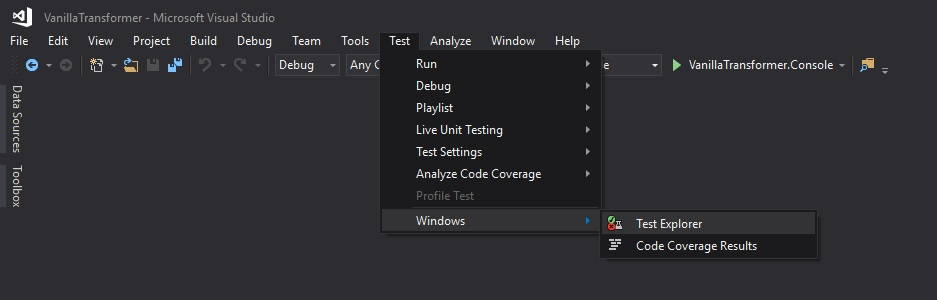
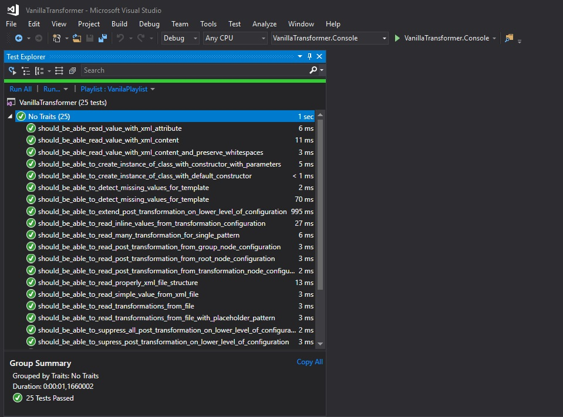

For many years Resharper was the most essential plugin for VisualStudio that makes this IDE very powerful.  Most people who tried Reshaper cannot work in VS without it anymore. If you ever been in a situation when you have to work without R# after trying it (for example you are just after system reinstall or forgot to renew your licence) you probable feel like disable and hitting well know shortcuts without response ends up with frustration. However, recently the situation starts changing, especially after introducing Roslyn as the integral part of the VisualStudio. Visual Studio is getting more and more feature becoming really powerful IDE itself.  And the question that appears recently: do I still need R# to work efficiently with C# projects? I heard it many times so I decide to make a blog post series that try to answer this question. This is the first episode in with I will check the possibilities of Visual Studio with and without Resharper in terms of Unit Testing.

## How to run UT
A few years ago, when I was starting my C# journey, Visual Studio was able to natively run only unit tests based on `MSTest`. If your Unit Test framework of choice was different (for example `NUnit` or `xUnit`) you have use some kind of plugin or external runner to work with your unit tests. Of course, the `Jetbrains` company has spot this market need and enriched R# with NUnit test runner (and later the xUnit too). It certainly helped to popularize the habit of writing unit tests because it made it very convenient without the need of switching to external tools. However, in the meantime `NUnit` and `xUnit` developed adapters which allow you to managed and run your unit test with Visual Studio `Test Explorer`. This adapters are distributed via nuget packages which should be installed to your test projects.

### How to run NUnit test in Visual Studio
In order to get support for NUnit tests in Visual Studio you have install [NUnit3TestAdapter](https://www.nuget.org/packages/NUnit3TestAdapter) nuget package to your Test project (there is also an option with Visual Studio Extension but it's already deprecated). After that you should be able to discover your unit test in `Test Explorer`

With `Test Explorer` you can run, debug and managed all your unit tests. You can also create a `playlist` that allows to define a subset of tests that are you interested in (for example you can exclude some tests). The file with `playlist` definition can be check into repository and shared amongst team members. More information about working with test playlists you can find in [official documentation](https://docs.microsoft.com/en-us/visualstudio/test/run-unit-tests-with-test-explorer?view=vs-2017#create-custom-playlists) or this [article](https://dailydotnettips.com/create-and-run-subset-of-unit-test-using-playlist-in-visual-studio/).

If you have a problem with discovering your test via `Test Explorer` please verify if you have an appropriate settings for processor architecture in test settings: `Tests-> Test Settings -> Default Processor Architecture`

Beside the `Test Explorer`, Visual Studio has also support for Unit Test via `code lens` mechanism. You can turn this on/off in `Tools -> Options -> Text Editor -> All Languages -> CodeLens -> Show test status`. After enabling this option you will be able to see test status right to method signature and run test with extra menu:

<iframe width="853" height="480" src="https://www.youtube.com/embed/b8D9VaRkbHQ?rel=0" frameborder="0" allow="autoplay; encrypted-media" allowfullscreen></iframe>

- [Running xUnit Test in Visual Studio](https://xunit.github.io/docs/getting-started/netfx/visual-studio)
- [NUnit Visual Studio test adapter](https://github.com/nunit/docs/wiki/Visual-Studio-Test-Adapter)

+ net core ??
## Discoverity 
(no code lens on TestFixture)
## Performance
## Code Coverage
## Continous Testing
## Load tests
https://docs.microsoft.com/en-us/visualstudio/test/quickstart-create-a-load-test-project?view=vs-2017
## Profiling

## Summary