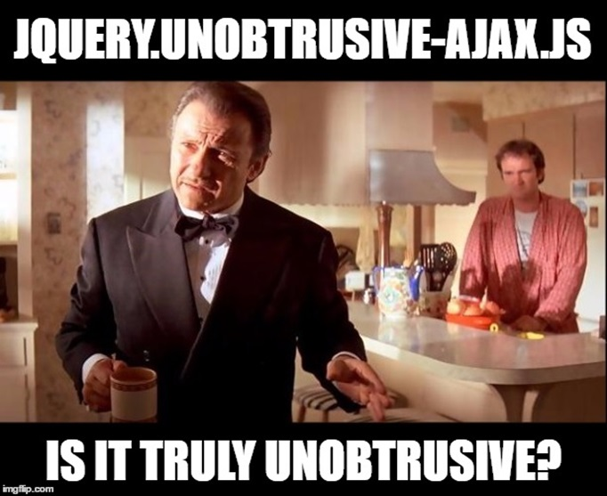
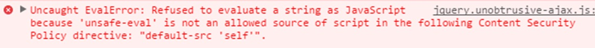
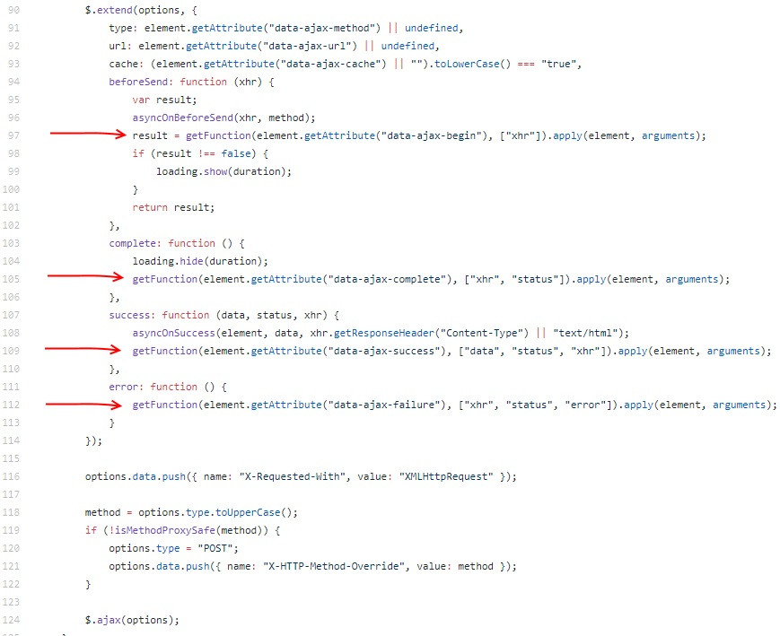
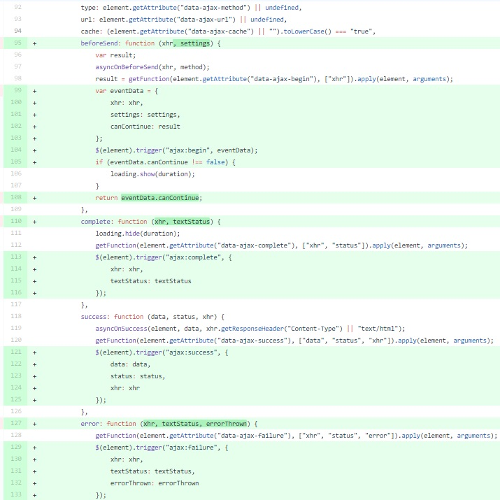
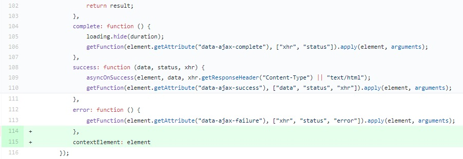

jquery.unobtrusive-ajax is the javascript library that every ASP.NET MVC developer certainly knows. It's shipped with MVC bootstrapping template and it's responsible for providing plumbing code which helps to add ajax functionality to rendered forms and links. Unfortunately, it has a few design drawbacks which could have negative impact on our system architecture and generate additional hidden costs. In this post I'm going to show you some of jquery.unobtrusive-ajax.js related problems I encountered in my 5-year journey as a ASP.NET MVC frontend developer, and how to fix them.

## How it works.
Before we start, let me briefly remind you how jquery.unobtrusive-ajax.js works. As I've mentioned in the introduction, this library adds ajax support for forms and hyperlinks. In order to use it you have to provide a set of appropriate data-ajax-* attributes which will be "interpreted" by the javascript library. You don't need to type these attributes directly - you can use AjaxOptions object accepted by razor helpers and translated into given html attributes. These attributes are responsible for configuring ajax connection, selecting the predefined behavior for handling ajax response and providing custom callbacks for given ajax events. The latter can be entered in the form of javascript method name, but nothing prevents us from typing full javascript expression. A sample usage of AjaxOptions with conjunction of Ajax.BeginForm can look as follows.

```razor
@using (Ajax.BeginForm("SaveData", new AjaxOptions { OnSuccess = "alert(\"Data successfuly saved!\");" }))
{
    <h1>This is sample form</h1>
    @*Sample form content*@
    <input type="submit" value="Submit"/>
}
```
When you have in web.config **"UnobtrusiveJavaScriptEnabled"** flag set to true, this razor code is translated into the following html markup :

```html
<form action="/Home/SaveData" data-ajax="true" data-ajax-success="alert(&quot;Data successfuly saved!&quot;);" id="form0" method="post">
    <h1>This is sample form</h1>
    <input type="submit" value="Submit">
</form>
```
If you switch **"UnobtrusiveJavaScriptEnabled"** to false you get the code as below which is some kind of fallback in case you don't have jquery (it requires another Microsoft JavaScript library).

```html
<form action="/Home/SaveData" id="form0" method="post" onclick="Sys.Mvc.AsyncForm.handleClick(this, new Sys.UI.DomEvent(event));" onsubmit="Sys.Mvc.AsyncForm.handleSubmit(this, new Sys.UI.DomEvent(event), { insertionMode: Sys.Mvc.InsertionMode.replace, onSuccess: Function.createDelegate(this, alert(&quot;Data successfuly saved!&quot;);) });">    
    <h1>This is sample form</h1>
    <input type="submit" value="Submit"/>
</form>
<script type="text/javascript">
//<![CDATA[
if (!window.mvcClientValidationMetadata) { window.mvcClientValidationMetadata = []; }
window.mvcClientValidationMetadata.push({"Fields":[],"FormId":"form0","ReplaceValidationSummary":false});
//]]>
</script>
```
After analyzing this "non-obtrusive" version I very much doubt if this works with ajax callbacks provided as a javascript expression (probably the javascript literals are the only valid value).

In ASP Core there is no longer AjaxHelper and AjaxOptions but you can still use jquery.unobtrusive-ajax.js functionality by providing data-ajax-* attributes manually.

## Is it truly unobtrusive?

I think the root of all problems lays in the (miss)understanding of "unobtrusive javascript" term. According to [Wikipedia](https://en.wikipedia.org/wiki/Unobtrusive_JavaScript) the concept of unobtrusive javascript appeared for the very first time in Stuart Langridge's article [Unobtrusive DHTML, and the power of unordered lists](https://kryogenix.org/code/browser/aqlists/) from 2002. A better explanation we can find in David Flanagan's book "JavaScript: The Definitive Guide" which looks as follows:

> A programming philosophy known as unobtrusive JavaScript argues that content (HTML) and behavior (JavaScript code) should as much as possible be kept separate. According to this programming philosophy, JavaScript is best embedded in HTML documents using \<script> elements with src attributes.

There are few other postulates of this paradigm (such as Graceful degradation) but this one is especially important from the clean code and maintainability perspective. 



According to this definition jquery.unobtrusive-ajax.js is not even close to unobtrusive approach compliance because it requires providing javascript callbacks inside the html attributes. I think the author(s) of this library was mainly focused on the aspect of Graceful degradation - which nowadays has marginal meaning - and totally forgot about separation of concerns between Javascript and HTML code.

## Implications

The main issue is not the compliance with the definition but the fact that this programming style (I mean messing javascript code with html markup) has some serious ramification. First of all, this code is really hard to maintain. If you put javascript code inside html atttributes you won't be able to refactor it with automatic refactoring tools, debug or verify syntax correctness. This is also  abused sometimes to build javascript dynamically (by concatenating strings) which could result with the potential XSS attack.

Another disavantage is that when you need to invoke function inside this "inline" code it requires global accessibility of this function. This means you can't put your function definition inside private context (for example wrapping with immediate invocation of anonymous function). Exposing function globally can have negative effects such as name collisions (which cause method overriding) and it makes it harder to keep contexts separated. 

And the most serious drawback, which can even prevent from releasing our software to the production due to security reasons, is lack of Content-Security-Policy compliance. I've been developing software for financial sector for the last few years and before we release application to the production server we have to go through the mandatory security audit. Since the CSP became widely supported by the modern browsers it also became one of the checkpoints during those security audits. I've also met CSP as one of the requirements in RFP documents. For those who don't know, CSP is another security mechanism which prevents against XSS attacks. This is pretty easy to implement - you have to only add "Content-Security-Policy" header to http response. However, enabling CSP has impact onto how javascript and css are interpreted. Since now you can't use inline scripts and styles and can't evaluate javascript dynamically (expressions such as "eval()" and "new Function()" are forbidden). When you add CSP header all your javascript code which is wired by jquery.unobtrusive-ajax stop working.



## How to fix it?

Now we know that the broken part of jquery.unobtrusive-ajax.js is about providing callback for ajax events, so we have to find a different way for creating these subscriptions.
Unfortunately, I wasn't able to find any solution that wouldn't imply modification of jquery.unobtrusive-ajax.js source code. I'm not a huge fan of modifying third party libraries for given project purpose because this has a lot of negative implications (for example you have to manually apply all updates and there is much more). I've even decided to send PR with fix proposal but it was rejected with not entirely clear reasons, so I've stucked with private modification of this library.

After quick analysis of jquery.unobtrusive-ajax.js source code we can easily spot the places where ajax callbacks are invoked (I marked these places with red arrows as you can see below)



One of the possible solutions is to replace these lines with code that triggers custom events on related DOM element. Instead of calling callback function directly we shift into event oriented direction which gives us a really nice point of extensibility. A sample implementation can look as follows:



Now we can subscribe for those ajax events in a more elegant way directly from js code:

```js
$(function(){
    $("#SampleForm").on("ajax:begin", function (event, ajaxData) {
        console.log("Begin");
    });

    $("#SampleForm").on("ajax:complete", function (event, ajaxData) {
        console.log("Complete");
    });

    $("#SampleForm").on("ajax:success", function (event, ajaxData) {
        console.log("Success");
    });

    $("#SampleForm").on("ajax:failure", function (event, ajaxData) {
        console.log("Failure");
    });
});
```
The id attributes are not required for this solution, you can locate interesting element in any way you want, but this is good practice to assign unique id to every form (if you don't do that BeginForm helper assigns a "default" value). If you are working with element that occurs multiple times (for example delete button on every list item) you can use a class selector to locate element for subscription as follows:

```js
$(function(){
    $(".button-delete").on("ajax:begin", function (event, ajaxData) {
        console.log("Begin");
    });
});
```
... or in more efficient way:

```js
$(function(){
    $("#ProductList").on("ajax:begin", ".button-delete", function (event, ajaxData) {
        console.log("Begin");
    });
});
```

Unfortunately, this solution has few drawbacks which can materialize in certain use cases. Namely, this fix is based on DOM events, so when the element with subscription is deleted in the meantime from the DOM, certain callbacks will not be fired. For example you have two subscriptions - success and complete - attached to the form, and you remove or replace form element in the success callback (this can be also done by pointing data-ajax-update attribute to the same form or its parent element) - the complete subscription will be ignored. Another disadvantage can be the necessity to wait with creating subscription until given element appears in the DOM (which could be an issue with dynamically loaded elements) but this is a more versatile problem related to DOM events and dynamic content.

Another possible solution that could address all formerly mentioned issues, as well as drawback of the previous solution, is to publish events through custom event aggregator instead of triggering it on DOM tree. You can declare this event aggregator globally or inject with some kind of DI container (I'll never understand why there is a need for DI container in a dynamic language like javascript). You can put the code responsible for triggering events in the same places as in the previous solution or organize it in separated unit without the need to modify jquery.unobtrusive-ajax.js thanks to [global ajax event handlers](https://api.jquery.com/category/ajax/global-ajax-event-handlers/). Unfortunately, this is not entirely true because in global handlers we have no information about the DOM element corelated with ajax events. We can smuggle the element responsible for context through the ajax options with a small modification to jquery.unobtrusive-ajax.js:



Now we are able to utilize global ajax event handlers to publish our custom events:

```javascript
$(function () {
    var $document = $(document);
    $document.ajaxSend(function (event, xhr, settings) {
        AjaxEventAggregator.publish("send", settings.contextElement, arguments);
     });

    $document.ajaxComplete(function (event, xhr, settings) {
       AjaxEventAggregator.publish("complete", settings.contextElement, arguments);
    });
    
    $document.ajaxError(function (event, xhr, settings, error) {
        AjaxEventAggregator.publish("error", settings.contextElement, arguments);
    });

    $document.ajaxSuccess(function (event, xhr, settings, data) {       
        AjaxEventAggregator.publish("success", settings.contextElement, arguments);
    });
});
```

Inside the AjaxEventAggregator implementation you should somehow determine channel name based on the parameter which receives the value of settings.contextElement (you can use the id or value of other custom attribute, for example data-ajax-channel) and publish the event only to subscriptions for given event on given channel.

```javascript
var AjaxEventAggregator = AjaxEventAggregator || {};
$.extend(AjaxEventAggregator, (function () {
    return {       
        subscribe: function (ajaxEventName, channel, callback) {
            //subscribe for given ajax event on channell
        },       
        publish: function (ajaxEventName, $contextElement, args) {
            //determine the channel name base on the $contextElement and publish given event on this channel
        }
    }
})());
```

Now we can subscribe for the given ajax events in the following way (I'm using form id for channel name)

```javascript
(function(){
    AjaxEventAggregator.subscribe("send", "SampleForm", function (response) {
        console.log("send");
    });

    AjaxEventAggregator.subscribe("complete", "SampleForm", function (response) {
        console.log("complete");
    });

    AjaxEventAggregator.subscribe("error", "SampleForm", function (response) {
        console.log("error");
    });

    AjaxEventAggregator.subscribe("success", "SampleForm", function (response) {
        console.log("success");
    });
})();
```

Here come some benefits from this approach:

1. You don't need to mix your javascript code with html markup anymore.
2. You can subscribe for ajax events in a very elegant way directly from javascript.
3. Your subscriptions are not globally accessible functions.
4. You are fully compliant with Content-Security-Policy.
5. You don't need to wait until all elements are loaded into DOM in order to subscribe for ajax events.
6. You improve the maintainability of your code responsible for handling ajax events.

## Final thought

This fake "unobtrusive" sense is not only jquery.unobtrusive-ajax.js related problem. You should always check CSP compliance of your javascript library/framework of choice before you start any development. Postponing this verification can generate additional costs and even result with system rewriting.