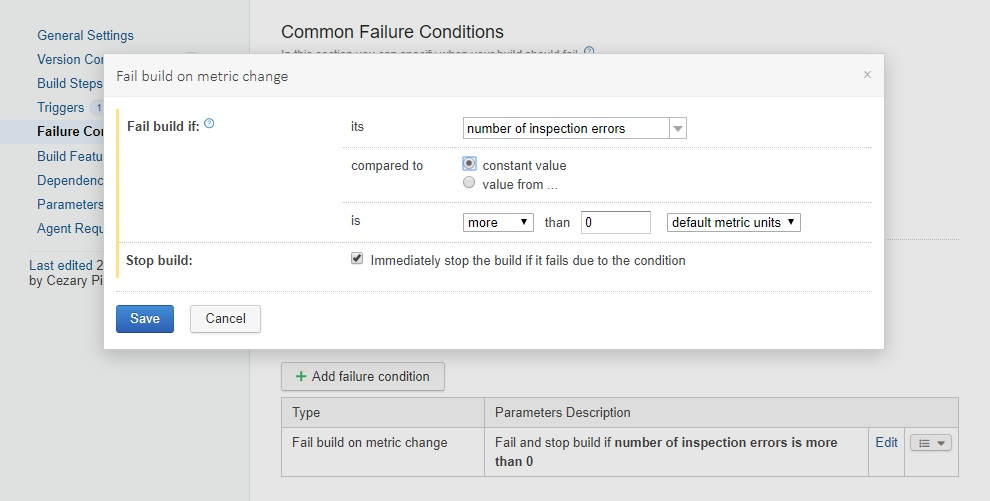

The idea behind this blog post is pretty old but I haven't had enough motivation to write this down till now. Recently, I've came across a couple of new articles about AutoMapper and I've been struck when I saw how people utilize AutoMapper in their projects. I've encountered cases when AutoMapper transforms simple thing like mapping values from object to other into a really complex problem, which results with highly complicated code only for the price of not writing mappings explicitly. Finally, I've found a provoking tweet on my timeline that definitely motivated me to materialize my reflections about AutoMapper into the form of this blog post.


Over 5 years ago I participated in a project where there was a trial of using AutoMapper but happily we drown back from this idea in time. Bear with me and I'll explain you why this was a good decision.

## Misleading static analysis

The first problem is that static analysis starts to report that some fields from my entity are never used. There is no direct reference in the code because on one side ORM automatically maps those fields into database table columns and on the other side there is AutoMapper. This issue is related to fields which are not involved in any business logic and they are simply read from user input, saved into database and read back only for raw presentation purpose (the business always wants to gather as much information as possible). So when we take advice from static analysis report and we drop those fields, we simply break the system. We could mark those fields with [UsedImplicity] attributes (if you use Resharper static analysis) or disable this inspection completely, but that only hides the problem. We experience the same situation with DTO objects. On one side there's AutoMapper, on the other - some kind of serializer. And again, if we rename or drop the field we silently break the system. We'll get feedback only when we run some kind of test during the runtime. 
For me, the static analysis plays a really important role in managing the project's code quality and when some library starts to undermine the credibility of this report I have to have a really good reason to choose that library. It's the same situation like in the story about a building with a broken window - when we have to ignore some set of errors caused by usage of given library, sooner or later we start to ignore other errors because we are not able to distinguish which one is a real problem. If you are in a situation where you are not burdened with errors that you have to mentally ignore, you can treat static analysis as another type of test for your system. You can run static analysis tool as a part of your continuous integration pipeline and treat all reported errors the same way as you treat failed unit tests. 



This will definitely save your code from really sophisticated bugs. You can read more about problems that can be solved thanks to static analysis in my post devoted to [Resharper Solution Wide Analysis](/post/hunt-your-bugs-design-time/)

## Helpless code navigation
Another problem is that it is not possible to find out which field from DTO maps to which field in entity (or entities). When we use tools like "show usages" it shows us only this single occurrence because there is no explicit mapping in the codebase. The resolution is to explicitly write mapping configuration for all the fields we want to map, but do I really need a heavy reflection mechanism to rewrite value from field in one object to another?

## Hard to debug

The next important issue is fluent configuration. I'm not a huge fan of this code writing approach, actually I don't like it at all. Why? It's very hard to debug this kind of code and sometimes it's even impossible. This is not a code which is evaluated, it's only a declarative description of expected behavior. Your "code" is processed by third party library which produces real code based on this description. Even if you provide mapping code within **MapFrom<>** method, you can't put there breakpoint and expect that program invocation stops when you call  **Mapper.Map<>()** method. This is due the fact that **MapFrom<>()** is expecting **Expression\<Func\<TSource, TSourceMember\>\>** not **Func\<TSource, TSourceMember\>**.  And if you have a bug in your mapping code you don't get exception in the place where you could potentially expect it. Actually you don't get any exception at all. I observed that AutoMapper is somehow swallowing exception that occurs during the mapping. These reasons makes debugging very hard.

```csharp
static void Main(string[] args)
{
    Mapper.Initialize(cfg =>
    {
        cfg.CreateMap<UserEntity, UserDTO>()
           .ForMember(x=>x.FullName, opt=> opt.MapFrom(x=> $"{x.FirstName} {x.LastName} ({x.Address.City})"));
    });

    var userEntity = new UserEntity()
    {
        FirstName = "Cezary",
        LastName = "Piątek",
        Address = null
    };
    var userDto = Mapper.Map<UserDTO>(userEntity);
    var serialized = JsonConvert.SerializeObject(userDto, Formatting.Indented);
    Console.WriteLine(serialized);
    Console.ReadKey();
}
```
In the example above I've been expecting *NullReferenceException* when I called *Mapper.Map<UserDTO>(userEntity)* (because x.Address in mapping code is null) but as the result I got the following output on my console:

```javascript
{
    FullName : null
}
```

## Broken code organization

Some people say that AutoMapper is perfectly fine for simple projects, but believe me - there is no such thing as simple project. Even when it looks simple at the beginning - sooner or later it gets complex. Starting with straigth one-to-one mapping between entities and dtos (or whatever types of objects you need to map) doesn't mean that you won't need to implement the following requirements in further stages of your project development:

1. Formatting
2. Composing one object from few others (ViewModel build with data that comes from couple of different entities)
3. Conditional mapping based on business and security rules
4. Limited access to given model's attributes based on user permissions.

People tend to put this complex mapping logic inside the AutoMapper configuration because this is the fastest way to achieve expected effect. I think it's a really bad practice to put your business and security logic inside some infrastructure tool configuration. This is the beginning of slippery slope and in the long term it will make the development, testing and maintenance more complicated. You can say ok - if I've got complex mapping then I write it explicitly. But then you have two ways of implementing one thing - AutoMapper and explicit mapping. And then the question appears: "When should I use which?". And the answer is: "it depends...". And you introduce chaos into your codebase.

## How to organize mappings
Write your mapping explicitly. If you find this boring you can utilize some kind of snippets or scaffolding tools (such as T4 Scaffolding or something based on Roslyn) to generate this "dummy" code. You can encapsulate this code inside the new component type responsible for mapping objects. In the project I've mentioned at the beginning of this article, we introduced a notion of *ServiceMapper components with a set of MapTo\* and MapFrom\* methods which serve the purpose of mapping objects for given endpoint service. Why not to use extension methods? The reason is again the complexity. Sometimes you need other dependencies to fulfill the mapping logic and the extension method makes it hard to utilize dependency injection to provide these dependencies (you can use only service locator which is considered as an anti-pattern or ambient context). Example service mapper can look like this below:

```cs
public class UserServiceMapper{

	private readonly AddressServiceMapper addressServiceMapper;
	
	public UserServiceMapper(AddressServiceMapper addressServiceMapper)
	{
		this.addressServiceMapper = this.addressServiceMapper;
	}
	
	public UserDTO MapToUserDTO(UserEntity entity)
	{
		return new UserDTO {
			FirstName = entity.FirstName,
			LastName = entity.LastName,
			Address = this.addressServiceMapper.MapToAddressDTO(entity.Address)
		};
	}
	
	public void UpdateUserEntity(UserEntity entity, UserDTO dto)
	{
		entity.FirstName = dto.FirstName;
		entity.LastName = dto.LastName;
		entity.Age = dto.Age;
		this.addressServiceMapper.UpdateAddress(entity.Address, dto.Address);
	}
}
```

## Final thought
AutoMapper is probably good for really small, short-lived projects or proof of concepts, but when you start to care about your code quality, you should definitely rethink all pros and cons regarding using AutoMapper. When you observe problems like the ones described in this blog post, you should consider abandoning AutoMapper and start to write your mappings explicitly (it really doesn't hurt). If you encountered other problems which arised from using AutoMapper I would be really appreciate if you could share your experience in the comment section down below.


