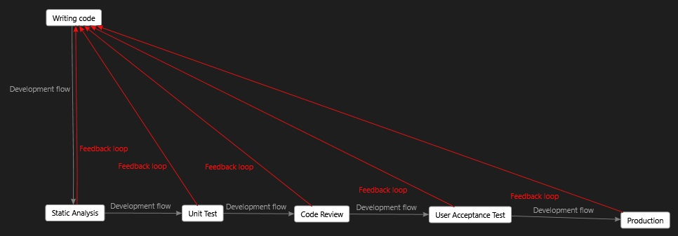

The idea behind this blog post is pretty old but I have not enought motivation to write this down so far. I encounter recently a couple of new articles about Automapper which is pretty weird because the idea and the project is quite old. I've also found a provoking tweet on my timeline that finally motivate me to make this blog post.

Over a 5 years ago I participate in the project where there was a trial of using Autommper bu happily we drow back from this idea in time. Bare with me and I explain you why this was a good decision.

## Misleading static analysis

The first problem is static analysis starts to report that some fields from my entity are never used. There is no reference in code because on side ORM automatically mamps those fields into database table columns and on the other side is Autommaper. This issue is related to fields which are not involded in any business logic and they are simply on read from user input, saved and read for raw presentation. So when we take advise from static analysis report and we drop the fields we simply break the system. We could mark the fields with [UsedImplicity] attributes but that only hide the problem. The same situation is with DTO objects. One side Automapper, on the other side some kind of serializer. And again if we rename or drop thte field we silently break the system. We'll get feedback only when we run some kind of test during the runtime. Another problem is it is not possible which field from DTO map to which field in Entity. When we use tools like "show usages" shows us only this single occurence because there is no explicit mapping in the codebase. The resolution is to write explicitly mapping configuration for all the fields we want to map,but do I really need heavy reflection mechanism to rewrite value from field in one object to another?

You can treat static analysis as a another type of test for your system. You can ran static analysis tool as a part of you continouonus integration pipeline and and treat all reported errors the same way as you treat failed unit tests.

Alright, so why the UT is worst that static analysis in this case when the result is the same. First of all you have to waste some time to werify something that can be checked by existing tools. The second reason is that unit test has longest feedback loop that static analysis. The cost of fixing bug is directly proportional to the length of feedback loop. Ofcourse, continous testing feature maight mitigate that cost but still it's a little bit slower and you have to write code that you actually don't need it.

## Hard to debug

The next thing is about fluent configuration. I'm not a huge fan of this writing code approach, actually I don't like it at all. Why? It's very hard to debug this kind of code and sometimes it's even imposible. This is not a code which is evaluated, it's only a declarative description of expected behaviour. Your "code" is processed by third party library which produce real code based on this description. You cannot put there breakpoint and expect that program invokation stop when you call Map<>() method. And if you have a bug in your mapping code you don't get exception in the place where you could potentially expect it.

## Code organization

Some people say that AutoMapper is perfectly fine for simple projects where the problems described above does't matter, but believe me - there is no such thing like simple project. Even when this looks simple at the begining - soner or later it get complex. The change requests appear which require conditional mapping or additional formatting. This is the reason of instroducing sophisticated logic or even the security (based on the permission set of current user you can sometimes map values to the transport object and vice versa). I think it's not a good practice to put you business and security logic inside some infrastructure tool configuration. You can say ok - If i've got a complex mapping then i write it explicitly. But then you have two ways of doing one thing - Automapper and explicit mapping. And there appears question when should I use which. And the answer is depend... And you introduce chaos into your codebase.

## How to organized mapping
Write your mapping explicitly. If you find this boring you can utilized some kind of snippets or scafolding tools (such as T4 Scafolding) to generate this "dummy" code. You can encapsule this code by introducing new component type responsible for mapping objects. We introduced a notion of *ServiceMapper components with a set of MapTo\* and MapFrom\* methods which serve the purpose of given endpoint service. Why not to use extension methods? The reason is againg the complexiti. Sometimes you need another dependencies to fullfil the mapping logic and the extension method make it hard to utilize dependency injection to provide this dependencies (you can use only service locator which is considered as an anti pattern or ambient context)

TODO:
8. Motivation behind the automapper
