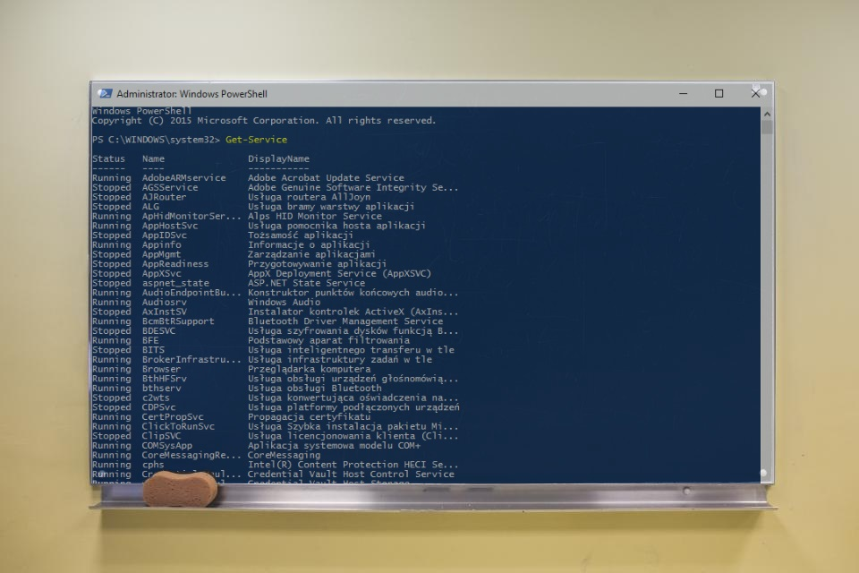

At the begining of my professional software developer career I have few unsucessful attemp of lerning PowerShell (I came accross on it in few different context...) I tried to lern from online tutorials but... All of them described a set of selected cmdlets and describe how to combine them together. I gave up for few years but again.. After reading XXX and YYY I've got a solid explanation of basic powershell concepts and that totally change my every-day work. A few weeks ago I started working on my own Powershell training wich should be mainly focus on what possibilities gives knowledge of that scripting language and how to apply it to automate out work. In the first part of the course I'm going to desribe what are the most valuable features of Powershell. In this blogpost I gave you a free sample of my course by summing up this part, so if you wonder why should you lern powershell instead of other scripting language you have to definetely keep reading.

### #1 Object-oriented 

Powershell functions can return data that are not plaintext but have a structure. You don't need to be a Regex-Master to write powershell scripts.

### #2 Based on .NET Platform

You have full access to .Net Platform. You can use BCL, reference .net libraries and evaluate .net languages source code. If you are .net developer then you can utilize your current knowledge in PowerShell scripts.

### #3 Generally Available

Formerly created as a Windows scripting language but since version 6 called PowerShell Core 6.0 became cross-platform. Thanks to .Net core powershell is now available on Windows, macOS and Linux. Not sure if it works on your platform of choice? You can check that on [PowerShell Team Blog](https://blogs.msdn.microsoft.com/powershell/2018/01/10/powershell-core-6-0-generally-available-ga-and-supported/)

### #4 Remoting
[PsExec](https://docs.microsoft.com/en-us/sysinternals/downloads/psexec)

### #5 Scheduler

### #6 Workflows

### #7 Desire State Configuration

### #8 Visual Studio Integration 

### #9 Continous Integration automation

### #10 ??