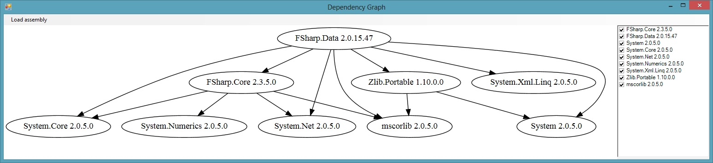

## Mapping Generator
	
"AutoMapper" like, Roslyn based, code fix provider that allows to generate mapping code in design time.

- **Article:** [Generate mapping code with Roslyn code fix provider.](/post/generate-mapping-code-with-roslyn/)
- **Repository:** [cezarypiatek/MappingGenerator](https://github.com/cezarypiatek/MappingGenerator)
- **Nuget:** [MappingGenerator](https://www.nuget.org/packages/MappingGenerator/)
- **Visual Studio Extension:** [MappingGenerator](https://marketplace.visualstudio.com/items?itemName=54748ff9-45fc-43c2-8ec5-cf7912bc3b84.mappinggenerator)

## CsharpMacros
 
A simple template base system of macros for C# that can be executed in design time.

- **Article:** [CSharp Macros - let the Roslyn type for you](/post/csharp-macros/)
- **Repository:** [cezarypiatek/CsharpMacros](https://github.com/cezarypiatek/CsharpMacros)
- **Nuget:** [CsharpMacros](https://www.nuget.org/packages/CsharpMacros/)
- **Visual Studio Extension:** [CsharpMacros](https://marketplace.visualstudio.com/items?itemName=54748ff9-45fc-43c2-8ec5-cf7912bc3b84.csharpmacros2)

## Tellurium
 
A utility pack to create maintainable and reliable UI tests using Selenium with additional support for ASP.NET MVC projects.

- **Repository:** [cezarypiatek/Tellurium](https://github.com/cezarypiatek/Tellurium)
- **Nuget:** [Tellurium.MvcPages](https://www.nuget.org/packages/Tellurium.MvcPages/), [Tellurium.VisualAssertions](https://www.nuget.org/packages/Tellurium.VisualAssertions/), [Tellurium.SeleniumDriverInstaller](https://www.nuget.org/packages/Tellurium.SeleniumDriverInstaller/)

## VanillaTransformer
 
VanillaTransformer is a simple generic text file transformer. It was designed for configuration transforming as an alternative for XML-Document-Transform tool. Unlike XML-DT, it works with any kind of text file (not only XML) and is much simpler to use.

- **Repository:** [cezarypiatek/VanillaTransformer](https://github.com/cezarypiatek/vanillatransformer)
- **Nuget:** [VanillaTransformer](https://www.nuget.org/packages/VanillaTransformer/)

## DDDToolbox

A set of Roslyn refactorings supporting DDD design.

- **Repository:** [cezarypiatek/DDDToolbox](https://github.com/cezarypiatek/DDDToolbox)
- **Visual Studio Extension:** [DDDToolbox](https://marketplace.visualstudio.com/items?itemName=54748ff9-45fc-43c2-8ec5-cf7912bc3b84.DDToolbox)

## MultithreadingAnalyzer

A set of Roslyn analyzers related to multithreading.

- **Article:** [Avoid multithreading traps with Roslyn: Lock object selection](/post/avoid-multithreading-traps-p1/), [Avoid thread synchronization problems with Roslyn: Synchronization primitives traps](/post/avoid-multithreading-traps-p2/)
- **Repository:** [SmartAnalyzers/MultithreadingAnalyzer](https://github.com/smartanalyzers/MultithreadingAnalyzer)
- **Nuget:** [SmartAnalyzers.MultithreadingAnalyzer](https://www.nuget.org/packages/SmartAnalyzers.MultithreadingAnalyzer/)

## ExceptionAnalyzer

A set of Roslyn analyzers related to exceptions usages.

- **Article:** [Exception usage analyzer](/post/exceptions-usages-analyzer//)
- **Repository:** [SmartAnalyzers/ExceptionAnalyzer](https://github.com/smartanalyzers/ExceptionAnalyzer)
- **Nuget:** [SmartAnalyzers.ExceptionAnalyzer](https://www.nuget.org/packages/SmartAnalyzers.ExceptionAnalyzer/)

## Project Graphs
	
PowerShell module to draw a graph of c# projects dependencies. It can also spot some kind of issues with libraries and nuget packages references (for example: multiple version of the same library\package).

- **Repository:** [cezarypiatek/ProjectGraphs](https://github.com/cezarypiatek/ProjectGraphs)

## Code Topology
 
Tool to visualize your codebase

- **Repository:** [synergy-software/CodeTopology](https://github.com/synergy-software/CodeTopology)
	

## DependencyGraph
 
A small F# application to visualize .net assembly dependencies.

- **Repository:** [cezarypiatek/dependencygraph](https://github.com/cezarypiatek/dependencygraph)	
	