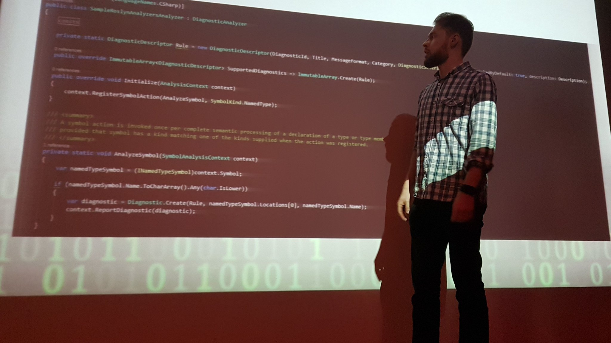

## Upcoming
- [2019-02-19] `"Jak usprawnić proces wytwarzania oprogramowania przy pomocy Roslyn"` - [115. spotkanie Wrocławskiej Grupy .NET](https://www.meetup.com/wrocnet/events/258708692/)

## Past

- [2019-01-15] `"Tworzenie łatwych w utrzymaniu oraz stabilnych testów UI"` - [KraQA #36](https://www.meetup.com/KraQA-pl/events/257856474/)
- [2018-12-04] `"Programisto, rozwijaj się!"` - [Dzień IT Politechniki Krakowskiej](https://itad-pk.github.io/)
- [2018-11-07] `"Jak usprawnić proces wytwarzania oprogramowania przy pomocy Roslyn."` - [114. spotkanie KGD.NET](https://www.meetup.com/KGD-NET/events/255950857/)
- [2017-11-30] `"Narzędzia programistyczne, które zwiększą twoją atrakcyjność na rynku pracy"` -  [Dzień IT Politechniki Krakowskiej](https://www.facebook.com/events/1340555766053134)
- [2017-10-25] `"Tworzenie łatwych w utrzymaniu oraz stabilnych testów UI dla aplikacji ASP.NET"` - [107. spotkanie KGD.NET](https://www.meetup.com/KGD-NET/events/244290559/)
- [2017-02-08] `"Highly maintainable UI with ASP.NET MVC"` - [102. spotkanie KGD.NET](https://www.meetup.com/KGD-NET/events/237039189/)
- [2016-08-05] `"Analiza jakości kodu z wykorzystaniem 'Resharper - search with pattern'"` - MMCC Conference